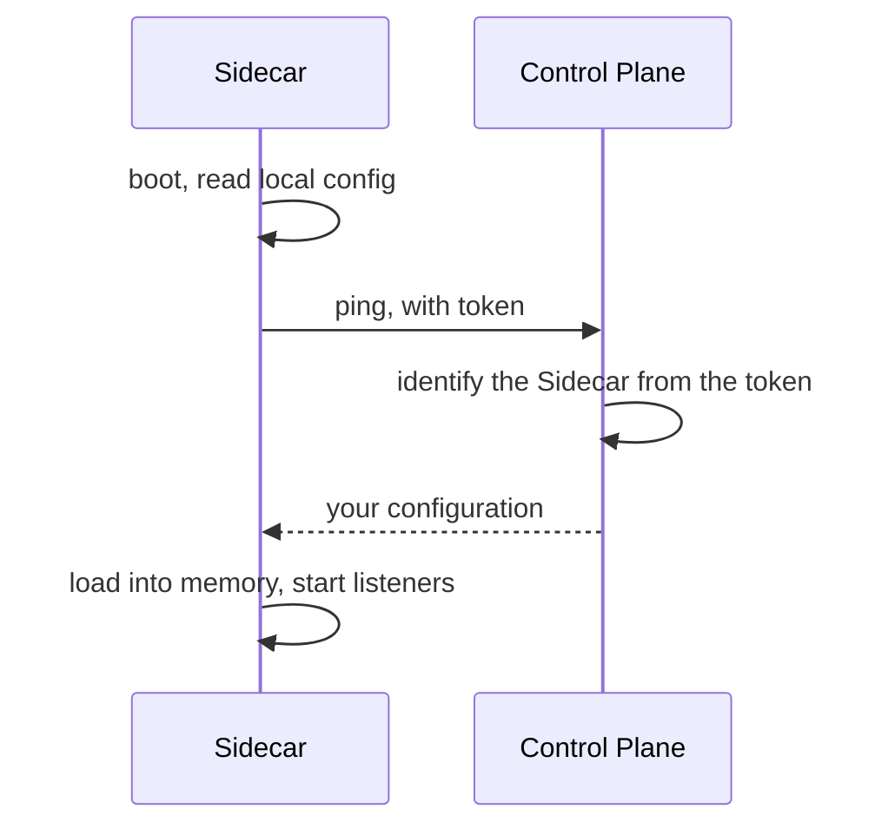

A [Sidecar](/core-concepts/sidecar) that knows nothing about a Control Plane reads its config file from disk and runs. Connecting it changes one thing: on boot, it asks the Control Plane what its configuration should be.

---

## The handshake



Four properties fall out of this shape, and they are the reason it looks like this:

- **No session to maintain.** The Sidecar loads its configuration into memory and keeps running. A Control Plane that goes down does not take running Sidecars with it.
- **The token is the authentication.** There is no second credential and no certificate exchange.
- **Ordinary HTTP.** A plain request and a plain response. Nothing is tunnelled and nothing bidirectional stays open.
- **Neither side knows the other's physical address.** The Sidecar dials out; the Control Plane never dials in. No inbound firewall rule, no NAT traversal.

---

## Steps

<Steps>
  <Step title="Issue a token in the Control Plane">
    Create a Sidecar registration and copy the token it returns. The token identifies this Sidecar and authenticates it — treat it as a credential.
  </Step>
  <Step title="Point the Sidecar at the Control Plane">
    Add the server host and token to the Sidecar's config file:

    ```yaml config.yaml
    control_plane:
      url: https://hoop.your-company.com
      token_file: /etc/hoop/sidecar.token    # a path, never an inline secret
    ```

    Or supply them through the environment, which is the shape a Kubernetes deployment wants — mount the secret, set the variables, pass no arguments:

    ```bash
    export HOOP_CONTROL_PLANE_URL=https://hoop.your-company.com
    export HOOP_SIDECAR_TOKEN_FILE=/etc/hoop/sidecar.token
    ```
  </Step>
  <Step title="Start it">
    ```bash
    hoop start sidecar --config config.yaml
    ```

    Listeners still come from the local file. Everything the Control Plane manages — guardrails, masking, analyzer settings — arrives over the ping.
  </Step>
  <Step title="Confirm what it resolved">
    The admin API reports the merged, live configuration. This is the only place you can see what the Sidecar actually ended up running:

    ```bash
    curl -s localhost:19000/healthz            # ok
    curl -s localhost:19000/config | python3 -m json.tool
    ```

    The Sidecar should also appear in the Control Plane's list, with a recent check-in.
  </Step>
</Steps>

---

## Troubleshooting

| Symptom | Check |
|---|---|
| The Sidecar starts but never appears in the Control Plane | Outbound HTTPS to the Control Plane host. The Sidecar dials out; nothing dials in. |
| It appears, but runs no managed guardrails | Read `/config` on the admin API. A Sidecar that could not fetch falls back to its local file. |
| Authentication fails | The token is per-Sidecar. Reusing one across two Sidecars is not a supported shape. |
| Rules changed centrally but the Sidecar did not | Configuration is picked up on the ping, not pushed. Wait for the next interval or restart the Sidecar. |

---

## Next

<CardGroup cols={2}>
  <Card title="Control Plane" icon="tower-control" href="/core-concepts/control-plane">
    What it manages and why the protocol is this simple.
  </Card>
  <Card title="Install the Control Plane" icon="server" href="/control-plane/install">
    Docker Compose, Kubernetes and AWS.
  </Card>
</CardGroup>
