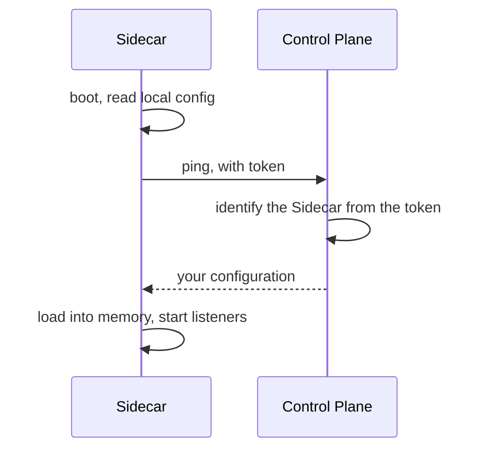

A [Sidecar](/core-concepts/sidecar) that knows nothing about a Control Plane reads its config file from disk and runs. Connecting it changes one thing: on boot, it asks the Control Plane what its configuration should be, and from then on the Control Plane owns that configuration.

---

## The handshake



Four properties fall out of this shape, and they are the reason it looks like this:

- **No session to maintain.** The Sidecar loads its configuration into memory and keeps running. A Control Plane that goes down does not take running Sidecars with it. A listener using `require_review` is the exception: it files each held statement with the Control Plane, and denies that statement while the Control Plane is unreachable.
- **The token is the authentication.** There is no second credential and no certificate exchange.
- **Ordinary HTTP.** A plain request and a plain response. Nothing is tunnelled and nothing bidirectional stays open.
- **Neither side knows the other's physical address.** The Sidecar dials out; the Control Plane never dials in. No inbound firewall rule, no NAT traversal.

---

## Steps

<Steps>
  <Step title="Issue a token in the Control Plane">
    Create a Sidecar registration and copy the token it returns. It is shown once and stored only as a hash, so losing it means registering a new Sidecar.

    The token identifies this Sidecar and authenticates it — treat it as a credential.
  </Step>
  <Step title="Point the Sidecar at the Control Plane">
    Add the Control Plane's URL to the Sidecar's config file. The token is never written to disk — it goes on the command line or in an environment variable:

    ```yaml config.yaml
    control_plane_url: https://hoop.your-company.com
    ```

    ```bash
    hoop start sidecar --config config.yaml --token "<the token you copied>"
    ```

    Or supply both through the environment, which is the shape a Kubernetes deployment wants — mount the secret, set the variables, pass no arguments:

    ```bash
    export HOOP_CONTROL_PLANE_URL=https://hoop.your-company.com
    export HOOP_SIDECAR_TOKEN=<the token you copied>
    ```
  </Step>
  <Step title="Start it">
    ```bash
    hoop start sidecar --config config.yaml --token "<the token you copied>"
    ```

    On the first start the Control Plane holds no configuration for this Sidecar. It answers `412`, the Sidecar imports the document from your local file, and then serves what the Control Plane sends back. That import happens once.
  </Step>
  <Step title="Edit the configuration in the Control Plane from now on">
    The Control Plane owns the whole document after the import — listeners included. The two are never merged. Listeners left in the local file are ignored, and the Sidecar says so at startup:

    ```
    the config file's listeners are ignored: the control plane owns the running config
    ```

    `--config` becomes optional at this point. The URL and the token are enough to start.
  </Step>
  <Step title="Confirm what it resolved">
    The admin API reports the live configuration. It only runs when the configuration names an address for it, so the document the Control Plane serves needs an `admin` block — there is no default port:

    ```yaml
    admin:
      listen: 127.0.0.1:19000
    ```

    ```bash
    curl -s localhost:19000/healthz            # ok
    curl -s localhost:19000/config | python3 -m json.tool
    ```

    The Sidecar should also appear in the Control Plane's list, with a recent check-in.
  </Step>
</Steps>

---

## The license

The organization's license lives on the Control Plane, not on each Sidecar. It rides on the handshake response, and the response carries a header saying the Control Plane owns the decision:

```
hoop-sidecar-license-managed: true
```

While that header is present, the Sidecar's own license sources — the `--license` flag, `HOOP_LICENSE` and the config file's `license` key — are ignored, and it warns at startup that it is ignoring them. A Control Plane whose organization holds no license runs the free tier.

A `license` key authored on a Sidecar's configuration in the Control Plane is refused. One organization, one license.

---

## Staying in sync

A heartbeat repeats the handshake every minute.

A change that only touches rules — guardrails, masking, PII, OPA, a listener's analyzer block — is applied in place and logged as `control plane configuration applied`. Connections already open drain under the rules they were accepted with.

A change beyond the rules — listeners, audit, admin, log level — logs `restart to apply it` instead.

A failed heartbeat changes nothing. The Sidecar keeps serving the configuration and the license it last received.

Reviews do not ride on the heartbeat. A listener using [`require_review`](/setup/configuration/hoop-sidecar/risk-analysis#holding-a-statement-for-a-person) calls the Control Plane once per held statement, and denies the statement when that call fails.

---

## Troubleshooting

| Symptom | Check |
|---|---|
| The Sidecar does not start at all | A first handshake that fails stops startup; there is no fallback to the local file. Check the URL, the token, and outbound HTTPS to the Control Plane host. |
| The Sidecar starts but never appears in the Control Plane | Outbound HTTPS to the Control Plane host. The Sidecar dials out; nothing dials in. |
| It warns that the config file's listeners are ignored | Expected once the Control Plane holds the configuration. Edit it there; the local file no longer holds it. |
| It warns that your license is ignored | Expected while the Control Plane manages licensing. Apply the license to the organization instead. |
| The admin API refuses the connection | `admin.listen` is not in the configuration the Control Plane serves. There is no default address. |
| Rules changed centrally but the Sidecar did not | Configuration is picked up on the heartbeat, not pushed. Wait up to a minute. A listener change needs a restart. |
| Authentication fails | The token is per-Sidecar. Reusing one across two Sidecars is not a supported shape. |
| Held statements are denied with `the review could not be filed` | Outbound HTTPS to the Control Plane host, and that the listener's `approval_rule` names an access request rule the Control Plane holds. A listener that holds statements fails closed. |

---

## Next

<CardGroup cols={2}>
  <Card title="Control Plane" icon="tower-control" href="/core-concepts/control-plane">
    What it manages and why the protocol is this simple.
  </Card>
  <Card title="Install the Control Plane" icon="server" href="/control-plane/install">
    Docker Compose, Kubernetes and AWS.
  </Card>
  <Card title="Config File Reference" icon="file-code" href="/setup/configuration/hoop-sidecar/config-file#control-plane">
    Every source for `control_plane_url` and the token, in precedence order.
  </Card>
</CardGroup>
