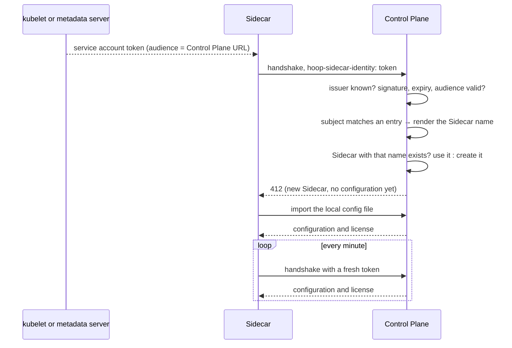

[Connect a Sidecar](/control-plane/connect-sidecar) issues one token per Sidecar before it is deployed. That works for a few Sidecars. It does not work for a fleet that automation deploys: every workspace would need a call to the Control Plane, a secret to store and a secret to inject, before the pod even exists.

A Sidecar can authenticate with the identity its platform already gives it instead:

- **A Kubernetes service account.** A projected token, signed by the cluster, rotated by the kubelet. GKE, EKS, AKS and self-managed clusters.
- **A Google service account.** An ID token from the metadata server, on GKE with Workload Identity, GCE or Cloud Run.

An admin adds one **sidecar service account** entry per cluster or project. Every workspace whose service account matches it enrolls on its first handshake. The manifest of a workspace is static: no token, no pre-step.

The token flow keeps working unchanged. A Control Plane can serve Sidecars of both kinds at the same time.

---

## How it works



- **The name is the key.** The entry turns the token's subject into a Sidecar name. The Control Plane looks the Sidecar up by that name in your organization and creates it only when none exists. Restarts, new pods, rollouts and replicas all produce the same name, so they all reach the same Sidecar.
- **The identity only authorizes.** A token proves which service account is calling; the entry decides whether that service account may reach a Sidecar, and which one.
- **First boot is the normal import.** A new Sidecar holds no configuration, so the handshake answers `412` and the Sidecar seeds it from its local config file, exactly as in [Connect a Sidecar](/control-plane/connect-sidecar). From then on the Control Plane owns the configuration.
- **The token is re-read on every request.** A projected token lives an hour by default and the kubelet replaces the file before it expires. A Google ID token is cached until five minutes before it expires.

---

## Steps

<Steps>
  <Step title="Give each workspace its own service account">
    One Kubernetes service account per workspace namespace. The same name in every namespace is enough: `hoop-sidecar` in `ws-acme` and `hoop-sidecar` in `ws-beta` are two identities, because the namespace is part of the subject.

    ```
    system:serviceaccount:ws-acme:hoop-sidecar
    system:serviceaccount:ws-beta:hoop-sidecar
    ```

    On Google, one service account per workspace, for example `sidecar-acme@my-project.iam.gserviceaccount.com`.
  </Step>

  <Step title="Add a sidecar service account entry">
    One entry per cluster (Kubernetes) or per project (Google). Entries are managed through the API by an admin; the organization needs an Enterprise license.

    Read the cluster's issuer:

    ```bash
    kubectl get --raw /.well-known/openid-configuration | jq -r .issuer
    # GKE: https://container.googleapis.com/v1/projects/my-project/locations/europe-west1/clusters/eu
    # EKS: https://oidc.eks.us-east-1.amazonaws.com/id/EXAMPLED539D4633E53DE1B71EXAMPLE
    ```

    Create the entry:

    ```bash
    curl -X POST https://hoop.your-company.com/api/sidecar-service-accounts \
      -H "Authorization: Bearer $HOOP_API_KEY" \
      -H "Content-Type: application/json" \
      -d '{
        "name": "gke-eu",
        "issuer": "https://container.googleapis.com/v1/projects/my-project/locations/europe-west1/clusters/eu",
        "audience": "https://hoop.your-company.com",
        "claim": "sub",
        "subject_pattern": "system:serviceaccount:ws-*:hoop-sidecar",
        "name_template": "gke-eu-{1}"
      }'
    ```

    With this entry, the service account `hoop-sidecar` in namespace `ws-acme` reaches the Sidecar `gke-eu-acme`. See [The entry](#the-entry) for every field.
  </Step>

  <Step title="Deploy the workspace">
    <Tabs>
      <Tab title="Helm chart">
        ```yaml values.yaml
        serviceAccount:
          create: true
          name: hoop-sidecar
        controlPlane:
          url: https://hoop.your-company.com
          identity: kubernetes
        config:
          listeners:
            - name: appdb
              protocol: postgres
              listen: 0.0.0.0:15432
              upstream: appdb.ws-acme.svc.cluster.local:5432
          admin:
            listen: 0.0.0.0:19000
        ```

        The chart mounts a projected token with the Control Plane URL as its audience and sets `HOOP_SIDECAR_IDENTITY_TOKEN_FILE`. It refuses to render `controlPlane.token` and `controlPlane.identity` together.
      </Tab>
      <Tab title="Kubernetes manifest">
        ```yaml
        spec:
          serviceAccountName: hoop-sidecar
          containers:
          - name: sidecar
            image: hoophq/hoopsidecar:latest
            env:
            - {name: HOOP_CONTROL_PLANE_URL, value: https://hoop.your-company.com}
            - {name: HOOP_SIDECAR_IDENTITY_TOKEN_FILE, value: /var/run/hoop-sidecar/token}
            volumeMounts:
            - {name: config, mountPath: /etc/hoop-inspect, readOnly: true}
            - {name: hoop-sidecar-identity, mountPath: /var/run/hoop-sidecar, readOnly: true}
          volumes:
          - name: config
            configMap: {name: hoop-sidecar}   # key config.yaml, imported on the first boot
          - name: hoop-sidecar-identity
            projected:
              sources:
              - serviceAccountToken:
                  audience: https://hoop.your-company.com
                  expirationSeconds: 3600
                  path: token
        ```

        The image reads its config file from `/etc/hoop-inspect/config.yaml`; the first boot imports it. Use a projected token with the Control Plane URL as its audience, not the default service account token: that one's audience is the Kubernetes API server, and the Control Plane refuses it.
      </Tab>
      <Tab title="Google service account">
        ```bash
        export HOOP_CONTROL_PLANE_URL=https://hoop.your-company.com
        export HOOP_SIDECAR_IDENTITY_GCP=true
        hoop start sidecar --config config.yaml
        ```

        The pod or instance runs as the Google service account. With the Helm chart, set `controlPlane.identity: gcp` and annotate the service account for Workload Identity.
      </Tab>
    </Tabs>
  </Step>

  <Step title="Check it enrolled">
    The Sidecar log says:

    ```
    control plane connected  url=https://hoop.your-company.com
    configuration imported into the control plane  listeners=1
    ```

    `GET /api/sidecars` lists it under the rendered name, with the service account that reached it in `identity_issuer` and `identity_subject`, and a recent `last_seen_at`.
  </Step>
</Steps>

---

## Credentials on the Sidecar

A Sidecar connected to a Control Plane uses exactly one credential. Two set at once is a startup error that names both.

| Variable | Credential |
|---|---|
| `HOOP_SIDECAR_TOKEN`, or `--token` | The token issued by `POST /api/sidecars`. Unchanged. |
| `HOOP_SIDECAR_IDENTITY_TOKEN_FILE` | Path to a projected Kubernetes service account token. Read on every request; an empty file or one over 16 KiB is refused. |
| `HOOP_SIDECAR_IDENTITY_GCP` | `true` fetches a Google ID token from the metadata server with the Control Plane URL as audience. `GCE_METADATA_HOST` overrides the metadata host. |

The identity travels in the `hoop-sidecar-identity` request header. A credential set without `HOOP_CONTROL_PLANE_URL`, or a URL without a credential, stops startup with a message that names the fix.

---

## The entry

| Field | Meaning |
|---|---|
| `name` | A label for the entry, unique in the organization. |
| `issuer` | The exact `iss` of the tokens. An `https` URL; the Control Plane fetches its keys through OIDC discovery at `{issuer}/.well-known/openid-configuration`, unless `jwks` is set. |
| `audience` | The `aud` the tokens must carry. Use the Control Plane URL the Sidecars dial. |
| `claim` | `sub` for a Kubernetes service account, `email` for a Google service account. With `email`, the token must carry `email_verified: true`. |
| `subject_pattern` | An exact value, or one with a single `*` that matches one or more characters. |
| `name_template` | The Sidecar name a matching token reaches. `{1}` is the text the `*` matched. The rendered name must be a valid resource name. |
| `jwks` | Optional. A static key set, for a cluster whose issuer the Control Plane cannot reach. |
| `allow_any_subject` | Allows the bare `*` pattern. See [Any valid identity](#any-valid-identity). |

### Clusters the Control Plane cannot reach

GKE and EKS publish their issuer's keys on the internet, so discovery needs nothing more. A self-managed cluster, or AKS without its OIDC issuer enabled, usually does not. Paste the cluster's key set into the entry instead:

```bash
kubectl get --raw /openid/v1/jwks
```

```json
{ "name": "onprem", "issuer": "https://kubernetes.default.svc.cluster.local", "jwks": { "keys": [ ... ] }, ... }
```

A static key set does not follow a rotation of the cluster's signing key. Update the entry when the cluster rotates it.

### Several clusters

Give each cluster's entry its own prefix. Two clusters that both have a `ws-acme` namespace then reach two Sidecars, not one:

| Entry | Issuer | `name_template` | `ws-acme` becomes |
|---|---|---|---|
| `gke-eu` | the EU cluster | `gke-eu-{1}` | `gke-eu-acme` |
| `gke-us` | the US cluster | `gke-us-{1}` | `gke-us-acme` |

Without the prefix, both clusters render `acme` and share one Sidecar and its configuration.

### Which entry wins

- An exact `subject_pattern` beats a wildcard one.
- Among wildcards, the one with the longest literal text wins.
- A token that matches entries in more than one organization is refused.

### One organization per issuer and audience

An `issuer` and `audience` pair belongs to one organization. Another organization that writes the same pair gets `409`:

```
this issuer and audience are already used by another organization; use an audience unique to your organization (for example the control plane URL with a path naming your organization)
```

Several entries in the same organization may share a pair, for example one per namespace pattern in one cluster.

### Any valid identity

A bare `*` pattern admits every service account of the issuer. It needs `"allow_any_subject": true`, set on purpose:

```json
{ "issuer": "<your cluster's issuer>", "subject_pattern": "*", "allow_any_subject": true, "name_template": "gke-eu-{1}", ... }
```

Use it only on an issuer your organization owns, such as your own cluster. It is refused for `https://accounts.google.com`: every Google account in the world holds a valid token from that issuer. A Google entry must use `claim: email` and end in a literal `@<project>.iam.gserviceaccount.com`:

```json
{ "issuer": "https://accounts.google.com", "claim": "email", "subject_pattern": "sidecar-*@my-project.iam.gserviceaccount.com", "name_template": "gcp-{1}", ... }
```

---

## What happens when…

| Event | Result |
|---|---|
| The pod restarts, is rescheduled, or rolls out with new pod names | Same name, same Sidecar, same configuration. Nothing is created. |
| The Deployment has several replicas, or scales | All replicas reach one Sidecar. Its check-in shows whichever pod handshook last. |
| The projected token rotates | The Sidecar reads the new file on its next request. Nothing restarts. |
| The local `config.yaml` changes after the first boot | Ignored. The Control Plane owns the configuration, and the Sidecar logs `the config file's listeners are ignored: the control plane owns the running config`. Edit the configuration in the Control Plane. |
| A Sidecar with the rendered name already exists, created with a token | The service account reaches it. Its configuration stays, and its token keeps working. |
| The service account or namespace is renamed | The entry renders a new name, so a new Sidecar is created with an empty configuration. To keep the old one, add an exact entry for the new subject whose `name_template` is the old name; an exact entry beats a wildcard. |
| An admin deletes the Sidecar | It stays deleted. The next handshake gets `401` and nothing is created. Clear the name to allow it again; the next boot then creates a new Sidecar and imports the local file. |
| A service account matches no entry | `401`, nothing created. The message names the subject. |
| Both a token and an identity are set | The Sidecar refuses to start. A request that carries both headers gets `400`. |
| The Control Plane is unreachable at boot | The Sidecar does not start, as with a token. Running Sidecars keep serving their last configuration. |

### Deleted names

Deleting a Sidecar that a service account reached records its name, so the next heartbeat does not bring it back. Deleting a Sidecar created with a token records nothing; its token simply stops working.

```bash
# names that are blocked
curl https://hoop.your-company.com/api/sidecar-deleted-names -H "Authorization: Bearer $HOOP_API_KEY"

# allow one again
curl -X DELETE https://hoop.your-company.com/api/sidecar-deleted-names/gke-eu-acme -H "Authorization: Bearer $HOOP_API_KEY"
```

Deleting, clearing the name and restarting the pod is also how a Sidecar starts over from its local config file.

### Revoking access

- One workspace: delete or disable its service account, or delete its Sidecar.
- A whole cluster: narrow or delete its entry.

Deleting the entry stops every Sidecar it admitted at its next heartbeat; they keep serving their last configuration while the Control Plane refuses them.

---

## Fleets

- **One entry per cluster, not per workspace.** 2,000 workspaces in one cluster are one entry and 2,000 Sidecars.
- **One service account per workspace.** A service account shared by several workspaces is one identity: all of them reach the same Sidecar and serve the same configuration, and any of them can read it.
- **Rules are copied per Sidecar.** Each Sidecar imports the rules in its own config file as its own rule items. A rule shared by the whole fleet is changed in each copy, or in each file followed by a fresh import.
- **Rows outlive workspaces.** A torn-down workspace leaves its Sidecar in the list. Delete it when the workspace goes away.

---

## Troubleshooting

The Sidecar prints the Control Plane's reason after the subject it presented:

```
the control plane at https://hoop.your-company.com rejected the service account identity (issuer "…", subject "system:serviceaccount:ws-acme:hoop-sidecar"): <reason>
```

| Reason | Fix |
|---|---|
| `no sidecar service account is configured for the token's issuer` | No entry names this exact `issuer`. Compare it with the `iss` the cluster reports, character for character. |
| `the service account token failed verification: …` | The audience in the projected token differs from the entry's `audience`, the token expired, or the keys do not match (a static `jwks` that is out of date). |
| `no sidecar service account of this issuer allows subject "…"` | The subject does not match any `subject_pattern`. Check the namespace and the service account name. |
| `the token's email is not verified` | A Google token without `email_verified: true`. |
| `… renders the sidecar name "…", which is refused` | The rendered name is not a valid resource name. Change `name_template` or the pattern. |
| `the token matches sidecar service accounts in more than one organization` | Two organizations admit this subject. Narrow the patterns. |
| `this sidecar was deleted in the control plane` | Clear the name in [Deleted names](#deleted-names). |
| `access denied`, with no other reason | The Control Plane predates service account support. Upgrade it before the Sidecars. |
| `more than one control plane credential is set` | Set only one of `HOOP_SIDECAR_TOKEN`, `HOOP_SIDECAR_IDENTITY_TOKEN_FILE` and `HOOP_SIDECAR_IDENTITY_GCP`. |

---

## API

All routes need an admin and an Enterprise license.

| Route | Purpose |
|---|---|
| `GET /api/sidecar-service-accounts` | List entries |
| `POST /api/sidecar-service-accounts` | Create an entry. `409` for a duplicate name or pattern, or an issuer and audience another organization uses; `422` for an invalid field |
| `GET /api/sidecar-service-accounts/{id}` | Read one |
| `PUT /api/sidecar-service-accounts/{id}` | Replace one |
| `DELETE /api/sidecar-service-accounts/{id}` | Delete one |
| `GET /api/sidecar-deleted-names` | Names a deleted Sidecar blocks |
| `DELETE /api/sidecar-deleted-names/{name}` | Allow a name again |

---

## Next

<CardGroup cols={2}>
  <Card title="Connect a Sidecar" icon="plug" href="/control-plane/connect-sidecar">
    The handshake, the license and staying in sync.
  </Card>
  <Card title="Kubernetes" icon="dharmachakra" href="/install/kubernetes#control-plane">
    The Helm chart's Control Plane attributes.
  </Card>
</CardGroup>
