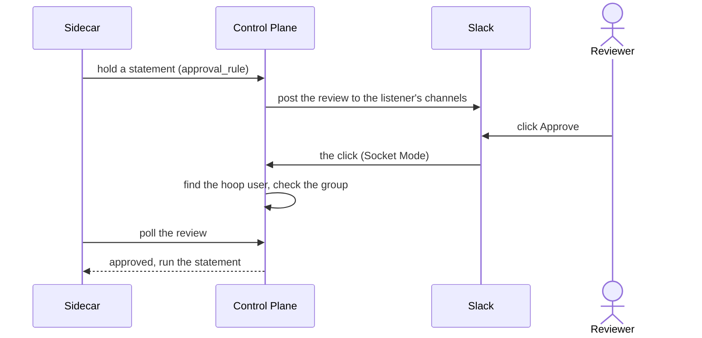

When a listener holds a statement for a person ([`require_review`](/setup/configuration/hoop-sidecar/risk-analysis#holding-a-statement-for-a-person)), the Control Plane posts a review to Slack. A reviewer clicks **Approve** or **Reject** in the message. They never open the Control Plane: hoop finds the hoop user behind the Slack user and checks that user's groups.

<Note>
This page is for the Control Plane. For the Gateway, see [Slack](/integrations/slack).
</Note>

---

## How it works



- **Channels are per listener.** A listener without channels uses the fallback channel.
- **Reviewers are hoop users.** They come from Slack user groups (the Slack import) or from the Users page.
- **Socket Mode.** The Control Plane dials out to Slack. No inbound URL is exposed.

---

## Requirements

- Permission to [create a Slack app](https://api.slack.com/apps) and install it in your workspace.
- An admin user on the Control Plane.
- A paid Slack plan (Pro or higher) for the Slack import: Slack user groups do not exist on the free plan. Without it, add reviewers on the Users page.
- **One Slack app for this Control Plane only.** Slack sends each click to any open connection of the app. A Gateway or a second Control Plane on the same app token takes clicks that are not theirs.
- **One Control Plane replica** with Slack configured. See [Replicas and Deployment Strategy](/control-plane/deployment/kubernetes#replicas-and-deployment-strategy).

---

## 1. Create the Slack app

<Steps>
  <Step title="Create the app from a manifest">
    Open [a new Slack app from an app manifest](https://api.slack.com/apps?new_app=1), choose the workspace and paste this manifest.

    <AccordionGroup>
      <Accordion title="slack-manifest.json">
        ```json
        {
          "display_information": {
            "name": "hoop",
            "description": "Review statements held by hoop sidecars",
            "background_color": "#7a7879"
          },
          "features": {
            "bot_user": {
              "display_name": "Hoop Bot",
              "always_online": true
            }
          },
          "oauth_config": {
            "scopes": {
              "bot": [
                "chat:write",
                "chat:write.public",
                "users:read",
                "users:read.email",
                "usergroups:read"
              ]
            }
          },
          "settings": {
            "interactivity": {
              "is_enabled": true
            },
            "org_deploy_enabled": false,
            "socket_mode_enabled": true,
            "token_rotation_enabled": false
          }
        }
        ```
      </Accordion>
    </AccordionGroup>

    | Scope | Why |
    |-------|-----|
    | `chat:write` | Post and update reviews, and answer a reviewer privately |
    | `chat:write.public` | Post to public channels without inviting the bot |
    | `users:read` | Read the Slack user who clicked, and the members for the import |
    | `users:read.email` | Match a Slack user to a hoop user by email |
    | `usergroups:read` | List user groups for the import |
  </Step>
  <Step title="Install it">
    Click **Install to Workspace**. Then open **OAuth & Permissions** and copy the **Bot User OAuth Token** (`xoxb-…`).
  </Step>
  <Step title="Create the app-level token">
    Open **Basic Information** → **App-Level Tokens** → **Generate Token and Scopes**. Name it `hoop`, add the scope `connections:write`, and copy the token (`xapp-…`).
  </Step>
  <Step title="Prepare the channels">
    Choose a fallback channel, and optionally one channel per listener. For a **private** channel, invite the bot: type `/invite @Hoop Bot` in the channel.

    hoop takes channel **IDs**, not names. Open the channel details and copy the **Channel ID** at the bottom (`C0…`).
  </Step>
</Steps>

<Tip>
Already have a Slack app for hoop? Add the three `users:*` and `usergroups:read` scopes and reinstall it. Slack does not apply new scopes before a reinstall. Do not share it with a Gateway.
</Tip>

---

## 2. Configure the Control Plane

<Steps>
  <Step title="Save the tokens">
    Go to **Settings** → **Slack** → **Configurations**. Paste the **Slack bot token** and the **Slack app token**. Optionally set the **Fallback channel**: it receives the reviews of listeners with no channel. Click **Save**.

    The Control Plane log shows `connected to Slack with Socket Mode`.
  </Step>
  <Step title="Choose a channel per listener">
    Open the **Listeners** tab. It lists every listener of every Sidecar. Type the channel IDs in a listener's row and click **Save** on that row.

    A listener with no channel posts to the fallback channel. With neither, the review is filed but nobody is notified in Slack, and the Control Plane logs a warning.
  </Step>
</Steps>

---

## 3. Add reviewers

A reviewer is a hoop user in the group the rule names. Add them in one of two ways.

<Tabs>
  <Tab title="Slack import">
    The members of the Slack user groups you pick become hoop users. `@dba-leads` becomes the group `dba-leads`.

    1. Go to **Settings** → **Users** → **Slack import**.
    2. Pick the user groups and the sync interval (5 minutes or more).
    3. Click **Save**, then **Sync now**.
    4. Open **Members**: the users show with their groups and Slack ID.

    What a run does:

    - Finds each member by Slack ID, then by email, else creates the user. The Slack ID links the two.
    - Skips bots, guests, deactivated users and users of other organizations.
    - Keeps the group name of the first import. A rename in Slack does not rename the hoop group, so the rules that name it keep working.
    - A member who leaves the user group loses the hoop group and keeps the account.
    - A user deactivated in Slack is deactivated in hoop, never an admin. The import never reactivates a user.
    - Refuses a user group named `admin`, `auditor` or `approver`.
    - Writes one audit entry with who joined and left each group.

    While the import is on, an SSO login does not overwrite the imported groups. **Remove** stops the import and keeps the users and their groups.

    <Warning>
    Whoever can edit a picked user group chooses who approves. In Slack, go to **Workspace settings** → **Permissions** → **User Groups** and allow only admins to create and edit user groups.
    </Warning>
  </Tab>
  <Tab title="Users page">
    Go to **Settings** → **Users** → **Members** → **Add User**. Use the reviewer's Slack email, and add the group.

    If the emails differ, set the **Slack ID** on the user. To copy it in Slack: open the person's profile → **⋮** → **Copy member ID** (`U…`).
  </Tab>
</Tabs>

---

## 4. Name the reviewers on the rule

Go to **AI Analyzer** and open the rule. Set a risk level to **Hold for approval**, then add the groups in **Reviewers**. The Control Plane sets the listener's `approval_rule` to this rule for you. See [Holding a statement for a person](/setup/configuration/hoop-sidecar/risk-analysis#holding-a-statement-for-a-person).

---

## 5. Approve in Slack

The review shows the Sidecar, the listener, the statement and the groups that may approve. **Reject** asks for an optional comment.

On a click, hoop finds the approver:

1. The hoop user with that Slack ID.
2. Else, exactly one hoop user with the Slack user's email.

On both paths, Slack must still vouch for the user: not deactivated, not a guest, and in your workspace. The hoop user must be active or invited, and in the group of the button. Otherwise only the clicker sees why:

| Message | Cause | Fix |
|---------|-------|-----|
| `You do not belong to group "…"` | The user is not in that group | Add them to the group, or to the Slack user group and sync |
| `No Hoop user has the email …` | No hoop user with that email | Add the user, or run the import |
| `More than one Hoop user has the email …` | Two users share the email | Fix it on the Users page |
| `Hoop could not read the email of your Slack user…` | The app lacks `users:read.email` | Add the scope and reinstall, or set the Slack ID |
| `Hoop could not verify your Slack user. Ask an admin to add the users:read scope…` | The app lacks `users:read` | Add the scope and reinstall |
| `Your Slack user is deactivated.` | The Slack account is deactivated | None: a deactivated user cannot approve |
| `Your Hoop user is not active…` | The hoop user is deactivated | Reactivate it on the Users page |
| `Confirm the email of your Slack user…` | Unconfirmed email in Slack | The user confirms it in Slack |
| `Slack guests cannot approve a review.` | Slack guest | Use a full member |
| `Users from another Slack workspace cannot approve a review.` | Slack Connect user | Use a member of your workspace |

The Sidecar sees the approval on its next poll, within 5 seconds.

---

## Troubleshooting

- **No message in Slack.** The bot is not in the private channel, the channel ID is wrong, the listener has no channel and there is no fallback, or the log lacks `connected to Slack with Socket Mode`.
- **A click does nothing, or answers "You are not registered".** Another server uses the same app token, usually a Gateway. Give the Control Plane its own app.
- **Each review arrives twice.** Two Control Plane replicas run with Slack configured. Run one.
- **The Slack import shows no user groups.** The app lacks `usergroups:read` (add it and reinstall), or the Slack plan has no user groups.
- **A sync fails with "no longer exists".** The user group was deleted in Slack. Remove it from the import.
- **A sync fails with "slack returned no email".** The app lacks `users:read.email`. Add it and reinstall the app. The run writes nothing until then.

---

## Differences from the Gateway

The Sidecar reports a statement, not a person, so the requester is unknown. Compared with the [Gateway](/integrations/slack):

- No `/hoop subscribe`: add reviewers with the Slack import or on the Users page.
- Channels are set per listener, not per connection.
- No message to the requester, no requester groups and no self-approval check.
