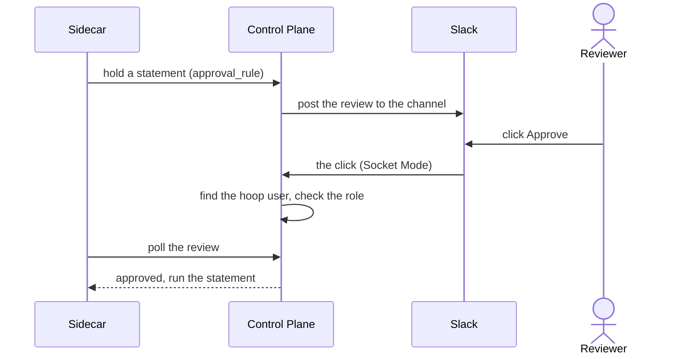

When a listener holds a statement for a person ([`require_review`](/setup/configuration/hoop-sidecar/risk-analysis#holding-a-statement-for-a-person)), the Control Plane posts a review to Slack. A reviewer clicks **Approve** or **Reject** in the message. They never open the Control Plane: hoop finds the hoop user behind the Slack user and checks their role.

<Note>
This page is for the Control Plane. For the Gateway, see [Slack](/integrations/slack).
</Note>

---

## How it works



- **One channel.** Every review goes to the channel set in the Slack settings.
- **Reviewers are hoop users.** An administrator or an approver on the Users page, with their Slack ID set.
- **Socket Mode.** The Control Plane dials out to Slack. No inbound URL is exposed.

---

## Requirements

- Permission to [create a Slack app](https://api.slack.com/apps) and install it in your workspace.
- An admin user on the Control Plane.
- **One Slack app for this Control Plane only.** Slack sends each click to any open connection of the app. A Gateway or a second Control Plane on the same app token takes clicks that are not theirs.
- **One Control Plane replica** with Slack configured. See [Replicas and Deployment Strategy](/control-plane/deployment/kubernetes#replicas-and-deployment-strategy).

---

## 1. Create the Slack app

<Steps>
  <Step title="Create the app from a manifest">
    Open [a new Slack app from an app manifest](https://api.slack.com/apps?new_app=1), choose the workspace and paste this manifest.

    <AccordionGroup>
      <Accordion title="slack-manifest.json">
        ```json
        {
          "display_information": {
            "name": "hoop",
            "description": "Review statements held by hoop sidecars",
            "background_color": "#7a7879"
          },
          "features": {
            "bot_user": {
              "display_name": "Hoop Bot",
              "always_online": true
            }
          },
          "oauth_config": {
            "scopes": {
              "bot": [
                "chat:write",
                "chat:write.public",
                "usergroups:read"
              ]
            }
          },
          "settings": {
            "interactivity": {
              "is_enabled": true
            },
            "org_deploy_enabled": false,
            "socket_mode_enabled": true,
            "token_rotation_enabled": false
          }
        }
        ```
      </Accordion>
    </AccordionGroup>

    | Scope | Why |
    |-------|-----|
    | `chat:write` | Post and update reviews, and answer a reviewer privately |
    | `chat:write.public` | Post to a public channel without inviting the bot |
    | `usergroups:read` | Optional. Check the reviewer against a Slack user group named after the role, see [Approve in Slack](#5-approve-in-slack) |
  </Step>
  <Step title="Install it">
    Click **Install to Workspace**. Then open **OAuth & Permissions** and copy the **Bot User OAuth Token** (`xoxb-…`).
  </Step>
  <Step title="Create the app-level token">
    Open **Basic Information** → **App-Level Tokens** → **Generate Token and Scopes**. Name it `hoop`, add the scope `connections:write`, and copy the token (`xapp-…`).
  </Step>
  <Step title="Prepare the channel">
    Choose the channel that receives the reviews. For a **private** channel, invite the bot: type `/invite @Hoop Bot` in the channel.

    hoop takes the channel **ID**, not the name. Open the channel details and copy the **Channel ID** at the bottom (`C0…`).
  </Step>
</Steps>

<Tip>
Already have a Slack app for hoop? Do not share it with a Gateway. Create a second app for the Control Plane.
</Tip>

---

## 2. Configure the Control Plane

- Go to **Settings** → **Slack**.
- Paste the **Slack bot token** and the **Slack app token**.
- Paste the **Slack channel** ID.
- Click **Save**.

The Control Plane log shows `connected to Slack with Socket Mode`.

<Warning>
Without a channel, the Control Plane files the review but posts nothing. The log shows `the org has no default slack channel, nobody was notified of this review`.
</Warning>

---

## 3. Add reviewers

A reviewer is a hoop user with the **Administrator** or **Approver** role. Go to **Settings** → **Users** → **Add User**, pick the role, and set the **Slack ID**.

To copy the Slack ID: in Slack, open the person's profile → **⋮** → **Copy member ID** (`U…`).

<Note>
A click from a Slack user with no hoop user behind it is refused with `You are not registered`. The Slack ID is what links the two.
</Note>

---

## 4. Hold statements on the rule

Go to **AI Analyzer** and open the rule. Set a risk level to **Hold for approval** and save. The Control Plane sets the listener's `approval_rule` for you and creates the access request rule behind it, named after the analyzer rule. Its reviewers are the `approver` and `admin` roles, and one approval releases the statement. See [Holding a statement for a person](/setup/configuration/hoop-sidecar/risk-analysis#holding-a-statement-for-a-person).

---

## 5. Approve in Slack

The review shows the Sidecar, the listener, the statement and one button per role that may approve. **Reject** asks for an optional comment.

On a click, hoop finds the hoop user with that Slack ID, then checks the role of the button:

1. If the workspace has a Slack user group whose handle or name equals the role (`@approver`, `@admin`), the clicker must be a member of it. This needs the `usergroups:read` scope.
2. Otherwise, the hoop user must have that role.

When the check fails, only the clicker sees why:

| Message | Cause | Fix |
|---------|-------|-----|
| `You are not registered…` | No hoop user has that Slack ID | Set the Slack ID on the user |
| `You do not belong to group "…"` | The user does not have that role | Change the role on the Users page |
| `You do not belong to the Slack group @… mapped to group "…"` | A Slack user group has the role's name and the user is not in it | Add the user to that Slack user group, or rename the user group |

The Sidecar sees the approval on its next poll, within 5 seconds.

---

## Troubleshooting

- **No message in Slack.** The bot is not in the private channel, the channel ID is wrong, no channel is set, or the log lacks `connected to Slack with Socket Mode`.
- **A click does nothing.** Another server uses the same app token, usually a Gateway. Give the Control Plane its own app.
- **Each review arrives twice.** Two Control Plane replicas run with Slack configured. Run one.
- **The log says `failed listing slack user groups`.** The app lacks `usergroups:read`. hoop falls back to the hoop role. Add the scope and reinstall the app, or ignore it.

---

## Differences from the Gateway

The Sidecar reports a statement, not a person, so the requester is unknown. Compared with the [Gateway](/integrations/slack):

- No `/hoop subscribe`: add reviewers on the Users page, with their Slack ID.
- One channel for every review, not one per resource role.
- Reviewers are the `approver` and `admin` roles, not the groups of a rule.
- No message to the requester, no requester groups and no self-approval check.
