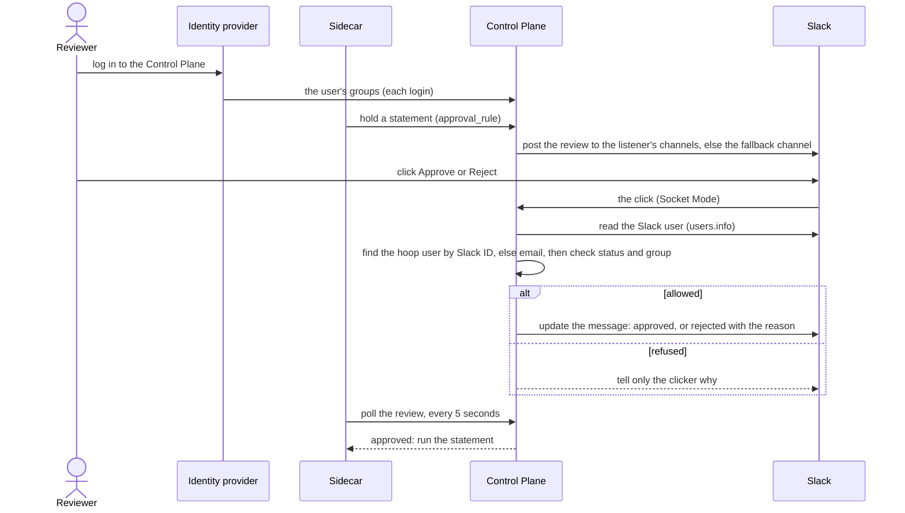

When a listener holds a statement for a person ([`require_review`](/setup/configuration/hoop-sidecar/risk-analysis#holding-a-statement-for-a-person)), the Control Plane posts a review to Slack. A reviewer clicks **Approve** or **Reject** in the message. hoop finds the hoop user behind the Slack user by email and checks that user's groups.

<Note>
This page is for the Control Plane. For the Gateway, see [Slack](/integrations/slack).
</Note>

---

## How it works



- **Reviewers are hoop users.** Their groups come from your identity provider at each login.
- **Channels are per listener.** A listener without channels uses the fallback channel.
- **Socket Mode.** The Control Plane dials out to Slack. No inbound URL is exposed.

---

## Requirements

- Permission to [create a Slack app](https://api.slack.com/apps) and install it in your workspace.
- An admin user on the Control Plane.
- **One Slack app for this Control Plane only.** Slack sends each click to any open connection of the app. A Gateway or a second Control Plane on the same app token takes clicks that are not theirs.
- **One Control Plane replica** with Slack configured. See [Replicas and Deployment Strategy](/control-plane/deployment/kubernetes#replicas-and-deployment-strategy).

---

## 1. Create the Slack app

<Steps>
  <Step title="Create the app from a manifest">
    Open [a new Slack app from an app manifest](https://api.slack.com/apps?new_app=1), choose the workspace and paste this manifest.

    <AccordionGroup>
      <Accordion title="slack-manifest.json">
        ```json
        {
          "display_information": {
            "name": "hoop",
            "description": "Review statements held by hoop sidecars",
            "background_color": "#7a7879"
          },
          "features": {
            "bot_user": {
              "display_name": "Hoop Bot",
              "always_online": true
            }
          },
          "oauth_config": {
            "scopes": {
              "bot": [
                "chat:write",
                "chat:write.public",
                "users:read",
                "users:read.email"
              ]
            }
          },
          "settings": {
            "interactivity": {
              "is_enabled": true
            },
            "org_deploy_enabled": false,
            "socket_mode_enabled": true,
            "token_rotation_enabled": false
          }
        }
        ```
      </Accordion>
    </AccordionGroup>

    | Scope | Why |
    |-------|-----|
    | `chat:write` | Post and update reviews, and answer a reviewer privately |
    | `chat:write.public` | Post to public channels without inviting the bot |
    | `users:read` | Read the Slack user who clicked |
    | `users:read.email` | Match a Slack user to a hoop user by email |
  </Step>
  <Step title="Install it">
    Click **Install to Workspace**. Then open **OAuth & Permissions** and copy the **Bot User OAuth Token** (`xoxb-…`).
  </Step>
  <Step title="Create the app-level token">
    Open **Basic Information** → **App-Level Tokens** → **Generate Token and Scopes**. Name it `hoop`, add the scope `connections:write`, and copy the token (`xapp-…`).
  </Step>
  <Step title="Prepare the channels">
    Choose a fallback channel, and optionally one channel per listener. For a **private** channel, invite the bot: type `/invite @Hoop Bot` in the channel.

    hoop takes channel **IDs**, not names. Open the channel details and copy the **Channel ID** at the bottom (`C0…`).
  </Step>
</Steps>

<Tip>
Already have a Slack app for hoop? Add the `users:read` and `users:read.email` scopes and reinstall it. Slack does not apply new scopes before a reinstall. Do not share it with a Gateway.
</Tip>

---

## 2. Configure the Control Plane

<Steps>
  <Step title="Save the tokens">
    Go to **Settings** → **Slack** → **Configurations**. Paste the **Slack bot token** and the **Slack app token**. Optionally set the **Fallback channel**: it receives the reviews of listeners with no channel. Click **Save**.

    The Control Plane log shows `connected to Slack with Socket Mode`.
  </Step>
  <Step title="Choose a channel per listener">
    Open the **Listeners** tab. It lists every listener of every Sidecar. Type the channel IDs in a listener's row and click **Save** on that row.

    A listener with no channel posts to the fallback channel. With neither, the review is filed but nobody is notified in Slack, and the Control Plane logs a warning.
  </Step>
</Steps>

---

## 3. Give reviewers their groups

A reviewer is a hoop user in a group the rule names. The groups come from the login:

- **With an identity provider (OIDC or SAML):** each login replaces the user's groups with the ones the provider sends. OIDC keeps the admin group; SAML does not. For OIDC, set `IDP_GROUPS_CLAIM` to the claim that holds them. See [Identity provider](/control-plane/environment-variables#identity-provider).
- **With local auth**, or a login that sends no groups: set the groups on **Settings** → **Users**.

A reviewer needs a hoop user: they log in once, or an admin adds them on **Settings** → **Users**. With an identity provider, no invitation is needed: the first login creates the user. With local auth, only an admin creates users. A group change in the identity provider reaches hoop at the reviewer's next login. After login, an admin lands on **Sidecars** and every other user on **Reviews**.

<Warning>
Microsoft Entra ID sends group IDs (GUIDs) by default, not names. Name those IDs on the rule, or configure Entra to send group names.
</Warning>

If a reviewer's Slack email differs from their hoop email, set their **Slack ID** on **Settings** → **Users**. To copy it in Slack: open the person's profile → **⋮** → **Copy member ID** (`U…`).

---

## 4. Name the reviewers on the rule

Go to **AI Analyzer** and open the rule. Set a risk level to **Hold for approval**, then pick the groups in **Reviewers**. The list shows every group of the organization. One approval from any of them releases the statement.

With no group, the admin group reviews. The Control Plane sets the listener's `approval_rule` to this rule for you. See [Holding a statement for a person](/setup/configuration/hoop-sidecar/risk-analysis#holding-a-statement-for-a-person).

---

## 5. Approve in Slack

The review shows the Sidecar, the listener, the statement and one button per group that may approve. **Reject** asks for an optional reason. **More details** opens the review on the Control Plane **Reviews** page, which every signed-in user can open.

On a click, hoop finds the approver:

1. The hoop user with that Slack ID.
2. Else, exactly one hoop user with the Slack user's email.

The user must be active or invited, and in the group of the button. Otherwise only the clicker sees why: see [Messages in Slack](#messages-in-slack).

The Sidecar sees the approval on its next poll, within 5 seconds.

---

## Messages in Slack

### On the review message

Everyone in the channel sees these. They replace the buttons as the review changes, whether a reviewer acts in Slack, on the Reviews page or through the API.

| Message | Meaning |
|---------|---------|
| `<email> approved this session at <time>` | That group approved |
| `<email> rejected this session at <time>` | That group rejected |
| `Approved by N of M required group(s)` | More approvals are needed; the other buttons stay |
| `Session ready to be executed!` | The review is approved; the Sidecar runs the statement on its next poll |
| `Rejection reason:` followed by the quoted text | The reason the reviewer typed when rejecting |

### Only to the person who clicked

hoop checks a click in this order and answers with the first check that fails. **Reject** asks for the reason before these checks run, so a refused reviewer sees the answer after sending the reason.

**The Slack user**

| Message | Cause | Fix |
|---------|-------|-----|
| `Hoop could not verify your Slack user. Try again.` | Slack answered `users.info` with an error | Click again. If it persists, check the Control Plane log |
| `Hoop could not verify your Slack user. Ask an admin to add the users:read scope to the Slack app and reinstall it.` | The Slack ID is set on the hoop user, and the app lacks `users:read` | Add the scope and reinstall the app |
| `Hoop could not read the email of your Slack user. Ask an admin to add the users:read.email scope to the Slack app, or to set your Slack ID on the Users page.` | The app lacks `users:read.email`, or Slack returns no email | Add the scope and reinstall, or set the Slack ID on the Users page |
| `Your Slack user is deactivated.` | The Slack account is deactivated | Use an active Slack account |
| `A bot cannot approve a review.` | A bot or an app clicked | A person approves |
| `Slack guests cannot approve a review.` | The user is a guest in Slack | Use a full member |
| `Users from another Slack workspace cannot approve a review.` | A Slack Connect user, or a workspace outside your Enterprise Grid | Use a member of your workspace |
| `Confirm the email of your Slack user before approving a review.` | The email is not confirmed in Slack. Checked only when hoop matches by email | The user confirms the email in Slack |

**The hoop user**

| Message | Cause | Fix |
|---------|-------|-----|
| `No Hoop user has the email <email>. Log in to Hoop once, or ask an admin to add you on the Users page.` | No active or invited hoop user has that email. A deactivated user matched by email gets this too | Open the login link under the message, or an admin adds or reactivates the user on the Users page |
| `More than one Hoop user has the email <email>. Ask an admin to fix it on the Users page.` | Two hoop users share the email | Remove or change one on the Users page |
| `Your Hoop user is not active. Ask an admin to reactivate it on the Users page.` | The Slack ID is set on a deactivated hoop user | Reactivate the user on the Users page |
| `failed obtaining approver's information` | The Control Plane could not read its database | Click again. If it persists, check the Control Plane log |

**The group**

| Message | Cause | Fix |
|---------|-------|-----|
| `You do not belong to group "<group>". If you joined it recently, log in to Hoop to refresh your groups.` | The hoop user is not in the group of the button | Add the user to the group in the identity provider, then they open the login link under the message |
| `failed obtaining approver's groups` | The Control Plane could not read the user's groups | Click again. If it persists, check the Control Plane log |

**The review**

| Message | Cause | Fix |
|---------|-------|-----|
| `The review is already approved or rejected` | The review was rejected, revoked, or already run | Nothing to do. The Sidecar holds the next statement in a new review |
| `review not found` | The review no longer exists | Nothing to do |
| `You're not eligible to approve/reject this review` | None of the user's groups is on the review | Add the user to one of the review's groups |
| Any other text | An internal error, shown as it came | Check the Control Plane log |

---

## Troubleshooting

- **No message in Slack.** The listener has no channel and there is no fallback, a channel ID is wrong, the bot is not in the private channel, or the log lacks `connected to Slack with Socket Mode`.
- **A click does nothing, or answers "You are not registered".** Another server uses the same app token, usually a Gateway. Give the Control Plane its own app.
- **Each review arrives twice.** Two Control Plane replicas run with Slack configured. Run one.
- **A reviewer is refused after joining a group.** hoop reads groups at login. The reviewer logs in again.

---

## Differences from the Gateway

The Sidecar reports a statement, not a person, so the requester is unknown. Compared with the [Gateway](/integrations/slack):

- No `/hoop subscribe`: hoop matches the Slack user by email.
- Channels are set per listener, not per connection.
- No message to the requester, no requester groups and no self-approval check.
