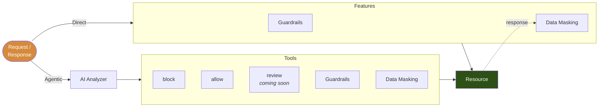

import EnterpriseLimit from '/snippets/EnterpriseLimit.mdx';

The Sidecar is where runtime control happens. It is a proxy that runs next to the resource it protects, decodes the wire protocol between a client and that resource, and decides what reaches the resource and what comes back.

---

## How a request flows

A listener decides how requests behave inside the Sidecar. Every request takes one of two paths, and both end at the resource or at a denial.



**Direct access** sends the request straight through. Guardrails and Data Masking apply inline, deterministically, with no model call. See [Direct Access](/features/direct-access).

**Agentic access** routes the request through the AI Analyzer first. The analyzer classifies the statement and the risk level picks a tool: block it, allow it, hand it to a Guardrail, mask what comes back, or send it for review. See [Agentic Access](/features/agentic-access).

The two features — [Guardrails](/features/guardrails) and [Data Masking](/features/data-masking) — are reachable from both paths. A listener can use one, the other, both, or neither.

---

## What it can read

The Sidecar picks a codec per listener, and the codec decides how much of the traffic is legible.

| Protocol | On the request | On the response |
|---|---|---|
| `postgres` | full statement text, its worst effect, every effect, and each relation as a read or a write | result columns, row count, masking by re-framing |
| `mssql` | SQLBatch and RPC, with `sp_executesql` unwrapped | result columns, masking by re-framing the TDS token stream |
| `http` | method, path, normalized resource; body and headers only when the listener opts in with `http.capture_body` | status; body and headers under the same setting |

The HTTP codec captures **nothing** by default — no bodies, no headers. Everything captured reaches the policy engine, the audit trail and, where an analyzer is configured, a third party, so each listener opts in explicitly.

---

## How many listeners

**One listener per upstream. One process runs as many listeners as you declare.**

A listener is one bind address in front of one upstream, speaking one protocol, with its own set of rules. `listeners` is a list in the config file, so protecting a second resource means adding a second entry — not starting a second Sidecar:

```yaml
listeners:
  - name: appdb                   # listener 1: Postgres
    protocol: postgres
    listen: 127.0.0.1:15432
    upstream: db.internal:5432
    connection: appdb

  - name: billing-api             # listener 2: HTTP, same process
    protocol: http
    listen: 127.0.0.1:18080
    upstream: billing.internal:8080
    connection: billing-api
```

Startup reports the count it resolved, so you always know how many you got:

```
config OK: 2 listener(s)
```

Three rules follow from this:

- **Listeners are independent:** each one picks its own protocol, bind address and transport. Moving one to a unix socket leaves the other on its TCP port.
- **Rules are per listener:** top-level `policy` and `mask` are defaults every listener inherits, and any listener can override them. A strict production database and a permissive staging one live in the same process.
- **Audit is per listener:** every event carries the listener's `connection` name, so one Sidecar serving three resources still produces three separable trails.

Most deployments run a single listener. Add a second when the same workload reaches more than one protected resource.

See [Listeners](/setup/configuration/hoop-inspect/config-file#listeners) for every field.

---

## Where the process sits

The Sidecar is a single binary with no external dependency, so placement is only a question of who can reach it:

- **Beside one workload:** a container in the same pod, reached over a unix socket. No port is opened, so reachability becomes a filesystem question rather than a network one.
- **On a host:** a plain process binding a TCP port. Nothing to mount, nothing to chown.
- **Behind an existing proxy:** Envoy, or anything that can forward plaintext to a local port. The Sidecar is an ordinary upstream, with no ext_proc, no WASM and no custom filter to install.

Nothing above the transport changes between these. Policy, masking and audit behave identically, because the Sidecar reads a connection and never asks what kind it is.

---

## Denials the user can read

When a rule denies a statement, the Sidecar writes the refusal in the protocol's own frame, always to the client, carrying the message the operator wrote in the config file:

| Protocol | Frame |
|---|---|
| `postgres` | pgwire `ErrorResponse`, `FATAL` `42501` |
| `http` | `403` with an `X-Hoop-Denied` header |

A developer reads the reason in `psql` instead of watching a connection drop.

---

## Audit

Every session is recorded whether or not it issues a statement, so a client that connects and disappears still leaves a trace. Events are JSON lines written to stdout or a file, and the write happens **before** the forward: a crash between the two cannot lose the record of the statement that caused it.

### The six event kinds

| Event | Fires when | Carries |
|---|---|---|
| `session_start` | a connection is accepted | principal, protocol, connection |
| `statement` | a statement is inspected and allowed | text, operation, tables, `allowed=true` |
| `violation` | a statement is denied | the same, plus the rule that denied it and the message the client read |
| `masked` | a response was rewritten | entity names and a cell count, never the values |
| `error` | a transport or upstream failure | the error text |
| `session_end` | the connection closes | duration, statement and denial totals |

A denial writes `violation` **instead of** `statement`, not in addition to it, so pulling every denial never means scanning every statement anyone ever ran.

### The admin API

The Sidecar serves a small read-only HTTP interface on its own listener, separate from every data lane — `admin.listen`, `127.0.0.1:19000` by convention. It answers three different questions: is the process healthy, what config did it actually resolve, and what has it recorded.

| Endpoint | Returns |
|---|---|
| `GET /healthz` | `ok`. What a container healthcheck polls. |
| `GET /stats` | Live counters, plus one line per listener with the address it really bound — a path means unix, a `host:port` means TCP. |
| `GET /config` | The **resolved** config: each listener's rules after inheritance, whether it is enforcing, and the analyzer settings with the credential omitted. |
| `GET /events` | The last N events from an in-memory ring buffer. |
| `GET /api/sessions` | One row per session: principal, connection, statement / denial / mask counts, and a verdict. |
| `GET /api/events` | Individual events, filterable. |
| `GET /api/stats` | Aggregates: totals, plus breakdowns by connection and by rule. |

`GET /config` is the one to reach for when a rule you wrote never fires. Inheritance is merged at startup, so the file tells you what you asked for and `/config` tells you what the process resolved:

```bash
curl -s localhost:19000/config | jq '.lanes[] | {name, rules}'
```

The query endpoints filter on `principal`, `connection`, `protocol`, `since`, `until`, `denied`, `open`, and `q` for substring search, with `limit` and `cursor` for paging. `/api/events` also takes `session_id` and a repeatable `kind`.

Both in-memory views are off by default, and each has its own budget: `audit.memory_buffer` sets how many events `/events` keeps, `audit.query_sessions` how many sessions back `/api/*`. Zero on either disables that surface without touching the JSON lines stream, which stays the record of truth.

<Warning>
The admin listener has no authentication and no CORS of its own, and it serves a read interface to every statement every user ran. Bind it to loopback, or put it behind whatever already gates access to your audit trail. Never expose it on a data port.
</Warning>

Where those events go on the way out — the bounded async queue, the file, and the two in-memory sinks — is in [Architecture](/setup/configuration/hoop-inspect/components#audit-six-kinds-one-write-path-three-sinks).

---

## Free and Enterprise

<EnterpriseLimit />

Running many Sidecars, shipping shared rule sets to all of them, and seeing them in one place is what the [Control Plane](/core-concepts/control-plane) adds.

---

## Next

<CardGroup cols={2}>
  <Card title="Control Plane" icon="tower-control" href="/core-concepts/control-plane">
    Centralize your Sidecars and deliver rule sets to all of them.
  </Card>
  <Card title="Architecture" icon="sitemap" href="/setup/configuration/hoop-inspect/components">
    The full trace of one connection, from accept through the gate to the upstream and back.
  </Card>
  <Card title="Running the Sidecar" icon="play" href="/setup/configuration/hoop-inspect/get-started">
    Transports, putting it behind Envoy, and a compose stack that runs the whole thing locally.
  </Card>
  <Card title="Config File Reference" icon="file-code" href="/setup/configuration/hoop-inspect/config-file">
    Every section, every field, inheritance between listeners, and what startup refuses.
  </Card>
</CardGroup>
