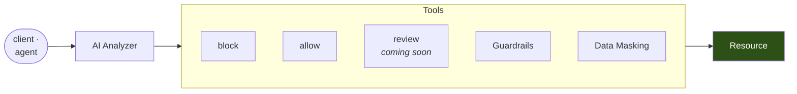

Rules are good at effects you can name. `DROP` is destructive, `/admin/**` is off limits, the `salaries` table is not yours. They are useless against intent you could not enumerate in advance — which is most of what an agent does.

Agentic access closes that gap. The AI Analyzer sits in front of the resource, classifies the statement, and the risk it reports selects a tool.



<Note>
This runs entirely in the [Sidecar](/core-concepts/sidecar). The Sidecar holds the provider credential and reads one YAML file, and no statement is sent anywhere you did not configure.
</Note>

---

## The tools

An `ai_analysis` rule maps each risk level the model can report to a tool.

| Tool | Effect |
|---|---|
| `allow` | Forward. The verdict is still recorded. |
| `warn` | Forward and record the risk. Observe-only, one tier at a time. |
| `block` | Deny, with the model's own title in the protocol's error frame. |
| `defer` | Forward, and hand the decision to [OPA](/setup/configuration/hoop-inspect/policy-rules#deferring-to-opa), which reads the risk level alongside the actor, the hour and the table. |
| `review` | Hold the statement for a human to approve. **Coming soon.** |

A risk level you do not name defaults to `allow`, so you opt into blocking a tier by writing it down.

<Warning>
`review` is not available yet — `require_review` is refused at startup, because holding a statement for approval needs a review backend the current build does not ship. Until it lands, `defer` is the closest working thing: the statement is classified and annotated, and Rego makes the call.
</Warning>

[Guardrails](/features/guardrails) and [Data Masking](/features/data-masking) reach the same request from the other direction. Local rules run **before** the analyzer, so a `DELETE` a `type: operation` rule already refuses never costs a model call; masking runs on the response regardless of which path the request took.

---

## Configuration

Two pieces: an `analyzer` block that says which model to call, and an `ai_analysis` rule that says when to call it and what to do with the answer.

```yaml config.yaml
pii:                               # optional: omit it and every entity is enabled
  entities: [EMAIL_ADDRESS, US_SSN, BR_CPF]

analyzer:
  provider: vertex                 # vertex | anthropic | openai
  model: claude-sonnet-4-5@20250929
  extra: {project: my-gcp-project, region: global}
  # credentials_file omitted: Application Default Credentials.
  timeout_sec: 10
  fail_open: true                  # the default, deliberately
  send: redacted                   # raw | redacted | refuse
  max_input_bytes: 8192
  cache: {size: 4096, ttl_sec: 900}
  max_calls: 500

listeners:
  - name: appdb
    protocol: postgres
    listen: 0.0.0.0:15432
    upstream: appdb:5432
    guardrails:
      rules:
        - name: risky-writes
          type: ai_analysis
          trigger: {operations: [update, delete]}
          high: block
          medium: warn
          low: allow
          message: refused by risk analysis
```

A blocked statement reaches the user the same way every other denial does:

```
FATAL:  unbounded delete against the customer ledger
```

### What leaves the process

`send` decides how much of a statement the provider sees:

| `send` | Behavior |
|---|---|
| `raw` | The statement text as written. |
| `redacted` | Detected entities are named, their values withheld. |
| `refuse` | Deny locally rather than call out at all. |

Neither mode needs a `pii` section: with the section omitted every supported entity is enabled, and a `pii.entities` list only narrows what the redactor looks for before the statement leaves the process.

The credential is always a path (`credentials_file`), never inline, and the file must be `0600` or stricter.

### HTTP listeners must opt into capture

The HTTP codec captures nothing by default, so an `ai_analysis` rule on an HTTP listener without `capture_body` is refused at startup:

```yaml
  - name: api
    protocol: http
    listen: 0.0.0.0:18080
    upstream: internal-api:8080
    http:
      capture_body: true
      max_body_bytes: 8192
      headers: [Content-Type]
    guardrails:
      rules:
        - name: risky-payloads
          type: ai_analysis
          trigger: {resources: ["/orders/**", "/admin/**"]}
          high: block
          medium: warn
```

`authorization`, `cookie` and `proxy-authorization` cannot be allowlisted as captured headers.

---

## Cost controls

This is the only evaluator that leaves the process, costs money per statement and can take a second. An ORM issues the same statement shape thousands of times in one session, so read this before enabling it anywhere real.

<Steps>
  <Step title="trigger narrows what is classified">
    Only statements naming these operations, tables or resources are sent. Everything else allows for free. An **empty trigger is a startup error** — the failure mode of the opposite default is an invoice.
  </Step>
  <Step title="The cache keys on the statement shape">
    `WHERE id = 1` and `WHERE id = 2` are one verdict: literals are stripped from SQL, and HTTP resources are already normalized by the codec. This is also more correct than caching on bytes — the shape is what is risky, not the parameter.
  </Step>
  <Step title="max_calls is a backstop">
    A process-lifetime budget. Past it, statements fall through to the local rules, the same outcome as a listener with no analyzer.
  </Step>
</Steps>

Watch the hit rate on the admin API before you enable a blocking action:

```bash
curl -s localhost:19000/stats | python3 -m json.tool
```

<Tip>
Trigger on `operations` for anything load-bearing. `tables` comes from a scanner rather than a full SQL grammar, and a statement whose relations it could not determine does not match a table trigger. `operations` reads the statement's most consequential effect, so a data-modifying CTE triggers on the `delete` it performs.
</Tip>

---

## It fails open, and everything else fails closed

The analyzer defaults to `fail_open: true`. It depends on a third-party API, and a provider outage that closes every database connection in your fleet is a worse incident than the one it prevents. Guardrails and OPA fail closed, as they should — they depend on nothing outside your own infrastructure.

Decide which you want per environment, and know that `fail_open: false` makes your model provider a hard dependency of your database.

---

## Next

<CardGroup cols={2}>
  <Card title="AI Analyzer Reference" icon="brain" href="/setup/configuration/hoop-inspect/risk-analysis">
    Every field, the gate phase, prompt precedence and the full findings vocabulary.
  </Card>
  <Card title="Direct Access" icon="bolt" href="/features/direct-access">
    The deterministic path, and when to prefer it.
  </Card>
  <Card title="Guardrails" icon="shield-halved" href="/features/guardrails">
    The rules that run before the analyzer and keep it cheap.
  </Card>
  <Card title="Data Masking" icon="mask" href="/features/data-masking">
    Rewrite sensitive values on the way back.
  </Card>
</CardGroup>
