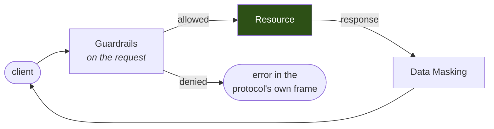

Direct access is the default path through the [Sidecar](/core-concepts/sidecar). A request arrives, the Sidecar decodes it, evaluates it against the rules you wrote, and forwards it. The response comes back through the same gate and sensitive values are rewritten before they reach the client.

Nothing about this path is probabilistic. The same statement produces the same decision every time, there is no third-party API in the chain, and the only latency added is a parse and a scan.



---

## Configuration

A listener is one upstream. Add [`policy`](/features/guardrails) to control what reaches the resource, and [`mask`](/features/data-masking) to control what comes back. Both are optional and independent.

```yaml config.yaml
pii:
  entities: [EMAIL_ADDRESS, US_SSN]

listeners:
  - name: appdb
    protocol: postgres          # postgres | mssql | http
    listen: 127.0.0.1:15432
    upstream: appdb:5432
    connection: appdb

    policy:
      enforce: true
      rules:
        - name: no-destructive-sql
          type: operation
          operations: [drop, delete, truncate]
          message: destructive statements are not permitted on appdb

    mask:
      enabled: true
      rules:
        - {name: emails, entity: EMAIL_ADDRESS, strategy: redact}
```

Validate before deploying — nothing needs to be running:

```bash
hoop start sidecar --config config.yaml --validate
```

```
config OK: 1 listener(s)
  appdb            postgres  enforcing 1 rule(s) + masking
```

<Warning>
`policy.enforce` defaults to **false**. Without it a listener inspects and audits but denies nothing, so a misconfigured rule cannot take production down on first deploy. That is the right way to roll out, and the wrong way to leave it.
</Warning>

---

## What the user sees when a rule denies

The refusal is written in the protocol's own frame, always to the client, carrying the message you wrote:

```bash
PGSSLMODE=disable psql -h 127.0.0.1 -p 15432 -U appuser -d appdb \
  -c 'DELETE FROM customers WHERE id = 1;'
```

```
FATAL:  destructive statements are not permitted on appdb
```

That is a real pgwire `ErrorResponse`, so the developer reads the reason in `psql` rather than watching a connection drop. On an HTTP listener the equivalent is a `403` with an `X-Hoop-Denied` header.

---

## Direct or Agentic?

Both paths run in the same Sidecar and a listener picks per rule, so this is not an either/or for the deployment — only for a given class of statement.

| | Direct Access | [Agentic Access](/features/agentic-access) |
|---|---|---|
| Decides with | rules you wrote | a language model classifying the statement |
| Determinism | same input, same verdict | a classification, with a cache |
| Latency added | parse and scan | a model call, roughly 100 ms to 2 s uncached |
| External dependency | none | your model provider |
| Failure mode | fails closed | fails open by default |
| Best for | effects you can name — destructive verbs, protected tables, forbidden paths | intent you cannot enumerate in advance |

The usual shape is direct rules for everything nameable, and an `ai_analysis` rule as the backstop for the rest.

---

## Next

<CardGroup cols={2}>
  <Card title="Guardrails" icon="shield-halved" href="/features/guardrails">
    Every rule type, and how a rule set resolves to a verdict.
  </Card>
  <Card title="Data Masking" icon="mask" href="/features/data-masking">
    Detection, masking strategies, and entity rules versus column rules.
  </Card>
  <Card title="Agentic Access" icon="robot" href="/features/agentic-access">
    Let a model classify the statement and pick the tool.
  </Card>
  <Card title="Config File Reference" icon="file-code" href="/setup/configuration/hoop-inspect/config-file">
    Every listener field, inheritance between listeners, and what startup refuses.
  </Card>
</CardGroup>
