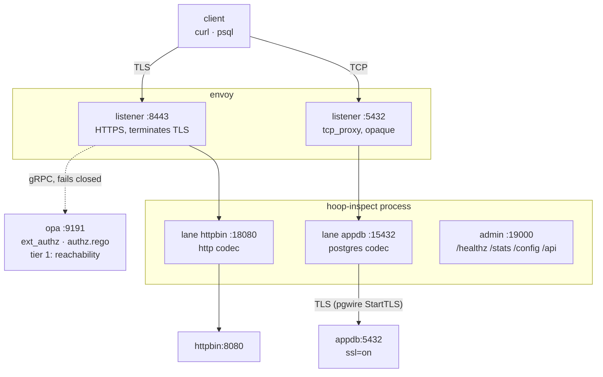
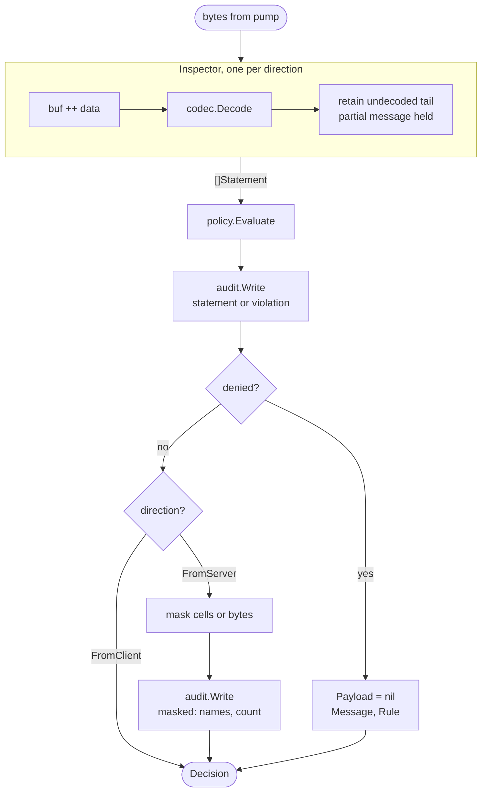
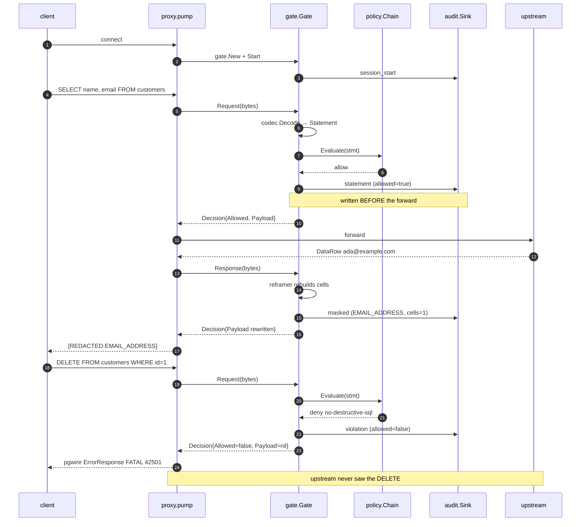
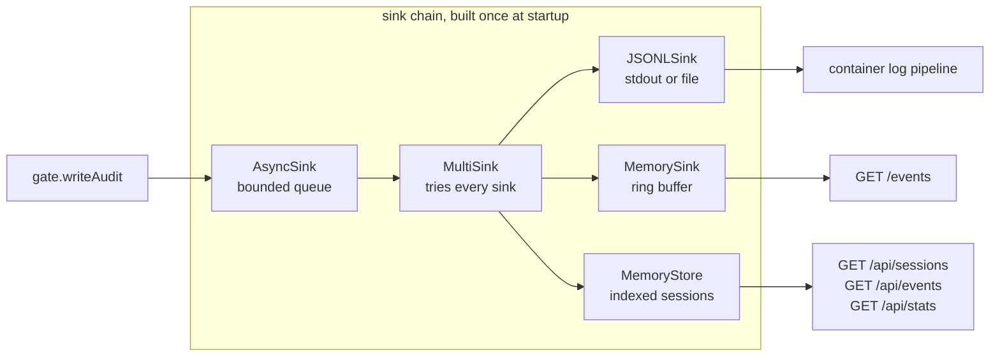

This page traces one connection from the client through Envoy, through the relay, to the upstream and back. Read it to find out where a policy denial happens, why Postgres masking takes a different path from HTTP masking, and which knob in `config.yaml` controls which behavior.

<Note>
For the commands, start at [Get Started](/setup/configuration/hoop-inspect/get-started). For every config field, see the [Config File reference](/setup/configuration/hoop-inspect/config-file).
</Note>

---

## The two tiers

Envoy owns TLS and the network path. OPA answers reachability. `hoop-inspect` reads the payload.



Envoy sees less on each lane going down the table.

| Lane | Envoy sees | OPA consulted |
|---|---|---|
| HTTPS → API | method, path, headers, bounded body | yes, `ext_authz` |
| postgres → database | a byte count | no, it has no pgwire parser |

On HTTP, `ext_authz` handles request-side authorization well. The gap sits on the response: `ext_authz` decides **before** Envoy calls the upstream, so no configuration of it reaches a response status or a response body. On Postgres the gap is wider. Envoy forwards bytes it cannot parse, so OPA never receives a statement to judge.

### Where Envoy ends and the relay begins

|  | Envoy | hoop-inspect |
|---|---|---|
| Postgres SQL parse | `postgres_proxy`, best effort | full statement text |
| Postgres granularity | `table.db` + operation verb | statement, operation, tables |
| Postgres **response** | not available | result columns, row count, masking by re-framing |
| HTTP request | `ext_authz`: method, path, headers, bounded body | same, plus normalized resource |
| HTTP **response** | not available, ext_authz decides before the upstream runs | status, headers, body |
| Deny UX | RBAC/ext_authz drops the connection or returns a bare 403 | the message an operator wrote |

Envoy is not blind here, and an argument that says otherwise loses a technical review. The relay covers what remains.

---

## One process, one lane per Envoy cluster

`hoop-inspect` serves one listener per Envoy cluster. Each listener resolves its own rules, its own masking and its own OPA endpoint.

```
envoy :8443 ──cluster hoop_inspect_http──> :18080  lane "httpbin"   http
envoy :5432 ──cluster hoop_inspect_pg────> :15432  lane "appdb"     postgres
                                                   └─ one process
```

Most sidecars run one lane. A per-user pod fronting both a database and an API runs two in one process instead of two containers. The relay resolves the merge between top-level defaults and a lane's overrides once at startup, and reports every broken lane in one run.

---

## Inside one connection

The relay accepts a socket, builds per-connection state, and starts two goroutines that pump in opposite directions through one Gate.

```
accept
  ├─ session.New(proto, Identity{PeerAddr})
  ├─ gate.New(sess, cfg)   two Inspectors, one per direction
  ├─ g.Start(ctx)          records the session even if it issues no statement
  ├─ dialUpstream()
  │
  ├─ go pump(client → upstream, FromClient) ─┐
  └─ go pump(upstream → client, FromServer) ─┘  first to finish closes the peer
```

Two Inspectors, because a codec reassembles messages across reads. Feeding both halves of a duplex stream into one reassembly buffer corrupts both.

`pump` reads 32 KiB at a time and hands every chunk to the Gate before anything reaches the far side:

```
src.Read(buf) ──> n bytes
      ↓
d := g.Request(ctx, buf[:n])        or g.Response for FromServer
      ↓
├─ d.Allowed == false ─→ DenyWriter.Deny(proto, msg) ─→ write frame ─→ return
│                        pgwire 'E' FATAL 42501  |  HTTP 403 + X-Hoop-Denied
│                        always to the CLIENT, whichever direction denied
│
└─ d.Allowed == true  ─→ dst.Write(d.Payload)
```

A re-framing codec holds rows back until their result set ends, so `pump` defers a flush on the server direction. Skipping that flush drops the tail of a client's output, and the user reads it as a truncated result rather than as a masking bug.

**Source:** [`hoopinspect/proxy/proxy.go`](https://github.com/hoophq/hoop/blob/main/hoopinspect/proxy/proxy.go)

---

## Inside the Gate

Four steps run per chunk, and the order carries weight.



Auditing **before** the forward costs a write on the hot path. It buys you the property that a crash between the two cannot lose the record of the statement that caused it. Reverse the order and you lose the one row an incident review needs most.

A clean payload aliases the input rather than copying it, so a statement nothing touched allocates nothing.

**Source:** [`hoopinspect/gate/gate.go`](https://github.com/hoophq/hoop/blob/main/hoopinspect/gate/gate.go)

---

## Inside the Inspector

A codec registers a factory, not an instance. Two connections sharing one stateful codec would corrupt each other's reassembly buffer, and one tenant's SQL would surface in another tenant's audit trail.

```
                  hoopinspect.Register(factory)   from codec init()
                            ↓
 hoopinspect.New(Postgres) ─┴─> Inspector{codec, buf, maxBuffer 8 MiB}
                                     │
                                     ↓ codec.Decode
   ┌─── codec/postgres ──────────────────────────────────┐
   │  skipHandshake()   startup packet, SSLRequest        │
   │  tag 'Q' Query ──> splitSimpleQuery()                │
   │  tag 'P' Parse ──> parseMessage()                    │
   │  everything else → skip by length                    │
   └──────────────────────┬───────────────────────────────┘
                          ↓
                ClassifySQL(text)   strips comments and string
                          │         literals first
                          ↓
   Statement{Protocol, Direction, Text, Operation, Tables,
             Database, HTTP *HTTPDetail, Metadata}
```

Two details in that path decide real verdicts.

`splitSimpleQuery` splits on semicolons, because `SELECT 1; DROP TABLE users` arrives as one `Q` message. A decoder that classified by leading verb would report a harmless select and wave the DROP through.

`ClassifySQL` strips comments and string literals before it looks for a verb, so `SELECT 'DROP TABLE customers'` classifies as `select`. That is why you prefer `type: operation` over `deny_words_list`: the word list denies the harmless one.

**Source:** [`hoopinspect/inspect.go`](https://github.com/hoophq/hoop/blob/main/hoopinspect/inspect.go), [`hoopinspect/codec/postgres/`](https://github.com/hoophq/hoop/tree/main/hoopinspect/codec/postgres)

### Protocols

| Protocol | Request messages | Response messages | Stateful |
|---|---|---|---|
| `postgres` | `Query` ('Q'), `Parse` ('P'); handshake skipped | `RowDescription` ('T'), `DataRow` ('D'), and the terminators that end a result set | yes |
| `http` | HTTP/1.x requests | HTTP/1.x responses | no |

The Postgres codec is stateful because one `RowDescription` describes every `DataRow` after it, and those land in different TCP reads.

---

## Policy evaluation

Two evaluators compose, local rules first, so a statement the local set already forbids never costs a network round trip.

```
Statement ──> policy.Chain{ Rules, OPAClient }
                   │           │
                   │           └─> POST /v1/data/…
                   │                {"input":{protocol, operation, tables,
                   │                          http{…}, context{user}}}
                   │                fails closed by default
                   ↓
             first match wins
             deny_words_list · pattern_match · operation · table
             http_resource · http_status · pii
```

Both evaluators fail closed. An unreachable OPA, a 500, or an undefined decision denies.

The `pii` rule type dispatches at the rule-set level rather than per rule, because the detector belongs to the rule set and not to any single rule.

**Source:** [`hoopinspect/policy/`](https://github.com/hoophq/hoop/tree/main/hoopinspect/policy)

---

## Masking, and why Postgres needed a second mechanism

Masking runs on responses only. The gate picks a mechanism per protocol by asking the codec, not by consulting a list of protocol names:

```
FromServer bytes
   ↓
├─ codec implements Reframer? ──> maskByReframing()
│                                  codec rebuilds every frame around
│                                  the new values
│
└─ substitutionSafe(proto)?   ──> maskBySubstitution()
                                   rewrite in place, then correct
                                   Content-Length
```

HTTP declares its body length in a header, so the gate substitutes bytes and retags `Content-Length`. Leave that header stale and the client reads the old count, stops mid-document, and you get a bug report about a corrupt upstream.

Postgres length-prefixes every row and every column. Substituting `ada@example.com` (15 bytes) with `[REDACTED:EMAIL_ADDRESS]` (24 bytes) desynchronizes psql on the next message, and the user sees "lost synchronization with server". The Postgres codec rebuilds the `DataRow` frames around the masked values instead.

A codec offering neither mechanism gets its `mask` section refused at startup. Accepting a mask config that can never fire is the failure that ends with an unmasked SSN in a screenshot.

**Source:** [`hoopinspect/codec/postgres/rewrite.go`](https://github.com/hoophq/hoop/blob/main/hoopinspect/codec/postgres/rewrite.go), [`hoopinspect/gate/contentlength.go`](https://github.com/hoophq/hoop/blob/main/hoopinspect/gate/contentlength.go)

---

## Where PII detection plugs in

The core library ships zero dependencies. A detection engine worth having carries recognizers for dozens of national identifier formats, so it lives behind two interfaces the core already declares.

```
                  ┌─ mask.Detector    { Entities(), Find(entity, data) }
alcatraz.Detector ┤                        ↓ response masking
  (one value)     └─ policy.Scanner   { ScanText(text) []string }
                                           ↓ request guardrails
```

One detector drives both paths: masking rewrites what comes back, and the `pii` policy rule denies what goes in. [alcatraz](https://github.com/hoophq/alcatraz) supplies 45 entity types across 12 countries, 25 of them checksum-verified.

It also carries three secret recognizers, which you name in config like any other entity: `AWS_ACCESS_KEY`, `JWT` (decodes the header rather than matching its shape) and `PRIVATE_KEY`.

There are no build tags. The config file decides every capability, so an operator turning on PII detection does not also have to swap the binary.

**Source:** [`hoopinspect/pii/alcatraz/`](https://github.com/hoophq/hoop/tree/main/hoopinspect/pii/alcatraz)

---

## Audit: six kinds, one write path, three sinks



| Kind | Fires | Carries |
|---|---|---|
| `session_start` | connection accepted | principal, protocol, connection |
| `statement` | each inspected statement | text, operation, tables, `allowed=true` |
| `violation` | a denied statement | same, plus `rule` and `message` |
| `masked` | response data rewritten | entity names and a count, never values |
| `error` | transport or upstream failure | the error text |
| `session_end` | connection closed | duration, statement and denial totals |

`session_start` fires even for a connection that issues nothing, so an abandoned session leaves a trace. Without it, a client that connects and disappears is invisible.

### Where the events go



The JSONL sink goes first, and the multi-sink attempts every sink regardless of what an earlier one returned, so the durable record survives a failure in the in-memory ring or the query store. Both in-memory sinks drop their oldest entry when full and report the drop count, so a reader can tell a partial window from a complete one. The JSONL stream stays the record of truth.

**Source:** [`hoopinspect/audit/`](https://github.com/hoophq/hoop/tree/main/hoopinspect/audit), [`hoopinspect/store/`](https://github.com/hoophq/hoop/tree/main/hoopinspect/store)

### Reading it back

```bash
curl -s localhost:19000/api/stats | python3 -m json.tool
```

```json
{"sessions": 16, "statements": 28, "denied": 6, "masked": 27, "errors": 0,
 "by_connection": [{"label": "appdb", "count": 9}, {"label": "httpbin", "count": 7}],
 "by_rule": [{"label": "no-destructive-sql", "count": 2},
             {"label": "no-upstream-5xx", "count": 2},
             {"label": "no-cpf-in-query", "count": 1}]}
```

The query endpoints accept filters: `principal`, `connection`, `protocol`, `since`, `until`, `denied`, `open`, `q` for substring search, plus `limit` and `cursor` for paging. `/api/events` also takes `session_id` and a repeatable `kind`.

---

## Deploying it

### As a sidecar container

The relay ships as a small static binary that reads one file. A [Dockerfile](https://github.com/hoophq/hoop/blob/main/deploy/docker-compose/envoy-stack/hoopinspect/Dockerfile) is in the repository; the process needs no privileges, so run it as a non-root user.

```yaml docker-compose.yml
hoop-inspect:
  image: hoop-inspect:local
  volumes:
    - ./config.yaml:/etc/hoop-inspect/config.yaml:ro
  ports:
    - "19000:19000"    # admin only; data lanes stay on the internal network
  healthcheck:
    test: ["CMD-SHELL", "curl -sf http://127.0.0.1:19000/healthz || exit 1"]
```

Expose the admin port to your scraper, never the data lanes.

### Over a unix socket

A TCP listener on 15432 is reachable by anything that can route to the pod. A NetworkPolicy narrows that; it does not remove it. With a socket there is no port at all, so reachability stops being a network question and becomes a filesystem one.

```yaml config.yaml
listeners:
  - name: appdb
    protocol: postgres
    network: unix
    listen: /run/hoop-inspect/pg.sock
    upstream: appdb:5432
```

The matching Envoy cluster uses `pipe:` and must be `STATIC`, since there is no name to resolve:

```yaml envoy.yaml
- name: hoop_inspect_pg
  type: STATIC
  connect_timeout: 5s
  load_assignment:
    cluster_name: hoop_inspect_pg
    endpoints:
      - lb_endpoints:
          - endpoint:
              address:
                pipe: { path: /run/hoop-inspect/pg.sock }
```

<Warning>
Two permission traps cost real time to diagnose.

**Creating the socket.** A shared volume arrives root-owned, and a relay running as a non-root uid cannot bind: `listen unix /run/hoop-inspect/pg.sock: bind: permission denied`. Chown the directory before either container starts.

**Connecting to the socket.** `connect()` on a unix socket needs **write** permission, not read. Envoy does not run as root, and `docker exec` hands you a root shell that hides this. A socket left at the default 0755 is unreachable, and the only symptom is a 503 with `flags=UF` and `upstream_cx_connect_fail`. Run the relay with Envoy's gid as its primary group and `umask 0002`, so every socket it creates comes out group-writable.
</Warning>

Keep the admin listener on TCP. It serves `/healthz` to a healthcheck and `/stats` to a scraper, and moving it to a socket means exec-ing into the container to read either.

### On Kubernetes

The same shape, with an `emptyDir` in place of the named volume:

```yaml
volumes:
  - name: inspect-sockets
    emptyDir: {}
containers:
  - name: hoop-inspect
    securityContext: { runAsUser: 10001, runAsGroup: 101 }
    volumeMounts: [{ name: inspect-sockets, mountPath: /run/hoop-inspect }]
  - name: envoy
    volumeMounts: [{ name: inspect-sockets, mountPath: /run/hoop-inspect }]
```

`fsGroup` on the pod securityContext replaces the chown step: the kubelet applies it to the `emptyDir` before any container starts. Set it to Envoy's gid and both sides can use the directory.

Mount the config as a ConfigMap and set `HOOP_INSPECT_CONFIG` instead of passing a flag.

---

## Identity

Every session records `principal: anonymous` unless a deployment fills it. The plumbing runs end to end: the session carries a subject, and the proxy exposes a seam a deployment fills from a verified JWT, an mTLS peer cert or a credential token. A listener names its `identity_header`, and the current implementation contributes only the peer address.

Until that function is written, a Rego policy keyed on `input.context.user` reads `anonymous` from every lane.

---

## Known limits

Read these before writing a policy against the relay.

- **Two codecs ship: postgres and http.** Adding one means a new `codec/<name>` package and nothing else.
- **`Tables` is best effort.** A lexer, not a SQL grammar, which is the same ceiling Envoy's own docs acknowledge for `postgres_proxy`. Empty means "could not determine" and never "touches nothing". Set `require_table_match: true` on rules protecting something critical and accept the false positives.
- **A response batch can be truncated.** The Postgres codec stops decoding columns past 1000 rows in one result set, to keep the relay's memory out of a query's hands. It keeps counting and marks the batch truncated. A policy must read that as inconclusive, never as proof a value is absent.
- **A response statement carries no verb.** For database codecs a server-direction statement reports `unknown`, because the operation belongs to the request the audit trail already recorded. Key a response-side SQL rule on the result, not on the operation.
- **PII detection is neither sound nor complete.** A checksum-verified identifier holds up. Everything else is a pattern. Detecting a name column needs NER, which this does not wire, and a caller can split a value across two responses. Masking raises the cost of accidental exposure without replacing "do not grant access to that table".
- **HTTP/1.x only for stream decoding.** HTTP/2 and HTTP/3 framing belongs to whatever terminated the connection.
- **Plaintext downstream only.** A client negotiating TLS end to end past the relay leaves nothing to parse. Terminating that leg is Envoy's job. The upstream leg may be TLS.
- **Statements are not transactions.** Each one gets its own verdict, and no cross-statement session state exists.
- **No SSH lane.** No SSH codec ships. Envoy ships no SSH filter at any fidelity either, so every service reached over SSH sits unpoliced by the Envoy and OPA layer.

---

## Reference stack

The repository ships a compose stack that runs every component on this page end to end.

| File | What it holds |
|---|---|
| [`docker-compose.yml`](https://github.com/hoophq/hoop/blob/main/deploy/docker-compose/envoy-stack/docker-compose.yml) | Six containers: Envoy, OPA, the relay, Postgres, an HTTP service, a client |
| [`envoy/envoy.yaml`](https://github.com/hoophq/hoop/blob/main/deploy/docker-compose/envoy-stack/envoy/envoy.yaml) | Both listeners, the `ext_authz` filter, and the relay clusters |
| [`opa/authz.rego`](https://github.com/hoophq/hoop/blob/main/deploy/docker-compose/envoy-stack/opa/authz.rego) | Tier-1 reachability policy |
| [`hoopinspect/config.yaml`](https://github.com/hoophq/hoop/blob/main/deploy/docker-compose/envoy-stack/hoopinspect/config.yaml) | Two lanes with rules, masking and upstream TLS |
| [`uds/`](https://github.com/hoophq/hoop/tree/main/deploy/docker-compose/envoy-stack/uds) | The unix-socket overlay, with both permission traps solved |
| [`demo.sh`](https://github.com/hoophq/hoop/blob/main/deploy/docker-compose/envoy-stack/demo.sh) | Walks every lane and prints the audit trail |

---

## Next

<CardGroup cols={2}>
  <Card title="Get Started" icon="rocket" href="/setup/configuration/hoop-inspect/get-started">
    Configure Envoy, run the relay, and watch a denial land in psql.
  </Card>
  <Card title="Config File" icon="file-code" href="/setup/configuration/hoop-inspect/config-file">
    Every section, every rule type, and what startup refuses.
  </Card>
</CardGroup>
