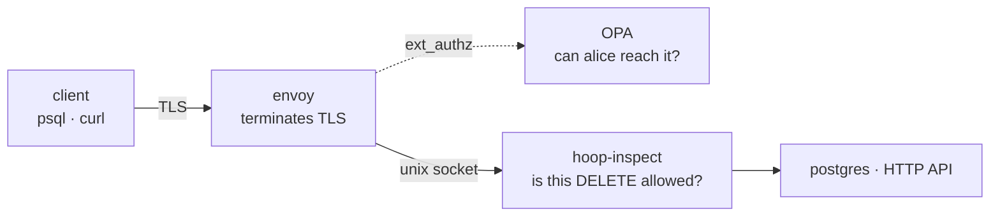

`hoop-inspect` is an inspecting relay. It decodes the wire protocol between a client and a database or an API, evaluates every statement against policy, records an audit trail, and masks sensitive values in the response.

It routes nothing and terminates no client TLS. You run it behind something that already owns the network path and identity, which in most enterprises means Envoy.



Envoy answers reachability. `hoop-inspect` answers what the statement does, and what comes back.

<Note>
This runs with no gateway, no agent, and no control-plane database. One config file is the whole setup.
</Note>

---

## Prerequisites

- The `hoop` CLI installed. See [CLI installation](/clients/cli).
- An Envoy you can add a cluster to, or any proxy that can forward plaintext to a local port.
- A backend to protect: PostgreSQL or an HTTP service.

---

## Step 1: Write a config file

One listener is one upstream. Start with a single Postgres lane and nothing else:

```yaml config.yaml
log_level: info

admin:
  listen: 127.0.0.1:19000     # /healthz, /stats, /config, /api/*

audit:
  file: "-"                   # JSON lines on stdout

policy:
  enforce: true               # false is observe-only: inspect and audit, deny nothing

listeners:
  - name: appdb
    protocol: postgres
    network: unix                          # recommended: no port to reach
    listen: /run/hoop-inspect/pg.sock      # where Envoy sends bytes
    upstream: appdb:5432                   # the real database
    connection: appdb                      # the name audit rows and policy key on
    policy:
      rules:
        - name: no-destructive-sql
          type: operation
          operations: [drop, delete, truncate]
          message: destructive statements are not permitted on appdb
```

<Note>
**Prefer a unix socket.** A TCP listener on 15432 is reachable by anything that can route to the host, and a NetworkPolicy narrows that without removing it. A socket opens no port at all, so reachability becomes a filesystem question. Swap `network: unix` for a `host:port` in `listen` when the two processes cannot share a directory. See [Transport](/setup/configuration/hoop-inspect/config-file#transport).
</Note>

<Warning>
`policy.enforce` defaults to **false**. Without it every lane inspects and audits but denies nothing, so a misconfigured rule cannot take production down on first deploy. Set it to `true` when you want the rules to bite.
</Warning>

---

## Step 2: Validate before you deploy

Nothing needs to be running. The validator builds every lane and reports every problem in one run:

```bash
hoop start inspect --config config.yaml --validate
```

```
config OK: 1 listener(s)
  appdb            postgres  enforcing 1 rule(s)
```

Each line is the **resolved** lane, so the rule count includes anything it inherited. A lane with an `opa` block reads `+ opa`, one with masking reads `+ masking`, and one with `enforce: false` reads `observe-only`.

---

## Step 3: Run it

```bash
hoop start inspect --config config.yaml
```

`--config` also reads `HOOP_INSPECT_CONFIG`, which is the shape a Kubernetes deployment wants: mount the ConfigMap, set the variable, pass no arguments.

Check it came up:

```bash
curl -s localhost:19000/healthz     # ok
curl -s localhost:19000/config | python3 -m json.tool
```

---

## Step 4: Point Envoy at it

`hoop-inspect` is an ordinary upstream. There is no ext_proc, no WASM, no custom Envoy filter to install. You change the cluster your listener already routes to.

A socket cluster is `STATIC` with a `pipe:` address, because there is no name to resolve. Both containers mount the same directory.

<Tabs>
  <Tab title="Postgres (socket)">
    Envoy has no pgwire parser, so this lane is plain `tcp_proxy`. Every byte reaches the relay unexamined, which is the reason the relay earns its place here.

    ```yaml envoy.yaml
    static_resources:
      listeners:
        - name: postgres_ingress
          address:
            socket_address: { address: 0.0.0.0, port_value: 5432 }
          filter_chains:
            - filters:
                - name: envoy.filters.network.tcp_proxy
                  typed_config:
                    "@type": type.googleapis.com/envoy.extensions.filters.network.tcp_proxy.v3.TcpProxy
                    stat_prefix: ingress_pg
                    cluster: hoop_inspect_pg

      clusters:
        - name: hoop_inspect_pg
          type: STATIC              # a path resolves to nothing; STRICT_DNS would fail
          connect_timeout: 5s
          load_assignment:
            cluster_name: hoop_inspect_pg
            endpoints:
              - lb_endpoints:
                  - endpoint:
                      address:
                        pipe: { path: /run/hoop-inspect/pg.sock }
    ```
  </Tab>
  <Tab title="HTTP (socket)">
    On HTTP you keep your existing `ext_authz` filter. Only the route's cluster changes: it points at the relay instead of at the service.

    ```yaml envoy.yaml
    route_config:
      name: local_route
      virtual_hosts:
        - name: inspect
          domains: ["*"]
          routes:
            - match: { prefix: "/" }
              route:
                cluster: hoop_inspect_http     # was: the service cluster
                timeout: 60s

    http_filters:
      # Unchanged. OPA still answers reachability before anything is forwarded.
      - name: envoy.filters.http.ext_authz
        typed_config:
          "@type": type.googleapis.com/envoy.extensions.filters.http.ext_authz.v3.ExtAuthz
          transport_api_version: V3
          failure_mode_allow: false
          grpc_service:
            envoy_grpc: { cluster_name: opa }
            timeout: 2s

      - name: envoy.filters.http.router
        typed_config:
          "@type": type.googleapis.com/envoy.extensions.filters.http.router.v3.Router

    clusters:
      - name: hoop_inspect_http
        type: STATIC
        connect_timeout: 5s
        load_assignment:
          cluster_name: hoop_inspect_http
          endpoints:
            - lb_endpoints:
                - endpoint:
                    address:
                      pipe: { path: /run/hoop-inspect/http.sock }
    ```
  </Tab>
  <Tab title="TCP fallback">
    Where the two processes cannot share a directory, bind a port instead. Drop `network: unix` from the lane, give `listen` a `host:port`, and use a resolvable cluster:

    ```yaml envoy.yaml
    clusters:
      - name: hoop_inspect_pg
        type: STRICT_DNS
        connect_timeout: 5s
        load_assignment:
          cluster_name: hoop_inspect_pg
          endpoints:
            - lb_endpoints:
                - endpoint:
                    address:
                      socket_address: { address: hoop-inspect, port_value: 15432 }
    ```

    Bind the lane to loopback where the relay and its peer share a network namespace. A `0.0.0.0` bind is reachable by anything that can route to the host.
  </Tab>
</Tabs>

<Warning>
**Two permission traps, and neither produces a useful error.**

*Creating the socket.* The relay needs write permission on the directory. A volume that mounts root-owned against a non-root image fails with `bind: permission denied`. Chown the directory before the relay starts, or set `fsGroup` on a Kubernetes pod.

*Connecting to it.* `connect()` on a unix socket requires **write** permission on the socket file, not read. Go creates a listening socket at `0777 &^ umask`, and the usual 022 clears exactly the group-write bit Envoy needs. Envoy then reports `flags=UF` and `upstream_cx_connect_fail` while the cluster still shows healthy, because the endpoint resolved. Run the relay with Envoy's gid and `umask 0002`.
</Warning>

<Warning>
Nothing terminates client TLS between the client and the relay. On a Postgres lane the client must connect with `PGSSLMODE=disable`, or there is no plaintext to parse and inspection is impossible. Envoy terminating TLS on that listener is the production answer. The hop from the relay **to** the database is a separate matter and can be encrypted: see [upstream TLS](/setup/configuration/hoop-inspect/config-file#upstream-tls).
</Warning>

---

## Step 5: Watch it work

With the lane above in place, a destructive statement never reaches the database:

```bash
PGSSLMODE=disable psql -h envoy -p 5432 -U appuser -d appdb \
  -c 'DELETE FROM customers WHERE id = 1;'
```

```
FATAL:  destructive statements are not permitted on appdb
```

That is a real pgwire `ErrorResponse` carrying the message you wrote in `config.yaml`, so the developer reads it in psql instead of watching a socket drop. Envoy forwarded the same bytes as opaque TCP and consulted nobody.

Read what the relay recorded:

```bash
curl -s localhost:19000/stats                  | python3 -m json.tool
curl -s 'localhost:19000/api/sessions?limit=1' | python3 -m json.tool
```

```json
{"sessions": [
  {"id": "98203ccc…", "principal": "anonymous", "protocol": "postgres",
   "connection": "appdb", "duration_ms": 11,
   "statement_count": 2, "denied_count": 1, "masked_count": 0, "verdict": "denied"}
]}
```

### Confirm the port is gone

`/stats` reports the address each lane bound, so a path there means the socket took effect:

```json
{"listeners": [
  {"name": "appdb",   "addr": "/run/hoop-inspect/pg.sock",   "active": 0, "total": 4},
  {"name": "httpbin", "addr": "/run/hoop-inspect/http.sock", "active": 0, "total": 5}
]}
```

Ask the relay's own namespace what it listens on:

```bash
netstat -ltn        # or: ss -ltn
```

```
tcp  0  0  127.0.0.11:41515  0.0.0.0:*  LISTEN     docker's internal resolver
tcp  0  0  :::19000          :::*       LISTEN     the admin API
```

The admin port is the only entry left. On a TCP deployment the same command also lists `:::15432` and `:::18080`. From a peer, `nc -z -w2 hoop-inspect 15432` reports it closed.

<Warning>
Check with `nc`, not `(echo > /dev/tcp/host/port)`. The latter is a bash builtin, and under BusyBox or dash it fails with no such device and calls every port closed, including open ones. It looks like a passing check and proves nothing.
</Warning>

---

## Step 6: Add masking

Masking runs on responses. Turn on detection by naming the entity types your data holds, then say how each is rewritten:

```yaml config.yaml
pii:
  entities: [EMAIL_ADDRESS, US_SSN, CREDIT_CARD, BR_CPF, IBAN_CODE]

mask:
  enabled: true
  rules:
    - {name: emails, entity: EMAIL_ADDRESS, strategy: redact}
    - {name: ssn,    entity: US_SSN, strategy: partial, keep_last: 4}
```

The same query now comes back rewritten:

```
     name     |          email           |     ssn     |          iban
--------------+--------------------------+-------------+------------------------
 Ada Lovelace | [REDACTED:EMAIL_ADDRESS] | ***-**-6789 | ******************5432
 Grace Hopper | [REDACTED:EMAIL_ADDRESS] | ***-**-4321 | ******************3000
```

<Warning>
`pii.entities` is required and there is no all-entities default. Turning on all 45 recognizers rewrites ordinary numeric columns: nine digits in a legal range is a valid `US_SSN` as far as any detector can tell, and it fires on about a third of random nine-digit business ids. Name the types your data contains.
</Warning>

---

## Run the whole thing on your laptop

The repository ships a compose stack that runs all of this end to end: Envoy terminating TLS, OPA answering reachability, the relay behind both, a seeded Postgres and an HTTP service behind that. Needs `docker`, `curl`, `openssl` and `python3`.

```bash
git clone https://github.com/hoophq/hoop
cd hoop/deploy/docker-compose/envoy-stack

./run.sh       # cert, sidecar image, compose up. First run takes a minute.
./demo.sh      # walks every lane and prints the audit trail
./run.sh down  # tear down, including volumes
```

The default stack runs on TCP, which keeps the bring-up to compose plus a certificate. Add the socket overlay once the certs exist and the image is built:

```bash
export COMPOSE_FILE=docker-compose.yml:uds/docker-compose.uds.yml
docker compose up -d --wait

./demo.sh                     # same lanes, same policy, now over sockets
docker compose down -v        # tear down
```

`COMPOSE_FILE` applies to every `docker compose` in that shell, `demo.sh` included, so the overlay stays selected without repeating the flags. Prefer it to a `CF="-f a -f b"` variable: that idiom relies on unquoted word splitting, which bash does and zsh does not, so on zsh the whole string arrives as one argument.

| Port | Serves |
|---|---|
| 8443 | Envoy HTTPS, to the HTTP lane |
| 5433 | Envoy TCP, to the Postgres lane |
| 19000 | relay admin: `/healthz`, `/stats`, `/config`, `/events`, `/api/*` |
| 9901 | Envoy admin |

Inside the compose network that Postgres listener is `envoy:5432`. The host publishes it on 5433, because a laptop tends to have something on 5432 already. Those are Envoy's ports and the overlay does not change them: it removes the relay's two, which were never published to the host.

Confirm the overlay took effect:

```bash
docker compose exec -T envoy ls -l /run/hoop-inspect/
#  srwxrwxr-x 1 10001 envoy 0 http.sock
#  srwxrwxr-x 1 10001 envoy 0 pg.sock

docker compose exec -T client sh -c 'nc -z -w2 hoop-inspect 15432 && echo OPEN || echo closed'
#  closed
```

---

## Troubleshooting

| Symptom | Check |
|---|---|
| A rule you wrote never fires | `curl -s localhost:19000/config` and read the lane's resolved `rules` |
| Masking leaves a value alone | The detector may refuse it. Add a column rule, or widen `pii.entities`. |
| The relay refuses to start | It prints every config problem at once, each naming its lane |
| psql says SSL is required | Set `PGSSLMODE=disable`. Nothing terminates TLS on the client leg. |
| Envoy returns 503 with `flags=UF` | On a socket lane, Envoy lacks write permission on the socket file. Check `ls -l` on the directory and the relay's umask. On TCP, check the cluster address. |
| Everything is allowed | `policy.enforce` defaults to false. `/config` reports `enforcing` per lane. |
| `bind: permission denied` at startup | The relay cannot write to the socket directory. Chown it, or set `fsGroup` on the pod. |
| `is a live socket; another relay is already listening on it` | A second relay tried to bind a path in use. Stop the first one. |
| Envoy rejects the cluster config | A `pipe:` endpoint needs `type: STATIC`. `STRICT_DNS` tries to resolve a filesystem path. |

---

## Next

<CardGroup cols={2}>
  <Card title="Config File Reference" icon="file-code" href="/setup/configuration/hoop-inspect/config-file">
    Every section, every rule type, inheritance between lanes, and what startup refuses.
  </Card>
  <Card title="Components and Architecture" icon="sitemap" href="/setup/configuration/hoop-inspect/components">
    How a request flows through the relay, multi-lane and unix-socket deployments, Kubernetes.
  </Card>
</CardGroup>
