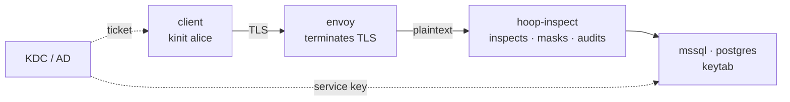

`hoop-inspect` relays Kerberos-authenticated database sessions and inspects each
statement inside them. It holds no credential, reads no ticket, and contains no
Kerberos code.

A user runs `kinit`, their OS mints a ticket, and the relay carries it to the
database untouched. Policy, masking and the audit trail behave as they do
on a password session.



<Note>
For the commands, start at [Get Started](/setup/configuration/hoop-inspect/get-started).
For every config field, see the [Config File reference](/setup/configuration/hoop-inspect/config-file).
</Note>

---

## Why a relay can sit in the middle

A Kerberos service ticket names a **service**. The machine that answers stays
out of it.

So `db.corp.example` can resolve to your Envoy. The client dials that name and
asks the KDC for a ticket naming that service. The KDC encrypts the ticket with
the **database's** key, so Envoy and the relay carry bytes neither can read, and
the database decrypts what it would have decrypted anyway.

The name the client dials has to match the SPN the database holds. The two
protocols build that name differently:

| Protocol | SPN the client requests | Note |
|---|---|---|
| MSSQL | `MSSQLSvc/db.corp.example:1433` | service, host **and port** |
| Postgres | `postgres/db.corp.example` | `krbsrvname/host`, no port |

Point that DNS name at Envoy and register the SPN against the database's service
account. The rest of Kerberos stays as it was.

---

## MSSQL

TDS gives the authentication exchange its own packet types, which is what lets
the relay forward a credential it cannot interpret.

| Packet | Type | What the relay does |
|---|---|---|
| PRELOGIN | `0x12` | forward |
| LOGIN7 | `0x10` | forward; record that the login is integrated |
| SSPI | `0x11` | forward verbatim, carrying the Kerberos exchange |
| Reply | `0x04` | forward, and refuse a routing redirect |
| SQLBatch / RPC | `0x01` / `0x03` | **inspect**: classify, evaluate policy, audit |

Inspection begins at the first `0x01` or `0x03`. The protocol's own message
typing draws that line, so no heuristic guesses where the credential ends.

### The client leg needs TDS 8.0

TDS 8.0 runs TCP, then TLS, then the protocol. The handshake is ordinary
TLS-on-connect, so Envoy terminates it with a plain `DownstreamTlsContext` and no
TDS awareness:

```yaml
- name: mssql_ingress
  address:
    socket_address: { address: 0.0.0.0, port_value: 1433 }
  filter_chains:
    - transport_socket:
        name: envoy.transport_sockets.tls
        typed_config:
          "@type": type.googleapis.com/envoy.extensions.transport_sockets.tls.v3.DownstreamTlsContext
          common_tls_context:
            tls_certificates:
              - certificate_chain: { filename: /etc/envoy/certs/server.crt }
                private_key: { filename: /etc/envoy/certs/server.key }
      filters:
        - name: envoy.filters.network.tcp_proxy
          typed_config:
            "@type": type.googleapis.com/envoy.extensions.filters.network.tcp_proxy.v3.TcpProxy
            stat_prefix: ingress_mssql
            cluster: hoop_inspect_mssql
            idle_timeout: 3600s
```

Clients connect with `Encrypt=strict`. TDS 7.x wraps its TLS handshake inside
`0x12` packets, which Envoy cannot speak, so 7.x lanes need a terminator that
does.

### The relay refuses a routing redirect

A login response can carry a routing ENVCHANGE, telling the driver to reconnect
elsewhere. AlwaysOn and Azure both use it, and drivers obey without
telling the user.

Forward it and the client lands on a socket the relay has no hold on, where the
session continues with no policy, no masking and no audit, leaving no trace
that it stopped being watched. The relay refuses it and ends the connection with a
message naming the redirect target. No rule enables this behaviour and none can
switch it off.

### The principal stays anonymous

Under integrated authentication, LOGIN7's username field is empty and the name
lives inside the encrypted ticket. Reading it would mean implementing Kerberos.

Audit rows on an MSSQL lane record `principal: anonymous`. To name the actor,
populate it from whatever terminated the client's TLS through
`proxy.Config.IdentityFn`: an mTLS peer certificate subject or a verified JWT.

---

## Postgres

pgwire carries its Kerberos exchange in ordinary tagged messages, which the
codec skips by length and forwards untouched:

```
R(7) AuthenticationGSS  →  p  AP-REQ  →  R(8) GSSContinue  →  R(0) Ok
```

Two things make this lane behave differently from MSSQL.

### GSS encryption is refused

This is the one to understand, because a mistake here shows no symptom.

`libpq` defaults `gssencmode=prefer`, so a client holding a ticket asks to wrap
the **whole session** in GSSAPI before anything else, ahead of TLS. Accept it and
each later byte is ciphertext: no statements, no masking, no audit trail, and no
error anywhere saying inspection stopped.

The relay answers `N` to that request. The client falls back and **keeps its
Kerberos authentication**, which travels as those tagged messages. Postgres
agrees:

```sql
SELECT gss_authenticated, encrypted FROM pg_stat_gssapi WHERE pid = pg_backend_pid();
 gss_authenticated | encrypted
-------------------+-----------
 t                 | f
```

Authenticated by ticket, transport left readable.

<Note>
`pgjdbc`, and therefore DBeaver, defaults `gssEncMode` to `allow`, which skips
the request. The exposure comes from `psql` and anything else built on
libpq.
</Note>

The refusal uses `N`, not `E`. Both decline, and pgjdbc closes and reopens the
TCP connection on `E`, which doubles each login in the audit trail.

### The audit trail names the actor

pgwire sends its `user` parameter in cleartext in the StartupMessage, so the
relay records it:

```
principal=alice@HOOP.TEST  stmts=1  denied=1  verdict=denied
rule=no-destructive-sql    operation=delete
```

At the moment the relay reads it the name is a claim. It becomes true when the
backend answers `AuthenticationOk`, because Postgres validated the ticket against
that exact name. Statements only flow after authentication succeeds, so a
statement attributed to a principal carries a verified one. A session showing a
principal and no statements is a login that failed.

### Terminating the client's TLS

pgwire negotiates TLS in-band: the client sends an 8-byte `SSLRequest` and waits
for a one-byte answer before any handshake. A plain TLS listener sees a sentinel
where it expects a ClientHello and fails.

Two ways to handle it.

**The relay terminates.** Set `downstream_tls` on the lane. Envoy stays a plain
`tcp_proxy`, and the relay answers both the GSS request and the TLS request in
the right order, so Kerberos and TLS coexist with no client flags:

```yaml
listeners:
  - name: appdb
    protocol: postgres          # the only protocol that accepts this
    downstream_tls:
      cert_file: /etc/hoop-inspect/certs/relay.crt
      key_file:  /etc/hoop-inspect/certs/relay.key
```

**Envoy terminates.** Requires the `envoy-contrib` image and
`envoy.filters.network.postgres_proxy` with `terminate_ssl`, layered over a
`starttls` transport socket. Envoy marks that filter work-in-progress and
documents it as unhardened. It also reacts to a `GSSENCRequest` by treating the
session as encrypted and stops terminating from that point, so Kerberos
clients on that lane must set `gssencmode=disable`.

Either way, clients need `channel_binding=disable` when the relay terminates the
**upstream** TLS. The relay strips `SCRAM-SHA-256-PLUS` from the server's offer,
because the client cannot bind to a channel it did not see, and a client on TLS
reads that missing mechanism as a downgrade attack.

---

## Masking

Both database lanes mask responses, by mechanisms suited to their framing.

Postgres rebuilds its length-prefixed `DataRow` frames. MSSQL reassembles the TDS
token stream across packets, rewrites `ROW` and `NBCROW` values, and lays fresh
packets over the result, because a longer value has nowhere to go in the
original framing.

```
SELECT name, email, ssn FROM customers;

 Ada Lovelace | [REDACTED:EMAIL_ADDRESS] | ***-**-6789
 Grace Hopper | [REDACTED:EMAIL_ADDRESS] | ***-**-4321
```

Covered on MSSQL: `NVARCHAR`, `NCHAR`, `VARCHAR`, `CHAR`, their `MAX` (PLP) forms,
and `TEXT`/`NTEXT`. A column type the codec cannot measure (`SQL_VARIANT`, `XML`,
UDT) stops the rewriting for that connection. Guessing a length would
desynchronize the client.
Statements and policy carry on; only masking steps aside, and whatever was
already rewritten stays rewritten.

<Warning>
A lane's `mask` block **replaces** the top-level defaults. Adding one column
rule drops the inherited entity rules, so list those again alongside it.
</Warning>

---

## Local testing

Two compose stacks under `deploy/docker-compose/envoy-stack` run the whole flow
against a real domain controller: a Samba AD DC, a database holding a keytab, a
client holding a ticket, and Envoy in front.

```bash
# Postgres, where a Kerberos login succeeds end to end. Starts in seconds.
hoopinspect/scripts/dev/pg-stack.sh
hoopinspect/scripts/dev/pg-kerberos-check.sh

# SQL Server. Runs emulated on Apple Silicon, so first boot takes minutes.
hoopinspect/scripts/dev/mssql-stack.sh
hoopinspect/scripts/dev/mssql-kerberos-check.sh
```

Each check script asserts the flow end to end: the ticket, the statement, the
denial, the masked values, and the audit rows. The MSSQL one runs the same login
down two paths, through the relay and straight at the database, and reports a
disagreement as a failure. A Kerberos result tells you about the relay only when
you know what the same login does without it.

---

## Limits

- **MSSQL statement extraction covers `sp_executesql`.** `sp_prepare`,
  `sp_prepexec` and the cursor family yield no statement, which is how JDBC and
  .NET send prepared statements. `EXEC('DELETE ...')` classifies as a call rather
  than a delete.
- **MSSQL logins need a directory.** SQL Server resolves `DOMAIN\user` to a SID
  over LDAP before it will store a login, so a keytab alone is not enough.
  Postgres compares the principal against `pg_authid`, a local table.
- **The MSSQL upstream hop is plaintext** unless the server speaks TDS 8.0.
  `upstream_tls` performs a TLS-on-connect handshake, and SQL Server on Linux
  offers no strict-encryption setting.
- **Prepared statements undercount in the audit trail.** pgjdbc stops sending
  `Parse` after `prepareThreshold` executions, so repeat runs of one prepared
  statement leave fewer records than executions. Policy still evaluates at parse
  time.
- **Extended Protection breaks the topology.** A channel-binding token ties the
  authenticator to the client's TLS channel. The database then compares that
  token against the channel Envoy terminated, and rejects the login. EPA's
  server side is Windows-only and off by default.
