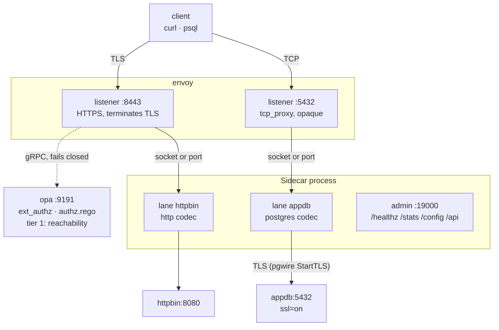
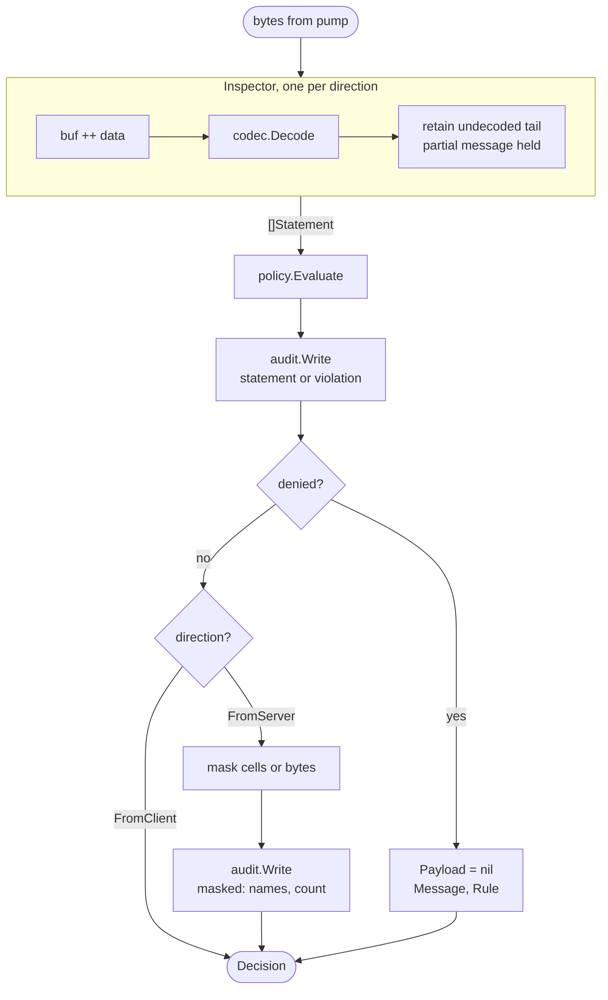
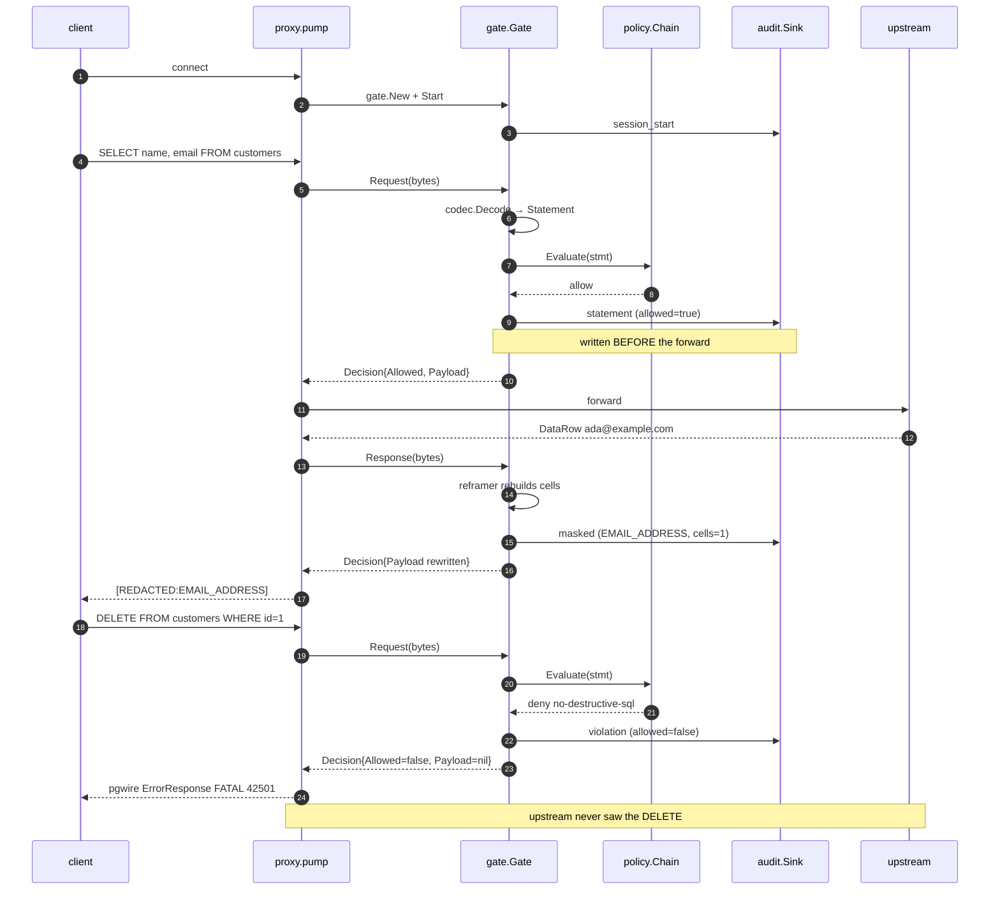
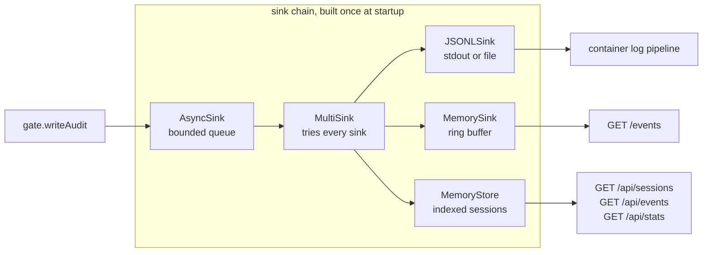

This page traces one connection from the client through Envoy, through the Sidecar, to the upstream and back. Read it to find out where a guardrail denial happens, why Postgres masking takes a different path from HTTP masking, and which knob in `config.yaml` controls which behavior.

<Note>
For the commands, start at [Command Line](/install/cli#running-the-sidecar). For every config field, see the [Config File reference](/setup/configuration/hoop-sidecar/config-file).
</Note>

---

## The two tiers

Envoy owns TLS and the network path. OPA answers reachability. The Sidecar reads the payload.



Envoy sees less on each lane going down the table.

| Lane | Envoy sees | OPA consulted |
|---|---|---|
| HTTPS → API | method, path, headers, bounded body | yes, `ext_authz` |
| postgres → database | a byte count | no, it has no pgwire parser |

On HTTP, `ext_authz` handles request-side authorization well. The gap sits on the response: `ext_authz` decides **before** Envoy calls the upstream, so no configuration of it reaches a response status or a response body. On Postgres the gap is wider. Envoy forwards bytes it cannot parse, so OPA never receives a statement to judge.

<Note>
The HTTP codec captures **nothing** by default: no bodies, no headers. Everything captured reaches the policy engine, the audit trail and, where an analyzer is configured, a third party, so a lane opts in per listener with an `http:` block. See [Risk Analysis](/setup/configuration/hoop-sidecar/risk-analysis#the-http-lane-needs-capture-body).
</Note>

### Where Envoy ends and the Sidecar begins

|  | Envoy | Sidecar |
|---|---|---|
| Postgres SQL parse | `postgres_proxy`, best effort | full statement text |
| Postgres granularity | `table.db` + operation verb | statement, its worst effect, every effect, and each relation as a read or a write |
| Postgres **response** | not available | result columns, row count, masking by re-framing |
| HTTP request | `ext_authz`: method, path, headers, bounded body | method, path, normalized resource; body and headers only when the lane sets `http.capture_body` |
| HTTP **response** | not available, ext_authz decides before the upstream runs | status; body and headers under the same setting |
| Deny UX | RBAC/ext_authz drops the connection or returns a bare 403 | the message an operator wrote |

Envoy is not blind here, and an argument that says otherwise loses a technical review. The Sidecar covers what remains.

---

## One process, one lane per Envoy cluster

The Sidecar serves one listener per Envoy cluster. Each listener resolves its own guardrails, its own masking and its own OPA endpoint.

```
envoy :8443 ──cluster hoop_inspect_http──> lane "httpbin"   http
envoy :5432 ──cluster hoop_inspect_pg────> lane "appdb"     postgres
                                           └─ one process
```

Each lane binds a unix socket or a TCP port, set per listener. Nothing above the transport changes, because the gate reads a `net.Conn` and never asks what kind it is.

Most sidecars run one lane. A per-user pod fronting both a database and an API runs two in one process instead of two containers. The Sidecar resolves the merge between top-level defaults and a lane's overrides at startup and again on every reload of the file, and reports every broken lane in one run.

---

## Inside one connection

The Sidecar accepts a socket, builds per-connection state, and starts two goroutines that pump in opposite directions through one Gate.

```
accept
  ├─ session.New(proto, Identity{PeerAddr})
  ├─ gate.New(sess, cfg)   two Inspectors, one per direction
  ├─ g.Start(ctx)          records the session even if it issues no statement
  ├─ dialUpstream()
  │
  ├─ go pump(client → upstream, FromClient) ─┐
  └─ go pump(upstream → client, FromServer) ─┘  first to finish closes the peer
```

Two Inspectors, because a codec reassembles messages across reads. Feeding both halves of a duplex stream into one reassembly buffer corrupts both.

`pump` reads 32 KiB at a time and hands every chunk to the Gate before anything reaches the far side:

```
src.Read(buf) ──> n bytes
      ↓
d := g.Request(ctx, buf[:n])        or g.Response for FromServer
      ↓
├─ d.Allowed == false ─→ DenyWriter.Deny(proto, msg) ─→ write frame ─→ return
│                        pgwire 'E' FATAL 42501  |  HTTP 403 + X-Hoop-Denied
│                        always to the CLIENT, whichever direction denied
│
└─ d.Allowed == true  ─→ dst.Write(d.Payload)
```

A re-framing codec holds rows back until their result set ends, so `pump` defers a flush on the server direction. Skipping that flush drops the tail of a client's output, and the user reads it as a truncated result rather than as a masking bug.

**Source:** [`hoopinspect/proxy/proxy.go`](https://github.com/hoophq/hoop/blob/main/hoopinspect/proxy/proxy.go)

---

## Inside the Gate

Four steps run per chunk, and the order carries weight.



Auditing **before** the forward costs a write on the hot path. It buys you the property that a crash between the two cannot lose the record of the statement that caused it. Reverse the order and you lose the one row an incident review needs most.

A clean payload aliases the input rather than copying it, so a statement nothing touched allocates nothing.

**Source:** [`hoopinspect/gate/gate.go`](https://github.com/hoophq/hoop/blob/main/hoopinspect/gate/gate.go)

---

## Inside the Inspector

A codec registers a factory rather than an instance. Two connections sharing one stateful codec would corrupt each other's reassembly buffer, and one tenant's SQL would surface in another tenant's audit trail.

```
                  hoopinspect.Register(factory)   from codec init()
                            ↓
 hoopinspect.New(Postgres) ─┴─> Inspector{codec, buf, maxBuffer 8 MiB}
                                     │
                                     ↓ codec.Decode
   ┌─── codec/postgres ──────────────────────────────────┐
   │  skipHandshake()   startup packet, SSLRequest        │
   │  tag 'Q' Query ──> lexer.Split() on top-level ';'    │
   │  tag 'P' Parse ──> parseMessage()                    │
   │  everything else → skip by length                    │
   └──────────────────────┬───────────────────────────────┘
                          ↓
           AnalyzeSQL(text, Postgres)   one pass, dialect-parameterized,
                          │             over a labelled region stack
                          ↓
   Statement{Protocol, Direction, Text, Operation, Effects, Relations,
             Tables, Database, HTTP *HTTPDetail, Metadata}
```

Two details in that path decide real verdicts.

The codec splits a simple-query payload on top-level semicolons, because `SELECT 1; DROP TABLE users` arrives as one `Q` message. A decoder classifying by the leading verb would report a harmless select and forward the DROP. The scanner owns the split, so a semicolon inside a string literal, a dollar-quoted body or a nested comment is never a separator.

`AnalyzeSQL` scans once and tracks nesting on a **labelled region stack**: every level knows whether it is a CTE, a subquery or a plain parenthesis. The previous classifier carried a single paren-depth integer, which is why `WITH d AS (DELETE FROM customers RETURNING *) SELECT count(*) FROM d` read as a `select` against `[customers d]`. It now reports `delete` against `customers` as a write.

Three fields come out of it, and a rule can key on any of them:

| Field | Answers |
|---|---|
| `Operation` | The most consequential effect. A statement whose effects are `{select, delete}` is a `delete`. |
| `Effects` | Every operation the statement performs, anywhere in the tree. |
| `Relations` | Each relation with `read` or `write`, so `INSERT INTO staging SELECT * FROM customers` writes one and reads the other. |

Comments and string literals never reach the token stream, so `SELECT 'DROP TABLE customers'` is a `select` and a `deny_words_list` rule on `DROP` denies that harmless query. Prefer `type: operation`, and see [Guardrail Rules](/setup/configuration/hoop-sidecar/policy-rules) for what each rule type reads.

A statement whose body the scanner cannot reach reports `Operation: unknown` and sets `Metadata["sql.incomplete"]` to the reason: `CALL purge()` gives "stored procedure; body is in the catalog", `EXECUTE p` gives "prepared statement; the text was supplied elsewhere", `DO $$…$$` gives "anonymous code block; body is interpreted at runtime". That pair is the fail-closed signal. Name `unknown` in a rule and the Sidecar refuses what nobody can read.

### Checked against PostgreSQL's own grammar

`lexer/conformance` is a separate module that parses every fixture with PostgreSQL 17.5 through `wasilibs/go-pgquery` and compares write-sets. It runs under wazero with `CGO_ENABLED=0`, so it needs no C toolchain, and nothing the root builds imports it: `hoopinspect` still has zero requires and no `go.sum`.

| Corpus | Result |
|---|---|
| 74 hand-written fixtures | 72 exact (97.3%), 2 conceded (`DO`, `CALL`), 0 wrong |
| PostgreSQL 17.5's regression suite, 20,391 statements | 20,240 complete (99.3%). The 151 concessions are 94 `PREPARE`, 36 `CALL`, 18 `DO` and 3 unbalanced-paren, every one of them failing closed. |
| `FuzzAnalyze`, 4.2M execs | zero findings |

The suite asserts one thing: the scanner's write-set equals PostgreSQL's, or the scanner reported `Complete=false`. A confident, different answer fails the build.

<Note>
`DO`, `CALL`/`EXECUTE` and a function call inside a SELECT list are a permanent ceiling that no parser clears, PostgreSQL's own included, because the body sits in the catalog or was supplied on another round trip. The first two set `Complete=false`; the third does not, because flagging every `SELECT count(*)` would make the flag meaningless. So `operations: [unknown, other]` is a standing posture on a lane that must fail closed. MSSQL runs this scanner permanently: no credible Go T-SQL parser exists.
</Note>

**Source:** [`hoopinspect/lexer/`](https://github.com/hoophq/hoop/tree/main/hoopinspect/lexer), [`hoopinspect/sqlmeta.go`](https://github.com/hoophq/hoop/blob/main/hoopinspect/sqlmeta.go), [`hoopinspect/codec/postgres/`](https://github.com/hoophq/hoop/tree/main/hoopinspect/codec/postgres)

### Protocols

| Protocol | Request messages | Response messages | Stateful |
|---|---|---|---|
| `postgres` | `Query` ('Q'), `Parse` ('P'); handshake skipped | `RowDescription` ('T'), `DataRow` ('D'), and the terminators that end a result set | yes |
| `mssql` | `SQLBatch` (`0x01`), `RPC` (`0x03`), `sp_executesql` unwrapped; PRELOGIN, LOGIN7, SSPI and an `ENCRYPT_OFF` encrypted login forwarded untouched | none decoded as statements; the login reply is scanned once and a routing ENVCHANGE ends the connection | yes |
| `http` | HTTP/1.x requests | HTTP/1.x responses | no |

Both database codecs are stateful: one Postgres `RowDescription` describes every `DataRow` after it, one TDS `COLMETADATA` describes every `ROW`, and those land in different TCP reads.

---

## Policy evaluation

Evaluators compose in ascending order of cost, so a statement an earlier one already forbids never pays for a later one.

```
Statement ──> policy.Chain{ Guardrails, OPAClient, analyzer, OPAClient }
                   │           │            │            │
                   │           │            │            └─> decide phase
                   │           │            │                reads input.findings
                   │           │            └─> POST to an LLM provider
                   │           │                 ~100ms-2s, costs money
                   │           │                 fails OPEN by default
                   │           │
                   │           └─> POST /v1/data/…   gate phase, optional
                   │                {"input":{operation, effects, relations,
                   │                          phase, context{principal}}}
                   │                fails closed
                   ↓
             first match wins among the rules that DENY
             deny_words_list · pattern_match · operation · table
             http_resource · http_status · pii
```

The chain stops at the first denial, so a `DELETE` an `operation` guardrail already refuses never reaches a model. That ordering is load-bearing.

A rule carrying `action: defer` reports its match as a **finding** and evaluation continues. The finding travels in-process on the evaluation context and reaches the decide-phase OPA call as `input.findings`, keyed by the rule's type. A producer that ran and could not answer still appears, carrying a status, because "no answer" is the case a policy most needs to see and the case an absent key hides.

| Lane | Chain |
|---|---|
| Nothing defers, no gate | `guardrails` → `opa` |
| Something defers | `guardrails` → producers → `opa(decide)` |
| `opa.gate: true` | `guardrails` → `opa(gate)` → producers → `opa(decide)` |

The gate runs before the producers and answers whether they are worth running, which is how the cost control survives moving a determination into Rego. [Guardrail Rules](/setup/configuration/hoop-sidecar/policy-rules) carries the finding shape, the status vocabulary and the Rego that reads it.

The analyzer is the lane's third evaluator, declared in the listener's own `analyzer:` block beside `guardrails`, `opa` and `mask`: it needs a provider, a deadline and a cache, so it gets a block of its own and always runs after OPA. The block holds what is per lane, the trigger, the risk-to-action map and the prompt, and inherits every tunable it does not name from the top-level `analyzer` section, which keeps the provider, the model and the credential process-wide.

Deprecated `type: ai_analysis` rules still build extra evaluators through the same path, appended after the block, so a lane can run both spellings while it migrates. If more than one evaluator classifies the same statement, the audit record keeps the **highest** risk reported and the action that came with it.

The guardrails engine and OPA fail closed. An unreachable OPA, a 500, or an undefined decision denies. One exception: an undefined **gate** decision allows and requests nothing, because a gate is an optimization over a policy someone already wrote. The analyzer inverts the default, because it depends on a third-party API rather than a service you run. A listener where the analyzer holds statements for review keeps failing closed. See [Risk Analysis](/setup/configuration/hoop-sidecar/risk-analysis#why-this-one-fails-open).

The `pii` rule type dispatches at the rule-set level rather than per rule, because the detector belongs to the rule set and not to any single rule.

**Source:** [`hoopinspect/policy/`](https://github.com/hoophq/hoop/tree/main/hoopinspect/policy)

---

## Masking, and why the codec owns it

Masking runs on responses only. The gate asks the codec for one capability, `Reframer`, and hands it the response bytes and the masker:

```
FromServer bytes
   ↓
codec implements Reframer? ──> maskByReframing()
                                codec rebuilds its own framing around
                                the new values
```

Only the codec knows where a value ends and what declares its length, so only the codec can change a value without breaking the client's read of the stream.

Postgres length-prefixes every row and every column. Substituting `ada@example.com` (15 bytes) with `[REDACTED:EMAIL_ADDRESS]` (24 bytes) desynchronizes psql on the next message, and the user sees "lost synchronization with server". The Postgres codec rebuilds the `DataRow` frames around the masked values instead.

MSSQL has the same problem in a different framing. Its codec reassembles the TDS token stream across packets, rewrites `ROW` and `NBCROW` values, and lays fresh packets over the result. A column type it cannot measure (`SQL_VARIANT`, `XML`, UDT) stops the rewriting for that connection rather than guessing a length; statements and policy carry on.

HTTP declares its length in `Content-Length` or in chunk sizes, and a WebSocket message in its frames. The HTTP codec walks a JSON body value by value, hands each to the masker under its key path, corrects `Content-Length`, re-chunks a chunked body as it streams, undoes gzip and deflate around the masker, and re-frames a WebSocket text message. A text or JSON body under an encoding it cannot undo (zstd, br) is refused rather than forwarded unmasked. See [HTTP](/setup/configuration/hoop-sidecar/protocols/http#masking).

A codec that cannot re-frame gets its `mask` section refused at startup, and a codec handed in through `CodecFactory` that cannot re-frame is refused when the gate is built. Accepting a mask config that can never fire is the failure that ends with an unmasked SSN in a screenshot.

**Source:** [`sidecar/gate/gate.go`](https://github.com/hoophq/hoop/blob/main/sidecar/gate/gate.go) (`maskByReframing`, `MaskSupported`); the codecs in [`hoophq/libhoop`](https://github.com/hoophq/libhoop) under `v2/codec/{postgres,mssql,http}/rewrite*.go`

---

## Where PII detection plugs in

The core library ships zero dependencies. A detection engine worth having carries recognizers for dozens of national identifier formats, so it lives behind two interfaces the core already declares.

```
                  ┌─ mask.Detector    { Entities(), Find(entity, data) }
alcatraz.Detector ┤                        ↓ response masking
  (one value)     └─ policy.Scanner   { ScanText(text) []string }
                                           ↓ request guardrails
```

One detector drives both paths: masking rewrites what comes back, and the `pii` guardrail rule denies what goes in. [alcatraz](https://github.com/hoophq/alcatraz) supplies 45 entity types across 12 countries, 25 of them checksum-verified. All 45 are enabled unless a `pii.entities` list narrows them.

It also carries three secret recognizers, which a rule names like any other entity: `AWS_ACCESS_KEY`, `JWT` (decodes the header rather than matching its shape) and `PRIVATE_KEY`.

There are no build tags. The config file decides every capability, so an operator narrowing or tuning PII detection does not also have to swap the binary.

**Source:** [`hoopinspect/pii/alcatraz/`](https://github.com/hoophq/hoop/tree/main/hoopinspect/pii/alcatraz)

---

## Audit: six kinds, one write path, three sinks



| Kind | Fires | Carries |
|---|---|---|
| `session_start` | connection accepted | principal, protocol, listener name |
| `statement` | each inspected statement | text, operation, tables, `allowed=true` |
| `violation` | a denied statement | same, plus `rule` and `message` |
| `masked` | response data rewritten | entity names and a count, never values |
| `error` | transport or upstream failure | the error text |
| `session_end` | connection closed | duration, statement and denial totals |

`session_start` fires even for a connection that issues nothing, so an abandoned session leaves a trace. Without it, a client that connects and disappears is invisible. The one exception is an `http` lane with `identity_header`, which reads the first request before it opens the session: a client that connects and never sends one is closed with no session at all. See [Identity](#identity).

### Where the events go



The JSONL sink goes first, and the multi-sink attempts every sink regardless of what an earlier one returned, so the durable record survives a failure in the in-memory ring or the query store. Both in-memory sinks drop their oldest entry when full and report the drop count, so a reader can tell a partial window from a complete one. The JSONL stream stays the record of truth.

**Source:** [`hoopinspect/audit/`](https://github.com/hoophq/hoop/tree/main/hoopinspect/audit), [`hoopinspect/store/`](https://github.com/hoophq/hoop/tree/main/hoopinspect/store)

### Reading it back

```bash
curl -s localhost:19000/api/stats | python3 -m json.tool
```

```json
{"sessions": 16, "statements": 28, "denied": 6, "masked": 27, "errors": 0,
 "by_connection": [{"label": "appdb", "count": 9}, {"label": "httpbin", "count": 7}],
 "by_rule": [{"label": "no-destructive-sql", "count": 2},
             {"label": "no-upstream-5xx", "count": 2},
             {"label": "no-cpf-in-query", "count": 1}]}
```

The query endpoints accept filters: `principal`, `connection`, `protocol`, `since`, `until`, `denied`, `open`, `q` for substring search, plus `limit` and `cursor` for paging. `/api/events` also takes `session_id` and a repeatable `kind`.

---

## Deploying it

Placement is a question of who reaches the Sidecar and how, not of what the Sidecar does — guardrails, masking and audit behave identically wherever it runs. It can sit beside one workload over a unix socket, on a host over a TCP port, or behind an existing proxy like Envoy; see [Where the process sits](/core-concepts/sidecar#where-the-process-sits) for the trade-offs between those.

The step-by-step setup for each shape — including both permission traps a unix-socket deployment hits — lives on its own page:

<CardGroup cols={3}>
  <Card title="Command Line" icon="terminal" href="/install/cli#running-the-sidecar">
    Wiring it up behind Envoy, unix socket or TCP, and a compose stack that runs the whole thing locally.
  </Card>
  <Card title="Container Images" icon="box" href="/install/container-images">
    The official `hoophq/hoopsidecar` image, what it sets, and building your own.
  </Card>
  <Card title="Kubernetes" icon="dharmachakra" href="/install/kubernetes">
    The Helm chart, including running it as a native Kubernetes sidecar container.
  </Card>
</CardGroup>

---

## Identity

A session records `principal: anonymous` until something names the caller. Three lanes can:

| Lane | Source of the principal |
|---|---|
| `http`, `grpc`, `spanner` | the header named by `identity_header`, set by the authenticating proxy in front. An `http` lane reads it from the first request on the connection, before the session exists, so `session_start` already carries it; a grpc or spanner lane reads it per RPC and falls back to the mTLS peer certificate |
| `postgres` | the `user` the client names in its StartupMessage |
| `ssh` | the certificate the lane verified itself, mapped by `ssh.identity` |

Every other lane records the peer address and nothing else. `identity_header` on a lane that does not read it is refused at startup.

The session reaches Rego as `input.context`, carrying `principal`, `session_id` and `connection` (the listener's name) on every statement, plus `subject`, `email`, `groups`, `peer_addr`, `upstream` and `correlation_id` where the identity supplies them. A policy that requires a named caller should deny `input.context.principal == "anonymous"`; the Sidecar admits an anonymous session and leaves that call to you.

<Note>
A sidecar lane used to send an **empty** `input.context`. The gate looked for a bare `*policy.OPAClient` to stamp the session onto, and a lane's policy is a `policy.Chain`, so the assertion never matched and the facts never left the process. The gate now seeds the evaluation context instead, which every evaluator in the chain reads, including both calls on a two-phase lane.
</Note>

---

## Known limits

Read these before writing a policy against the Sidecar.

- **Six codecs ship: postgres, mysql, mssql, mongodb, clickhouse and http.** Adding one means a new `codec/<name>` package and nothing else. `grpc`, `spanner` and `ssh` lanes are not codecs: each terminates its protocol itself and builds statements above it.
- **Relations come from a scanner, not a SQL grammar.** One pass over a labelled region stack, reporting each relation as a read or a write. A statement it cannot finish comes back with no relations and an `unknown` operation carrying the reason in `metadata["sql.incomplete"]`, so "could not determine" never reads as "touches nothing". Set `require_table_match: true` on rules protecting something critical and accept the false positives. `lexer/conformance` holds the scanner to zero wrong answers against PostgreSQL 17.5's grammar.
- **A response batch can be truncated.** The Postgres codec stops decoding columns past 1000 rows in one result set, to keep the Sidecar's memory out of a query's hands. It keeps counting and marks the batch truncated. A policy must read that as inconclusive, never as proof a value is absent.
- **A response statement carries no verb.** For database codecs a server-direction statement reports `unknown`, because the operation belongs to the request the audit trail already recorded. Key a response-side SQL rule on the result, not on the operation.
- **MSSQL statement extraction covers `sp_executesql`.** `sp_prepare`, `sp_prepexec` and the cursor family yield no statement, which is how JDBC and .NET send prepared statements. `EXEC('DELETE ...')` reports `unknown` with the reason "stored procedure; body is in the catalog", so a rule naming `unknown` refuses it and one naming `call` no longer matches.
- **PII detection is neither sound nor complete.** A checksum-verified identifier holds up. Everything else is a pattern. Detecting a name column needs NER, which this does not wire, and a caller can split a value across two responses. Masking raises the cost of accidental exposure without replacing "do not grant access to that table".
- **HTTP/1.x only for stream decoding.** HTTP/2 and HTTP/3 framing belongs to whatever terminated the connection.
- **Plaintext at the Sidecar, with one exception.** A client negotiating TLS end to end past the Sidecar leaves nothing to parse. Something in front terminates it: an HTTPS listener covers HTTP, `postgres_proxy` with a `starttls` socket covers Postgres, and a plain `DownstreamTlsContext` covers TDS 8.0. TDS 7.x is the exception, because nothing can terminate it: PRELOGIN's `ENCRYPT_OFF` encrypts the first LOGIN7 packet and leaves every statement in the clear, so the Sidecar walks that region by TLS record framing and reads the session after it. See [Kerberos and SQL Server](/setup/configuration/hoop-sidecar/kerberos#tds-7x-encrypts-the-login-and-nothing-else). The upstream leg may be TLS, which the Sidecar originates itself, except on MSSQL where SQL Server on Linux accepts no handshake the Sidecar can start.
- **A session encrypted end to end is refused, not forwarded.** `ENCRYPT_ON`, or a TDS 8.0 client reaching the Sidecar with nothing terminating in front, leaves no statement that can be classified, masked or audited. Both report `rule: stream-unsafe` and name the cause. Such a session used to connect and run uninspected, so check what your driver sets for `Encrypt` before putting an existing MSSQL lane behind this: ODBC Driver 18 and SqlClient 5+ default to `Mandatory`, go-mssqldb to `ENCRYPT_OFF`.
- **Statements are not transactions.** Each one gets its own verdict, and no cross-statement session state exists.

---

## Reference stack

The repository ships a compose stack that runs every component on this page end to end.

| File | What it holds |
|---|---|
| [`docker-compose.yml`](https://github.com/hoophq/hoop/blob/main/deploy/docker-compose/envoy-stack/docker-compose.yml) | Six containers: Envoy, OPA, the Sidecar, Postgres, an HTTP service, a client |
| [`envoy/envoy.yaml`](https://github.com/hoophq/hoop/blob/main/deploy/docker-compose/envoy-stack/envoy/envoy.yaml) | Both listeners, the `ext_authz` filter, and the Sidecar clusters |
| [`opa/authz.rego`](https://github.com/hoophq/hoop/blob/main/deploy/docker-compose/envoy-stack/opa/authz.rego) | Tier-1 reachability policy |
| [`hoopinspect/config.yaml`](https://github.com/hoophq/hoop/blob/main/deploy/docker-compose/envoy-stack/hoopinspect/config.yaml) | Two lanes with guardrails, masking and upstream TLS |
| [`uds/`](https://github.com/hoophq/hoop/tree/main/deploy/docker-compose/envoy-stack/uds) | The socket overlay: `pipe:` clusters, the init container, and both permission traps solved |
| [`demo.sh`](https://github.com/hoophq/hoop/blob/main/deploy/docker-compose/envoy-stack/demo.sh) | Walks every lane and prints the audit trail |

---

## Next

<CardGroup cols={2}>
  <Card title="Guardrail Rules" icon="shield-halved" href="/setup/configuration/hoop-sidecar/policy-rules">
    Every rule type, deferring a match to Rego, and the findings a policy reads.
  </Card>
  <Card title="Command Line" icon="terminal" href="/install/cli#running-the-sidecar">
    Configure Envoy, run the Sidecar, and watch a denial land in psql.
  </Card>
  <Card title="Config File" icon="file-code" href="/setup/configuration/hoop-sidecar/config-file">
    Every section, every rule type, and what startup refuses.
  </Card>
</CardGroup>
