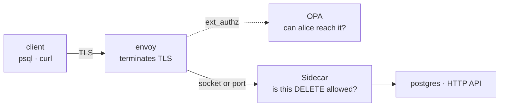

The Sidecar is an inspecting proxy. It decodes the wire protocol between a client and a database or an API, evaluates every statement against policy, records an audit trail, and masks sensitive values in the response.

It routes nothing and terminates no client TLS. You run it behind something that already owns the network path and identity, which in most enterprises means Envoy. Envoy reaches it over a unix socket or a TCP port, your choice per lane.



Envoy answers reachability. The Sidecar answers what the statement does, and what comes back.

<Note>
This runs with no gateway, no agent, and no control-plane database. One config file is the whole setup.
</Note>

---

## Prerequisites

- The `hoop` CLI installed. See [CLI installation](/clients/cli).
- An Envoy you can add a cluster to, or any proxy that can forward plaintext to a local port.
- A backend to protect: PostgreSQL, SQL Server or an HTTP service.

---

## Step 1: Write a config file

One listener is one upstream. Start with a single Postgres lane and nothing else.

Pick a transport first. One field decides it, and the rest of the file is identical either way:

| | Unix socket | TCP port |
|---|---|---|
| Config | `network: unix` + a path | omit `network`, `listen` takes `host:port` |
| Reachable by | whoever can open the file | anything that can route to the host |
| Needs | both processes sharing a directory, and agreeing uids | nothing |
| Fits | a sidecar beside one workload, one pod | separate hosts, or a laptop |

<Tabs>
  <Tab title="Unix socket">
    ```yaml config.yaml
    log_level: info

    admin:
      listen: 127.0.0.1:19000     # /healthz, /stats, /config, /api/*

    audit:
      file: "-"                   # JSON lines on stdout

    listeners:
      - name: appdb                            # the name audit rows and rules key on
        protocol: postgres
        network: unix                          # no port is opened at all
        listen: /run/hoop-inspect/pg.sock      # where Envoy sends bytes
        upstream: appdb:5432                   # the real database
        guardrails:
          rules:
            - name: no-destructive-sql
              type: operation
              operations: [drop, delete, truncate]
              message: destructive statements are not permitted on appdb
    ```

    A socket opens no port, so reachability becomes a filesystem question rather than a network one. The cost is coordination: Envoy and the Sidecar mount the same directory and their uids have to agree. Cheap in a pod spec, awkward across hosts.
  </Tab>
  <Tab title="TCP port">
    ```yaml config.yaml
    log_level: info

    admin:
      listen: 127.0.0.1:19000     # /healthz, /stats, /config, /api/*

    audit:
      file: "-"                   # JSON lines on stdout

    listeners:
      - name: appdb               # the name audit rows and rules key on
        protocol: postgres
        listen: 127.0.0.1:15432   # network omitted -> tcp
        upstream: appdb:5432      # the real database
        guardrails:
          rules:
            - name: no-destructive-sql
              type: operation
              operations: [drop, delete, truncate]
              message: destructive statements are not permitted on appdb
    ```

    Nothing to mount and nothing to chown, which is why the compose stack defaults to this. Bind loopback where the Sidecar and Envoy share a network namespace: a `0.0.0.0` bind is reachable by anything that can route to the host, and a NetworkPolicy narrows that without removing it.
  </Tab>
</Tabs>

Nothing above the transport changes. Guardrails, masking, audit and `upstream_tls` behave the same way, because the gate reads a `net.Conn` and never asks what kind it is. See [Transport](/setup/configuration/hoop-sidecar/config-file#transport) for the full comparison.

### Another protocol is one field

`protocol` picks the codec and nothing else in the lane changes with it. A SQL Server lane is the same shape as the Postgres one above:

```yaml config.yaml
listeners:
  - name: mssqldb
    protocol: mssql             # postgres | mssql | http
    listen: 127.0.0.1:11433     # network: unix works here too
    upstream: mssql:1433
    guardrails:
      rules:
        - name: no-destructive-tsql
          type: operation
          operations: [drop, delete, truncate]
          message: destructive statements are not permitted on mssqldb
```

Guardrails, masking and audit behave as they do on a Postgres lane. Two differences belong to the protocol: the client's TLS is TDS 8.0, which Envoy terminates with a plain listener, and the hop to SQL Server stays plaintext because the Linux build accepts no TLS shape the Sidecar can originate. Both are covered in [Kerberos and SQL Server](/setup/configuration/hoop-sidecar/kerberos).

<Warning>
**A lane always enforces.** There is no observe-only switch: a rule you write denies from the first statement that matches it. Deploy a new rule set against a staging listener, or [validate](#step-2-validate-before-you-deploy) and read `/api/events?kind=violation` there, before it fronts production.
</Warning>

<Note>
`type: operation` matches the statement's most consequential **effect**, so `WITH d AS (DELETE FROM customers RETURNING *) SELECT count(*) FROM d` counts as a `delete` and the rule above catches it. [Guardrail Rules](/setup/configuration/hoop-sidecar/policy-rules) covers every rule type, including deferring a match to a Rego policy instead of denying it.
</Note>

---

## Step 2: Validate before you deploy

Nothing needs to be running. The validator builds every lane and reports every problem in one run:

```bash
hoop start sidecar --config config.yaml --validate
```

```
config OK: 1 listener(s)
  appdb            postgres  1 rule(s)
```

Each line is the **resolved** lane, so the rule count includes anything it inherited. A lane with an `opa` block reads `+ opa`, and one with masking reads `+ masking`.

---

## Step 3: Run it

```bash
hoop start sidecar --config config.yaml
```

`--config` also reads `HOOP_SIDECAR_CONFIG`, which is the shape a Kubernetes deployment wants: mount the ConfigMap, set the variable, pass no arguments.

Check it came up:

```bash
curl -s localhost:19000/healthz     # ok
curl -s localhost:19000/config | python3 -m json.tool
```

---

## Step 4: Point Envoy at it

The Sidecar is an ordinary upstream. There is no ext_proc, no WASM, no custom Envoy filter to install. You change the cluster your listener already routes to.

The cluster shape follows the transport you picked in Step 1:

| Transport | Cluster `type` | Endpoint address |
|---|---|---|
| Unix socket | `STATIC` | `pipe: { path: … }` |
| TCP port | `STRICT_DNS` | `socket_address: { address, port_value }` |

A path resolves to nothing, so `STRICT_DNS` on a `pipe:` endpoint fails at load.

<Tabs>
  <Tab title="Unix socket">
    ```yaml envoy.yaml
    static_resources:
      listeners:
        - name: postgres_ingress
          address:
            socket_address: { address: 0.0.0.0, port_value: 5432 }
          filter_chains:
            - filters:
                - name: envoy.filters.network.tcp_proxy
                  typed_config:
                    "@type": type.googleapis.com/envoy.extensions.filters.network.tcp_proxy.v3.TcpProxy
                    stat_prefix: ingress_pg
                    cluster: hoop_inspect_pg

      clusters:
        - name: hoop_inspect_pg
          type: STATIC
          connect_timeout: 5s
          load_assignment:
            cluster_name: hoop_inspect_pg
            endpoints:
              - lb_endpoints:
                  - endpoint:
                      address:
                        pipe: { path: /run/hoop-inspect/pg.sock }
    ```

    Envoy has no pgwire parser, so this lane is plain `tcp_proxy`. Every byte reaches the Sidecar unexamined, which is the reason the Sidecar earns its place here.

    <Warning>
    **Two permission traps, and neither produces a useful error.**

    *Creating the socket.* The Sidecar needs write permission on the directory. A volume that mounts root-owned against a non-root image fails with `bind: permission denied`. Chown the directory before the Sidecar starts, or set `fsGroup` on a Kubernetes pod.

    *Connecting to it.* `connect()` on a unix socket requires **write** permission on the socket file, not read. Go creates a listening socket at `0777 &^ umask`, and the usual 022 clears exactly the group-write bit Envoy needs. Envoy then reports `flags=UF` and `upstream_cx_connect_fail` while the cluster still shows healthy, because the endpoint resolved. Run the Sidecar with Envoy's gid and `umask 0002`.
    </Warning>
  </Tab>
  <Tab title="TCP port">
    ```yaml envoy.yaml
    static_resources:
      listeners:
        - name: postgres_ingress
          address:
            socket_address: { address: 0.0.0.0, port_value: 5432 }
          filter_chains:
            - filters:
                - name: envoy.filters.network.tcp_proxy
                  typed_config:
                    "@type": type.googleapis.com/envoy.extensions.filters.network.tcp_proxy.v3.TcpProxy
                    stat_prefix: ingress_pg
                    cluster: hoop_inspect_pg

      clusters:
        - name: hoop_inspect_pg
          type: STRICT_DNS
          connect_timeout: 5s
          load_assignment:
            cluster_name: hoop_inspect_pg
            endpoints:
              - lb_endpoints:
                  - endpoint:
                      address:
                        socket_address: { address: hoop-inspect, port_value: 15432 }
    ```

    Nothing to mount. The Sidecar's port is reachable by anything that can route to it, so keep it off any interface a client can find.
  </Tab>
  <Tab title="MSSQL lane">
    TDS 8.0 is TCP, then TLS, then the protocol, so Envoy terminates it with an ordinary `DownstreamTlsContext` and needs no TDS awareness.

    ```yaml envoy.yaml
    static_resources:
      listeners:
        - name: mssql_ingress
          address:
            socket_address: { address: 0.0.0.0, port_value: 1433 }
          filter_chains:
            - transport_socket:
                name: envoy.transport_sockets.tls
                typed_config:
                  "@type": type.googleapis.com/envoy.extensions.transport_sockets.tls.v3.DownstreamTlsContext
                  common_tls_context:
                    tls_certificates:
                      - certificate_chain: { filename: /etc/envoy/certs/server.crt }
                        private_key: { filename: /etc/envoy/certs/server.key }
              filters:
                - name: envoy.filters.network.tcp_proxy
                  typed_config:
                    "@type": type.googleapis.com/envoy.extensions.filters.network.tcp_proxy.v3.TcpProxy
                    stat_prefix: ingress_mssql
                    cluster: hoop_inspect_mssql
                    idle_timeout: 3600s   # a session idles between keystrokes

      clusters:
        - name: hoop_inspect_mssql
          type: STRICT_DNS
          connect_timeout: 5s
          load_assignment:
            cluster_name: hoop_inspect_mssql
            endpoints:
              - lb_endpoints:
                  - endpoint:
                      address:
                        socket_address: { address: hoop-inspect, port_value: 11433 }
    ```

    Clients connect with `Encrypt=strict`. A TDS 7.x client wraps its TLS handshake inside `0x12` packets, which Envoy cannot speak, so that lane skips Envoy and the Sidecar takes the connection directly: `ENCRYPT_OFF` encrypts the login packet alone and leaves every statement readable. See [Kerberos and SQL Server](/setup/configuration/hoop-sidecar/kerberos#tds-7x-encrypts-the-login-and-nothing-else).
  </Tab>
  <Tab title="HTTP lane">
    On HTTP you keep your existing `ext_authz` filter. Only the route's cluster changes: it points at the Sidecar instead of at the service.

    ```yaml envoy.yaml
    route_config:
      name: local_route
      virtual_hosts:
        - name: inspect
          domains: ["*"]
          routes:
            - match: { prefix: "/" }
              route:
                cluster: hoop_inspect_http     # was: the service cluster
                timeout: 60s

    http_filters:
      # Unchanged. OPA still answers reachability before anything is forwarded.
      - name: envoy.filters.http.ext_authz
        typed_config:
          "@type": type.googleapis.com/envoy.extensions.filters.http.ext_authz.v3.ExtAuthz
          transport_api_version: V3
          failure_mode_allow: false
          grpc_service:
            envoy_grpc: { cluster_name: opa }
            timeout: 2s

      - name: envoy.filters.http.router
        typed_config:
          "@type": type.googleapis.com/envoy.extensions.filters.http.router.v3.Router

    clusters:
      - name: hoop_inspect_http
        type: STATIC                          # STRICT_DNS for a TCP lane
        connect_timeout: 5s
        load_assignment:
          cluster_name: hoop_inspect_http
          endpoints:
            - lb_endpoints:
                - endpoint:
                    address:
                      pipe: { path: /run/hoop-inspect/http.sock }
    ```

    Envoy already terminated the client's TLS on the HTTPS listener, so this lane carries plaintext to the Sidecar and there is nothing extra to configure.
  </Tab>
</Tabs>

### Terminating client TLS

The Sidecar reads plaintext. Something in front has to decrypt whatever the client encrypted before the gate sees a statement; the Sidecar terminates **no** downstream TLS.

On the HTTP lane Envoy already does it, because an HTTPS listener terminates TLS by definition. On the Postgres lane the stock `tcp_proxy` does not, which is why the client connects with `PGSSLMODE=disable`. An MSSQL lane is the easy case: TDS 8.0 hands Envoy an ordinary TLS-on-connect handshake, which the tab above terminates.

To encrypt the client's Postgres leg, terminate it in Envoy with the `postgres_proxy` filter and a `starttls` transport socket:

```yaml envoy.yaml
filter_chains:
  - transport_socket:
      name: envoy.transport_sockets.starttls
      typed_config:
        "@type": type.googleapis.com/envoy.extensions.transport_sockets.starttls.v3.StartTlsConfig
        tls_socket_config:
          common_tls_context:
            tls_certificates:
              - certificate_chain: { filename: /etc/envoy/certs/pg.crt }
                private_key: { filename: /etc/envoy/certs/pg.key }
    filters:
      - name: envoy.filters.network.postgres_proxy
        typed_config:
          "@type": type.googleapis.com/envoy.extensions.filters.network.postgres_proxy.v3alpha.PostgresProxy
          stat_prefix: pg
          terminate_ssl: true
      - name: envoy.filters.network.tcp_proxy
        typed_config:
          "@type": type.googleapis.com/envoy.extensions.filters.network.tcp_proxy.v3.TcpProxy
          stat_prefix: tcp
          cluster: hoop_inspect_pg
```

Postgres negotiates TLS in-band: the client sends an `SSLRequest` packet and waits for a one-byte reply, which is why this needs the `starttls` socket rather than a plain `DownstreamTlsContext`. The client then connects with `PGSSLMODE=require`, Envoy decrypts, and the Sidecar receives the plaintext it needs.

<Warning>
`postgres_proxy` ships only in the **contrib** image (`envoyproxy/envoy-contrib`), and Envoy marks it experimental and not hardened. The stock `envoyproxy/envoy` image rejects the config with `could not find @type … PostgresProxy`. On Envoy 1.33 the field is `terminate_ssl: true`; newer versions deprecate it in favor of `downstream_ssl: REQUIRE`, so check which your image accepts.
</Warning>

With all three legs covered, only the hop the Sidecar reads is ever in the clear:

| Leg | Encrypted by |
|---|---|
| client → Envoy | Envoy, via `starttls` + `postgres_proxy` (HTTPS listener on the HTTP lane, plain `DownstreamTlsContext` on an MSSQL one) |
| Envoy → relay | nothing, and it must stay that way: the gate parses these bytes |
| relay → database | the Sidecar, via [`upstream_tls`](/setup/configuration/hoop-sidecar/config-file#upstream-tls) |

Keep the middle leg on loopback or a unix socket. It carries decrypted traffic by design, and a socket is the tighter boundary because no port exists to reach.

---

## Step 5: Watch it work

With the lane above in place, a destructive statement never reaches the database:

```bash
PGSSLMODE=disable psql -h envoy -p 5432 -U appuser -d appdb \
  -c 'DELETE FROM customers WHERE id = 1;'
```

```
FATAL:  destructive statements are not permitted on appdb
```

That is a real pgwire `ErrorResponse` carrying the message you wrote in `config.yaml`, so the developer reads it in psql instead of watching a socket drop. Envoy forwarded the same bytes as opaque TCP and consulted nobody.

The rule catches more than its three verbs suggest, because `Operation` is the worst effect rather than the leading word. A delete hidden inside a CTE trips it:

```bash
PGSSLMODE=disable psql -h envoy -p 5432 -U appuser -d appdb \
  -c 'WITH d AS (DELETE FROM customers RETURNING *) SELECT count(*) FROM d;'
```

```
FATAL:  destructive statements are not permitted on appdb
```

<Warning>
`CALL` and `EXECUTE` report `unknown` rather than `call`, because their bodies live in the catalog and no parser can say what they touch. The rule above forwards `CALL purge()`. Add `unknown` where that matters:

```yaml
operations: [drop, delete, truncate, unknown]
```

A rule written as `operations: [call]` stops matching `CALL` and `EXECUTE` entirely. Write `operations: [call, unknown]`.
</Warning>

Read what the Sidecar recorded:

```bash
curl -s localhost:19000/stats                  | python3 -m json.tool
curl -s 'localhost:19000/api/sessions?limit=1' | python3 -m json.tool
```

```json
{"sessions": [
  {"id": "98203ccc…", "principal": "anonymous", "protocol": "postgres",
   "connection": "appdb", "duration_ms": 11,
   "statement_count": 2, "denied_count": 1, "masked_count": 0, "verdict": "denied"}
]}
```

### Confirm which transport bound

`/stats` reports the address each lane bound, not the string you configured, so it tells you what happened. A path means a socket, a `host:port` means TCP:

```json
{"listeners": [
  {"name": "appdb",   "addr": "/run/hoop-inspect/pg.sock",   "active": 0, "total": 4},
  {"name": "httpbin", "addr": "/run/hoop-inspect/http.sock", "active": 0, "total": 5}
]}
```

On a socket deployment, ask the Sidecar's own namespace what it listens on:

```bash
netstat -ltn        # or: ss -ltn
```

```
tcp  0  0  127.0.0.11:41515  0.0.0.0:*  LISTEN     docker's internal resolver
tcp  0  0  :::19000          :::*       LISTEN     the admin API
```

The admin port is the only entry left. A TCP deployment lists `:::15432` and `:::18080` beside it. From a peer, `nc -z -w2 hoop-inspect 15432` reports closed or open to match.

<Warning>
Check with `nc`, not `(echo > /dev/tcp/host/port)`. The latter is a bash builtin, and under BusyBox or dash it fails with no such device and calls every port closed, including open ones. It looks like a passing check and proves nothing.
</Warning>

---

## Step 6: Add masking

Masking runs on responses. Detection needs no setup — every supported entity is enabled unless a `pii` section narrows the list — so one block says what gets rewritten and how:

```yaml config.yaml
mask:
  rules:
    - {name: emails, entities: [EMAIL_ADDRESS], strategy: redact}
    - {name: ssn,    entities: [US_SSN], strategy: partial, keep_last: 4}
```

The same query now comes back rewritten:

```
     name     |          email           |     ssn     |          iban
--------------+--------------------------+-------------+------------------------
 Ada Lovelace | [REDACTED:EMAIL_ADDRESS] | ***-**-6789 | ******************5432
 Grace Hopper | [REDACTED:EMAIL_ADDRESS] | ***-**-4321 | ******************3000
```

`entities` is a list, so one rule can cover several types that share a strategy: `{name: ids, entities: [US_SSN, BR_CPF], strategy: hash}`.

<Warning>
Only the types a `mask` rule names are rewritten, and `US_SSN` is the one to be careful with: it carries no checksum, so nine digits in a legal range is a valid SSN as far as any detector can tell, and it fires on about a third of random nine-digit business ids. Where a lane carries ids like that, mask the column by name instead, and add a `pii` section naming the types your data really holds:

```yaml config.yaml
pii:
  entities: [EMAIL_ADDRESS, CREDIT_CARD, BR_CPF, IBAN_CODE]
```
</Warning>

---

## Run the whole thing on your laptop

The repository ships a compose stack that runs all of this end to end: Envoy terminating TLS, OPA answering reachability, the Sidecar behind both, a seeded Postgres and an HTTP service behind that. Needs `docker`, `curl`, `openssl` and `python3`.

```bash
git clone https://github.com/hoophq/hoop
cd hoop/deploy/docker-compose/envoy-stack

./run.sh       # cert, sidecar image, compose up. First run takes a minute.
./demo.sh      # walks every lane and prints the audit trail
./run.sh down  # tear down, including volumes
```

The stack ships both transports. TCP is the default because it needs no shared volume; the overlay swaps in sockets once the certs exist and the image is built.

<Tabs>
  <Tab title="TCP (default)">
    ```bash
    ./run.sh
    ./demo.sh
    ```

    The Sidecar binds `:15432` and `:18080` on the compose network. Neither is published to the host.
  </Tab>
  <Tab title="Unix socket (overlay)">
    ```bash
    export COMPOSE_FILE=docker-compose.yml:uds/docker-compose.uds.yml
    docker compose up -d --wait

    ./demo.sh                     # same lanes, same policy, now over sockets
    docker compose down -v        # tear down
    ```

    `COMPOSE_FILE` applies to every `docker compose` in that shell, `demo.sh` included, so the overlay stays selected without repeating the flags. Prefer it to a `CF="-f a -f b"` variable: that idiom relies on unquoted word splitting, which bash does and zsh does not, so on zsh the whole string arrives as one argument.

    Confirm it took effect:

    ```bash
    docker compose exec -T envoy ls -l /run/hoop-inspect/
    #  srwxrwxr-x 1 10001 envoy 0 http.sock
    #  srwxrwxr-x 1 10001 envoy 0 pg.sock

    docker compose exec -T client sh -c 'nc -z -w2 hoop-inspect 15432 && echo OPEN || echo closed'
    #  closed
    ```
  </Tab>
</Tabs>

| Port | Serves |
|---|---|
| 8443 | Envoy HTTPS, to the HTTP lane |
| 5433 | Envoy TCP, to the Postgres lane |
| 19000 | relay admin: `/healthz`, `/stats`, `/config`, `/events`, `/api/*` |
| 9901 | Envoy admin |

Inside the compose network that Postgres listener is `envoy:5432`. The host publishes it on 5433, because a laptop tends to have something on 5432 already. Those are Envoy's ports and the overlay leaves them alone: it removes the Sidecar's two, which were never published to the host.

<Note>
SQL Server runs in two stacks of its own, and what separates them is who terminates the client's TLS. `deploy/docker-compose/envoy-stack/mssql/` (`hoopinspect/scripts/dev/mssql-stack.sh`) runs SQL Server 2022 over TDS 8.0, with Envoy terminating, a Samba AD DC and a client holding a ticket. `deploy/docker-compose/envoy-stack/mssql2019/` (`mssql2019-stack.sh`) runs TDS 7.4 with no Envoy at all, covering the encrypted login; its `MSSQL_TAG` accepts 2017, 2019 and 2022. Microsoft publishes no arm64 image, so first boot on Apple Silicon takes minutes. See [Kerberos and SQL Server](/setup/configuration/hoop-sidecar/kerberos#local-testing).
</Note>

---

## Troubleshooting

| Symptom | Check |
|---|---|
| A rule you wrote never fires | `curl -s localhost:19000/config` and read the lane's resolved `rules`. A rule naming `operations: [call]` stopped matching: `CALL` and `EXECUTE` now report `unknown`. |
| Masking leaves a value alone | The detector may refuse it. Add a column rule, or check that no `pii.entities` list is narrowing the type out. |
| The Sidecar refuses to start | It prints every config problem at once, each naming its lane |
| psql says SSL is required | Set `PGSSLMODE=disable`, or terminate the client's TLS in Envoy with [`postgres_proxy`](#terminating-client-tls). The Sidecar reads plaintext either way. |
| Envoy returns 503 with `flags=UF` | On a socket lane, Envoy lacks write permission on the socket file. Check `ls -l` on the directory and the Sidecar's umask. On TCP, check the cluster address. |
| Everything is allowed | Read the lane's resolved `rules` at `/config`. A rule set that reached no lane, or a `guardrails` block still written as `policy`, allows everything. |
| `bind: permission denied` at startup | The Sidecar cannot write to the socket directory. Chown it, or set `fsGroup` on the pod. |
| `is a live socket; another relay is already listening on it` | A second Sidecar tried to bind a path in use. Stop the first one. |
| Envoy rejects the cluster config | A `pipe:` endpoint needs `type: STATIC`; `STRICT_DNS` tries to resolve a filesystem path. A `socket_address` endpoint needs `STRICT_DNS` or `STATIC` with an IP. |

---

## Next

<CardGroup cols={2}>
  <Card title="Guardrail Rules" icon="shield-halved" href="/setup/configuration/hoop-sidecar/policy-rules">
    Every rule type, deferring a match to Rego, and the findings a policy reads.
  </Card>
  <Card title="Config File Reference" icon="file-code" href="/setup/configuration/hoop-sidecar/config-file">
    Every section, every rule type, inheritance between lanes, and what startup refuses.
  </Card>
  <Card title="Components and Architecture" icon="sitemap" href="/setup/configuration/hoop-sidecar/components">
    How a request flows through the Sidecar, multi-lane and unix-socket deployments, Kubernetes.
  </Card>
</CardGroup>
