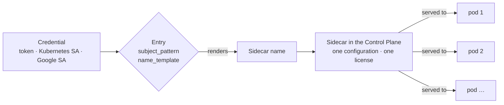
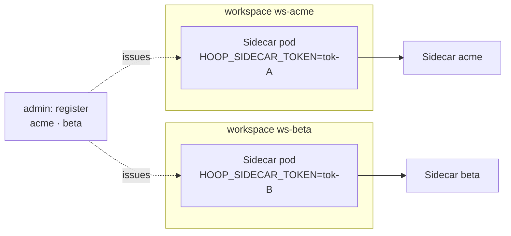
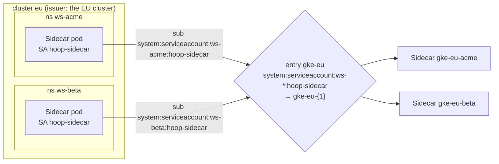
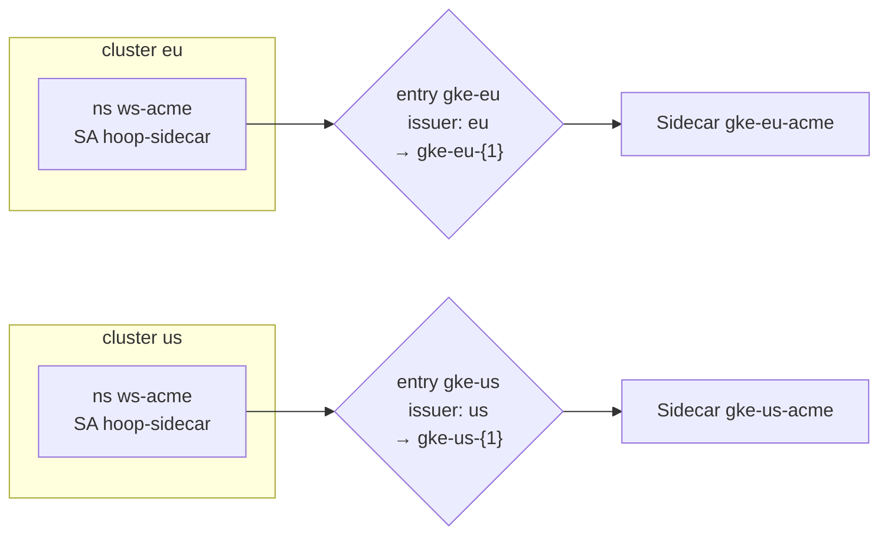
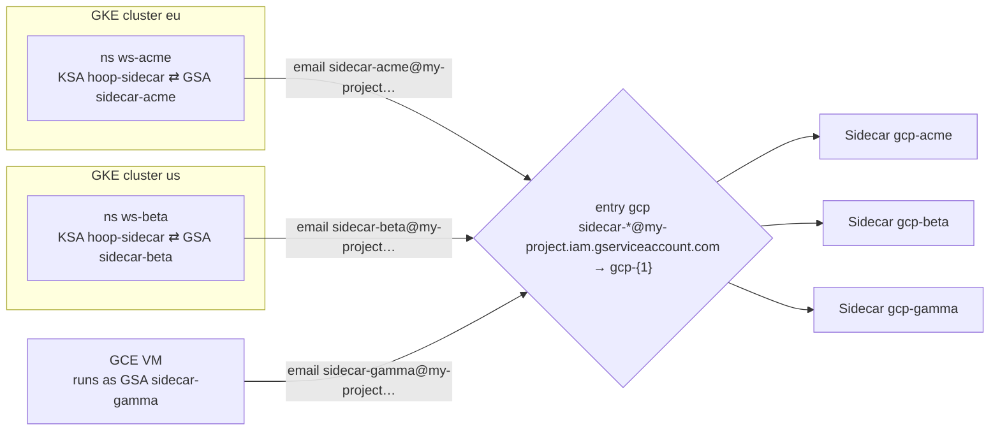
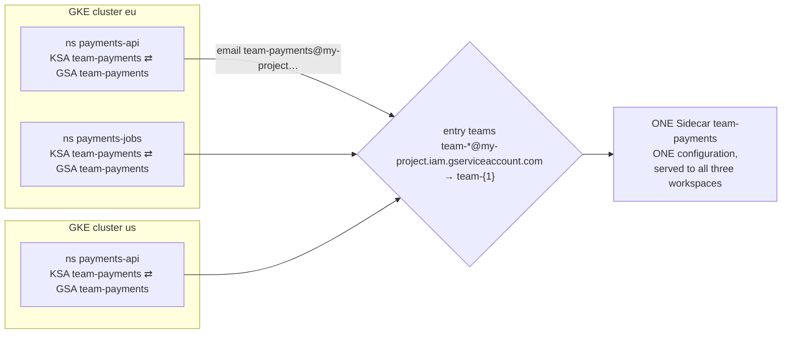
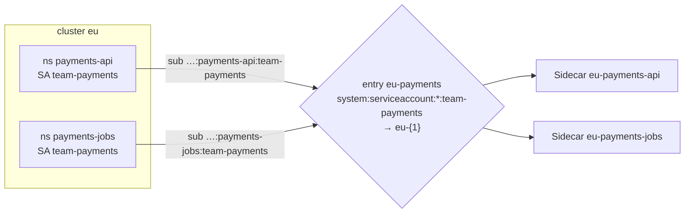
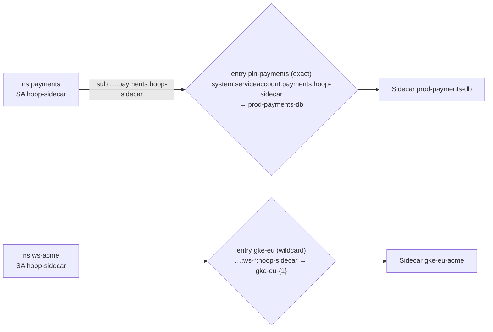
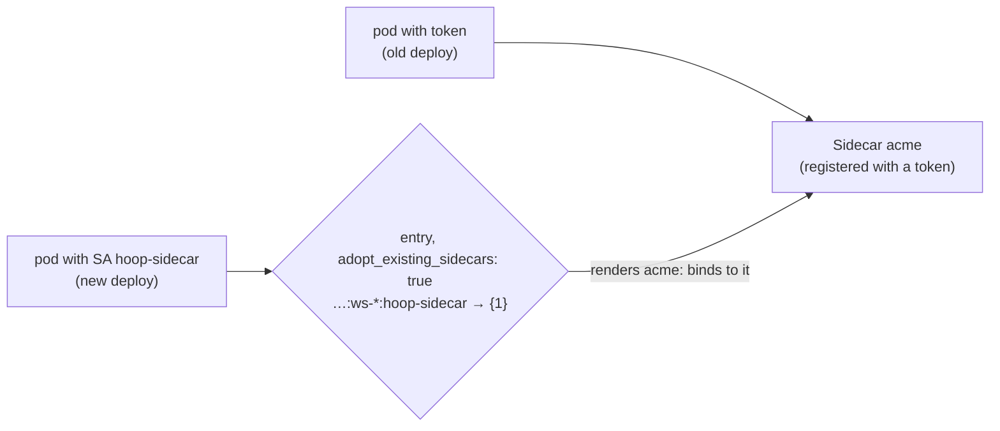
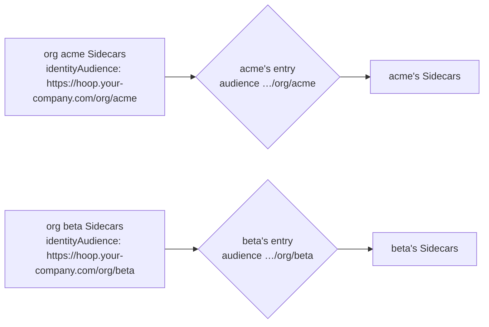

A Sidecar connected to a [Control Plane](/core-concepts/control-plane) proves who it is with one credential. The Control Plane turns that credential into a **Sidecar name**, and the name decides which configuration the Sidecar runs. This page shows every layout that follows from that, with the entry and the Helm values to build each one.

How each credential works is covered in [Connect a Sidecar](/control-plane/connect-sidecar) (tokens) and [Service Accounts](/setup/configuration/hoop-sidecar/service-accounts) (platform identities). This page is about combining them.

---

## Find Your Layout

| You want | Layout |
|---|---|
| A few Sidecars, or no Kubernetes or Google Cloud | [Token per Sidecar](#token-per-sidecar) |
| One Sidecar per namespace, in one cluster | [Kubernetes SA per Namespace](#kubernetes-sa-per-namespace) |
| One Sidecar per namespace, in several clusters | [Kubernetes SA Across Clusters](#kubernetes-sa-across-clusters) |
| One Sidecar per workload on Google Cloud, any number of clusters, VMs or Cloud Run services | [Google SA per Workspace](#google-sa-per-workspace) |
| One Sidecar for a whole team, tenant, user or environment | [Shared Identity](#shared-identity) |
| One Sidecar per namespace, where each team has its own Kubernetes service account | [Kubernetes SA per Team](#kubernetes-sa-per-team) |
| A specific name for one Sidecar, or an exception to a pattern | [Pinned Sidecar](#pinned-sidecar) |
| Move existing token Sidecars to service accounts, keeping their names | [Token-to-Identity Migration](#token-to-identity-migration) |
| Several organizations on one Control Plane | [Multiple Organizations](#multiple-organizations) |

---

## Workspaces

This page says **workspace** for whatever unit you already use to separate workloads. Each workspace runs its own Sidecar, in front of the databases and services its workload uses:

| You separate workloads by | A workspace is, for example |
|---|---|
| Team or application | a namespace per team or application: `payments`, `checkout` |
| Environment | a namespace or a cluster per environment: `dev`, `staging`, `prod` |
| Tenant or customer | a namespace per tenant: `tenant-acme`, `tenant-beta` |
| User | a namespace per user's sandbox or dev environment |
| Google Cloud without Kubernetes | a VM, or a Cloud Run service |

The examples name namespaces `ws-acme`, `ws-beta` and so on, so one pattern (`ws-*`) can match them all. Use your own naming scheme.

---

## How Mapping Works



- **One credential, one Sidecar.** A token *is* a Sidecar. A service account reaches the Sidecar its entry renders.
- **The name is the only key.** Every pod that renders the same name reaches the **same** Sidecar and runs the **same** configuration. That includes restarts, replicas, other namespaces, other clusters and other projects.
- **The configuration belongs to the Sidecar, not the pod.** The first pod to reach a new Sidecar imports its local config file. Every later pod runs what the Control Plane holds, whatever its own file says.
- **One credential per Sidecar.** A token, a Kubernetes service account or a Google service account. Never two at once.

The design question for any layout is: **which pods should share a configuration?** Give those pods one identity, and give every other pod a different one.

---

## Credential Types

| | Token | Kubernetes service account | Google service account |
|---|---|---|---|
| **Chart setting** | `controlPlane.token` | `controlPlane.identity: kubernetes` | `controlPlane.identity: gcp` |
| **Environment variable** | `HOOP_SIDECAR_TOKEN` | `HOOP_SIDECAR_IDENTITY_TYPE=kubernetes` | `HOOP_SIDECAR_IDENTITY_TYPE=gcp` |
| **Issued by** | The Control Plane, when you register a Sidecar | The cluster: a projected token, rotated by the kubelet | Google: an ID token from the metadata server |
| **Identifies the Sidecar by** | The token itself | Cluster issuer + `system:serviceaccount:<namespace>:<name>` | The service account's email |
| **Before each deploy** | Register, copy the token, store it in a Secret | Nothing | Nothing |
| **Secret in the workspace** | Yes | No | No |
| **Rotation** | None. A lost token means a new registration. | Automatic, hourly by default | Automatic, before expiry |
| **Control Plane entries** | None | One **per cluster** | One **per project**, for every cluster, VM and Cloud Run service in it |
| **Keys the Control Plane fetches** | None | The cluster's public keys, or a pasted `jwks` | Google's public keys |
| **Runs on** | Anywhere | GKE, EKS, AKS, self-managed Kubernetes | GKE with Workload Identity, GCE, Cloud Run |
| **Sidecar created** | At registration | On its first handshake | On its first handshake |

All three can run side by side on one Control Plane.

---

## Layouts

Each layout has the same parts: when to use it, a diagram, the Control Plane entry and the Helm values, and the Sidecars that result.

Every entry is created with the same call, as an admin:

```bash
curl -X POST https://hoop.your-company.com/api/sidecar-service-accounts \
  -H "Authorization: Bearer $HOOP_API_KEY" -H "Content-Type: application/json" \
  -d @entry.json
```

### Token per Sidecar

**Use when:** you run a few Sidecars, or the pods have no Kubernetes or Google identity. This is the standard flow.



<CodeGroup>
```bash Register
curl -X POST https://hoop.your-company.com/api/sidecars \
  -H "Authorization: Bearer $HOOP_API_KEY" -H "Content-Type: application/json" \
  -d '{"name": "acme"}' | jq -r .token
# hsc_…   shown once, stored hashed
```

```yaml values.yaml
controlPlane:
  url: https://hoop.your-company.com
  token: hsc_…        # better: inject from a Secret, see Connect a Sidecar
```
</CodeGroup>

| Workspace | Sidecar |
|---|---|
| `ws-acme` with `tok-A` | `acme` |
| `ws-beta` with `tok-B` | `beta` |

The same token in two deployments is the same Sidecar, with one configuration. See [Connect a Sidecar](/control-plane/connect-sidecar).

### Kubernetes SA per Namespace

**Use when:** you run one cluster and want one Sidecar per namespace, with no step before each deploy.

Every workspace namespace has a service account with the same name. The namespace is part of the identity, so each namespace is its own Sidecar.



<CodeGroup>
```json entry.json
{
  "name": "gke-eu",
  "issuer": "https://container.googleapis.com/v1/projects/my-project/locations/europe-west1/clusters/eu",
  "audience": "https://hoop.your-company.com",
  "claim": "sub",
  "subject_pattern": "system:serviceaccount:ws-*:hoop-sidecar",
  "name_template": "gke-eu-{1}"
}
```

```yaml values.yaml
serviceAccount:
  create: true
  name: hoop-sidecar
controlPlane:
  url: https://hoop.your-company.com
  identity: kubernetes
```
</CodeGroup>

Get the cluster's issuer with `kubectl get --raw /.well-known/openid-configuration | jq -r .issuer`.

| Workspace | Sidecar |
|---|---|
| namespace `ws-acme` | `gke-eu-acme` |
| namespace `ws-beta` | `gke-eu-beta` |
| any new `ws-*` namespace | created on its first handshake |

### Kubernetes SA Across Clusters

**Use when:** you run several clusters and want one Sidecar per namespace, per cluster.

Each cluster is its own issuer, so each cluster needs its own entry. Give each entry its own name prefix, so namespaces with the same name in two clusters stay two Sidecars.



<CodeGroup>
```json entry-eu.json
{
  "name": "gke-eu",
  "issuer": "<the EU cluster's issuer>",
  "audience": "https://hoop.your-company.com",
  "claim": "sub",
  "subject_pattern": "system:serviceaccount:ws-*:hoop-sidecar",
  "name_template": "gke-eu-{1}"
}
```

```json entry-us.json
{
  "name": "gke-us",
  "issuer": "<the US cluster's issuer>",
  "audience": "https://hoop.your-company.com",
  "claim": "sub",
  "subject_pattern": "system:serviceaccount:ws-*:hoop-sidecar",
  "name_template": "gke-us-{1}"
}
```

```yaml values.yaml
# the same file in every cluster
serviceAccount:
  create: true
  name: hoop-sidecar
controlPlane:
  url: https://hoop.your-company.com
  identity: kubernetes
```
</CodeGroup>

| Workspace | Sidecar |
|---|---|
| cluster eu, namespace `ws-acme` | `gke-eu-acme` |
| cluster us, namespace `ws-acme` | `gke-us-acme` |

<Warning>
Two entries with the **same** `name_template` (for example, both `{1}`) send `ws-acme` in both clusters to **one** Sidecar. The first service account to reach it is bound to it, and the other cluster's is refused with `sidecar "acme" is bound to another service account`.
</Warning>

### Google SA per Workspace

**Use when:** you run on Google Cloud and want one Sidecar per workload, with one entry for any number of clusters, VMs and Cloud Run services.

Each workspace runs as its own Google service account: on GKE through Workload Identity, or as the service account of a VM or Cloud Run service.



<CodeGroup>
```json entry.json
{
  "name": "gcp",
  "issuer": "https://accounts.google.com",
  "audience": "https://hoop.your-company.com",
  "claim": "email",
  "subject_pattern": "sidecar-*@my-project.iam.gserviceaccount.com",
  "name_template": "gcp-{1}"
}
```

```yaml values.yaml
serviceAccount:
  create: true
  name: hoop-sidecar
  annotations:
    iam.gke.io/gcp-service-account: sidecar-acme@my-project.iam.gserviceaccount.com  # per workspace
controlPlane:
  url: https://hoop.your-company.com
  identity: gcp
```

```bash Workload Identity
# once per workspace
gcloud iam service-accounts create sidecar-acme
gcloud iam service-accounts add-iam-policy-binding sidecar-acme@my-project.iam.gserviceaccount.com \
  --role roles/iam.workloadIdentityUser \
  --member "serviceAccount:my-project.svc.id.goog[ws-acme/hoop-sidecar]"
```
</CodeGroup>

| Workspace | Sidecar |
|---|---|
| GKE eu, namespace `ws-acme`, GSA `sidecar-acme` | `gcp-acme` |
| GKE us, namespace `ws-beta`, GSA `sidecar-beta` | `gcp-beta` |
| GCE VM running as `sidecar-gamma` | `gcp-gamma` |

The Google service account needs no IAM role of its own. On GKE, the Workload Identity binding is what ties the Kubernetes service account to it, and Google enforces it:

- The cluster needs Workload Identity (`--workload-pool`, on by default on Autopilot), and the project needs `iamcredentials.googleapis.com`. See [Service Accounts](/setup/configuration/hoop-sidecar/service-accounts#steps).
- A new binding takes a minute or two to apply. Until then the pod exits with `403 … getOpenIdToken`, and it enrolls on a later restart.
- A pod without the annotation does not fall back to the node's service account. It exits with the metadata server's `404`, and the Control Plane never sees it.

To share one values file across workspaces, pass the annotation per release: `--set-string "serviceAccount.annotations.iam\.gke\.io/gcp-service-account=sidecar-acme@my-project.iam.gserviceaccount.com"`.

### Shared Identity

**Use when:** a team, tenant, user or environment is your policy unit, and all of its workspaces run the same services.

When several workspaces present the **same** identity, they are **one** Sidecar. This holds for every credential type. Here, the payments team runs two workspaces in the EU cluster and one in the US cluster, all as the team's service account:



<CodeGroup>
```json entry.json
{
  "name": "teams",
  "issuer": "https://accounts.google.com",
  "audience": "https://hoop.your-company.com",
  "claim": "email",
  "subject_pattern": "team-*@my-project.iam.gserviceaccount.com",
  "name_template": "team-{1}"
}
```

```yaml values.yaml
serviceAccount:
  create: false
  name: team-payments          # the team's existing KSA, already bound to its GSA
controlPlane:
  url: https://hoop.your-company.com
  identity: gcp
config:                        # imported once, by the first workspace to boot
  admin: {listen: 0.0.0.0:19000}
  listeners:
    - name: api
      protocol: http
      listen: 0.0.0.0:18080
      upstream: api:8080       # a short name: resolves in each pod's own namespace
```
</CodeGroup>

| Workspace | Sidecar |
|---|---|
| cluster eu, namespace `payments-api` | `team-payments` |
| cluster eu, namespace `payments-jobs` | `team-payments` |
| cluster us, namespace `payments-api` | `team-payments` |

What sharing means in practice:

| Area | Behaviour |
|---|---|
| Configuration | The **first** workspace to boot imports its config file. Every other workspace of the team runs that configuration, and logs `the config file's listeners are ignored`. |
| Upstreams | Shared by every workspace. Write them as **short Service names** (`api:8080`), which resolve in each pod's own namespace, so each workspace reaches its own services. A fully qualified name (`api.payments-api.svc.cluster.local`) sends every workspace to that one namespace. |
| Lanes | Every workspace serves the same lanes. A workspace that fronts different services needs its own identity. |
| Rules | One rule set per team. A change applies to every workspace of the team at its next heartbeat. |
| Visibility | One entry in the Sidecar list per team. `last_seen_at` and `version` show the pod that reported last. |
| Revoking | Deleting the Sidecar or disabling the service account stops configuration updates and new pods for **every** workspace of the team. Running pods keep serving their last configuration. |

<Warning>
A fully qualified upstream in the first workspace's file crosses workspaces. If `payments-api` boots first with `upstream: db.payments-api.svc.cluster.local:5432`, then `payments-jobs` also proxies to the database in `payments-api`. Its own file is ignored. Use short names. To fix a Sidecar that already imported the wrong file, delete it, [clear its name](/setup/configuration/hoop-sidecar/service-accounts#deleted-names) and restart a pod that has the right file.
</Warning>

The same applies to Kubernetes identities: replicas, or several Deployments in **one** namespace that use one service account, are one Sidecar.

### Kubernetes SA per Team

**Use when:** each team (or tenant, or user) has its own Kubernetes service account name, used in several namespaces, and you want one Sidecar per namespace.

The namespace is in the subject, so a Kubernetes identity separates the namespaces. But a pattern allows **one** `*`, so the team's name must be literal: one entry per team per cluster.



<CodeGroup>
```json entry.json
{
  "name": "eu-payments",
  "issuer": "<the EU cluster's issuer>",
  "audience": "https://hoop.your-company.com",
  "claim": "sub",
  "subject_pattern": "system:serviceaccount:*:team-payments",
  "name_template": "eu-{1}"
}
```

```yaml values.yaml
serviceAccount:
  create: false
  name: team-payments
controlPlane:
  url: https://hoop.your-company.com
  identity: kubernetes
```
</CodeGroup>

| Workspace | Sidecar |
|---|---|
| namespace `payments-api` | `eu-payments-api` |
| namespace `payments-jobs` | `eu-payments-jobs` |

A single pattern for every team, such as `system:serviceaccount:*`, would capture `payments-api:team-payments`. A Sidecar name may hold only letters, digits, `-`, `_` and `.`, so the Control Plane refuses it: `… renders the sidecar name "…", which is refused`.

### Pinned Sidecar

**Use when:** one workspace needs a name you choose, it falls outside your naming scheme, or a namespace was renamed and should keep its Sidecar.

An exact `subject_pattern` with a literal `name_template` maps one identity to one Sidecar. Exact entries win over wildcard ones, so a pinned entry also overrides a wildcard for that one identity.



```json entry.json
{
  "name": "pin-payments",
  "issuer": "<the cluster's issuer>",
  "audience": "https://hoop.your-company.com",
  "claim": "sub",
  "subject_pattern": "system:serviceaccount:payments:hoop-sidecar",
  "name_template": "prod-payments-db"
}
```

| Workspace | Sidecar |
|---|---|
| namespace `payments` | `prod-payments-db` (exact entry wins) |
| namespace `ws-acme` | `gke-eu-acme` (wildcard entry) |

After a rename, point the pinned entry at the new subject with the old name, then [clear the binding](/setup/configuration/hoop-sidecar/service-accounts#bindings).

### Token-to-Identity Migration

**Use when:** you already run token Sidecars and want to move them to service accounts, keeping their names and configuration.

A Control Plane serves token Sidecars and service-account Sidecars at the same time. Render each Sidecar's existing name and set `adopt_existing_sidecars`:



<CodeGroup>
```json entry.json
{
  "name": "gke-eu-adopt",
  "issuer": "<the cluster's issuer>",
  "audience": "https://hoop.your-company.com",
  "claim": "sub",
  "subject_pattern": "system:serviceaccount:ws-*:hoop-sidecar",
  "name_template": "{1}",
  "adopt_existing_sidecars": true
}
```

```yaml values.yaml
# redeploy each workspace: drop the token, add the identity
serviceAccount:
  create: true
  name: hoop-sidecar
controlPlane:
  url: https://hoop.your-company.com
  identity: kubernetes
```
</CodeGroup>

The token keeps working during the move. Set `adopt_existing_sidecars` back to `false` once every workspace has moved. See [Moving token Sidecars to service accounts](/setup/configuration/hoop-sidecar/service-accounts#moving-token-sidecars-to-service-accounts).

### Multiple Organizations

**Use when:** one Control Plane serves several organizations.

An issuer and audience pair belongs to one organization. All Google service accounts share the issuer `https://accounts.google.com`, and all Sidecars in one cluster share that cluster's issuer. So each organization picks its **own audience**:



<CodeGroup>
```yaml values.yaml
controlPlane:
  url: https://hoop.your-company.com
  identity: gcp                 # or kubernetes
  identityAudience: https://hoop.your-company.com/org/acme
```

```json entry.json
{
  "name": "gcp",
  "issuer": "https://accounts.google.com",
  "audience": "https://hoop.your-company.com/org/acme",
  "claim": "email",
  "subject_pattern": "sidecar-*@acme-project.iam.gserviceaccount.com",
  "name_template": "gcp-{1}"
}
```
</CodeGroup>

Without the Helm chart, set the audience on the projected token volume (`kubernetes`) or in `HOOP_SIDECAR_IDENTITY_AUDIENCE` (`gcp`). A Control Plane with one organization leaves it empty.

---

## Pattern Cheat Sheet

`subject_pattern` takes an exact value or one `*`. `name_template` puts the text that `*` matched where it says `{1}`. The rendered name must be 3–254 characters: letters, digits, `-`, `_` and `.`.

| Token subject | `subject_pattern` | `name_template` | Sidecar |
|---|---|---|---|
| `system:serviceaccount:ws-acme:hoop-sidecar` | `system:serviceaccount:ws-*:hoop-sidecar` | `gke-eu-{1}` | `gke-eu-acme` |
| `system:serviceaccount:payments-api:team-payments` | `system:serviceaccount:*:team-payments` | `eu-{1}` | `eu-payments-api` |
| `system:serviceaccount:payments:hoop-sidecar` | the same, exact | `prod-payments-db` | `prod-payments-db` |
| `sidecar-acme@my-project.iam.gserviceaccount.com` | `sidecar-*@my-project.iam.gserviceaccount.com` | `gcp-{1}` | `gcp-acme` |
| `team-payments@my-project.iam.gserviceaccount.com` | `team-*@my-project.iam.gserviceaccount.com` | `team-{1}` | `team-payments` |
| `system:serviceaccount:payments-api:team-payments` | `system:serviceaccount:*` | `{1}` | refused: `payments-api:team-payments` holds `:` |

Google entries must use `claim: email` and end in a literal `@<project>.iam.gserviceaccount.com`. A bare `*` needs `allow_any_subject` and is refused for Google. See [The entry](/setup/configuration/hoop-sidecar/service-accounts#the-entry).

---

## Check the Result

List every Sidecar with the identity bound to it:

```bash
curl -s https://hoop.your-company.com/api/sidecars -H "Authorization: Bearer $HOOP_API_KEY" \
  | jq -r '.[] | [.name, (if (.identity_subject // "") == "" then "token" else .identity_subject end), .last_seen_at] | @tsv'
```

```
gke-eu-acme      system:serviceaccount:ws-acme:hoop-sidecar         2026-10-06T09:28:54Z
gcp-beta         sidecar-beta@my-project.iam.gserviceaccount.com    2026-10-06T09:28:56Z
acme             token                                              2026-10-06T09:29:16Z
```

A pod that is refused exits with code 1 and prints the subject it presented and the reason. See [Troubleshooting](/setup/configuration/hoop-sidecar/service-accounts#troubleshooting).

---

## Layout Comparison

| Layout | Credential | Entries | Sidecars | Configuration per | Before each deploy |
|---|---|---|---|---|---|
| [Token per Sidecar](#token-per-sidecar) | Token | none | 1 per token | Sidecar | Register + store a Secret |
| [Kubernetes SA per Namespace](#kubernetes-sa-per-namespace) | Kubernetes | 1 per cluster | 1 per namespace | Namespace | Nothing |
| [Kubernetes SA Across Clusters](#kubernetes-sa-across-clusters) | Kubernetes | 1 per cluster, own prefix | 1 per namespace per cluster | Namespace | Nothing |
| [Google SA per Workspace](#google-sa-per-workspace) | Google | 1 per project | 1 per Google SA | Workspace | Create the Google SA + Workload Identity binding |
| [Shared Identity](#shared-identity) | Any | 1 | 1 per shared identity | Team, tenant, user or environment | Nothing |
| [Kubernetes SA per Team](#kubernetes-sa-per-team) | Kubernetes | 1 per team per cluster | 1 per namespace | Namespace | Nothing |
| [Pinned Sidecar](#pinned-sidecar) | Kubernetes or Google | 1 per pinned Sidecar | 1, named by you | Sidecar | Nothing |
| [Token-to-Identity Migration](#token-to-identity-migration) | Token, then service account | As for the target layout | Existing names kept | Sidecar | Nothing after the move |
| [Multiple Organizations](#multiple-organizations) | Kubernetes or Google | 1 per organization, own audience | As for the chosen layout | As for the chosen layout | Nothing |

---

## Limitations

| Not supported | Instead |
|---|---|
| Two identities at once, for example a Kubernetes **and** a Google service account | Use one. On GKE, Google IAM already ties the two: only Kubernetes service accounts with `roles/iam.workloadIdentityUser` on a Google service account can get its token. |
| The namespace, cluster or pod in a Sidecar name when the identity is a Google service account | The email is the only input. Give each workspace its own Google service account, or use a Kubernetes identity. |
| A different configuration per workspace under one shared identity | Give each workspace its own identity. |
| More than one `*` in a pattern, or placeholders other than `{1}` | One entry per fixed part, as in [Kubernetes SA per Team](#kubernetes-sa-per-team). |
| One rule shared by several Sidecars | Rules are copied per Sidecar. Change each copy, or use a [Shared Identity](#shared-identity). |

---

## Next

<CardGroup cols={2}>
  <Card title="Service Accounts" icon="id-badge" href="/setup/configuration/hoop-sidecar/service-accounts">
    Entry fields, the handshake and troubleshooting.
  </Card>
  <Card title="Connect a Sidecar" icon="plug" href="/control-plane/connect-sidecar">
    Tokens, the license and staying in sync.
  </Card>
</CardGroup>
