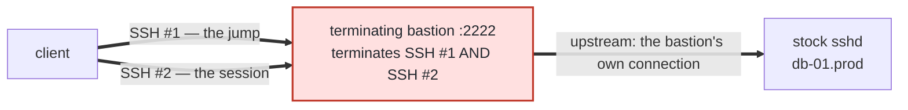
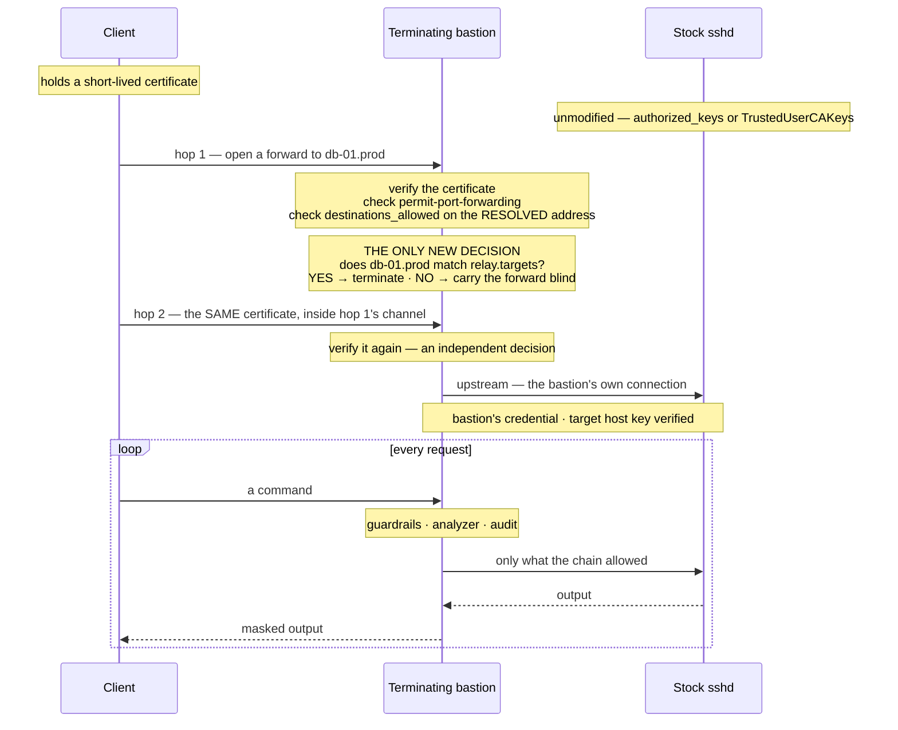
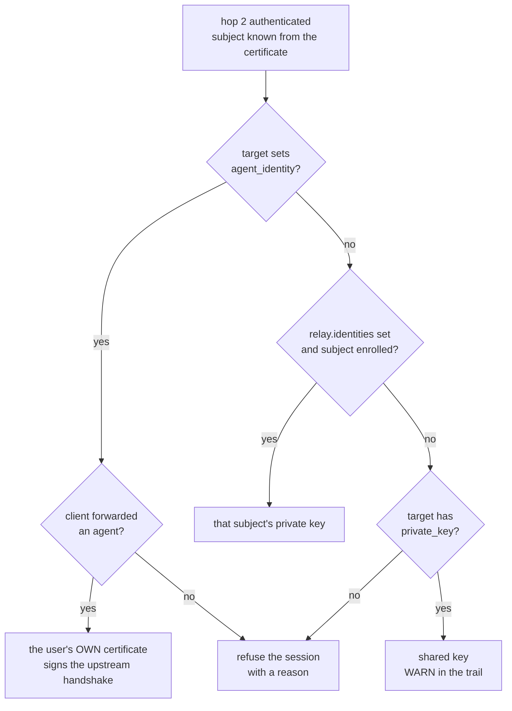
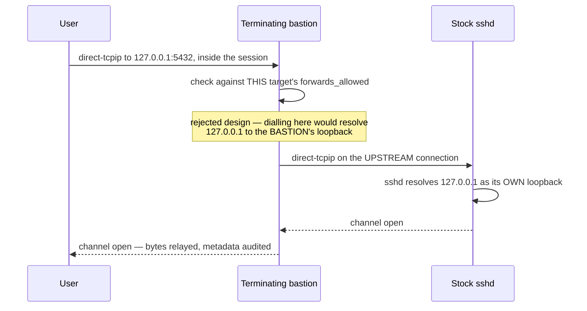

The three topologies in [Topologies](/setup/configuration/hoop-sidecar/protocols/ssh/topologies) put the inspecting endpoint **on the target**. This one puts it **in the middle**.

The bastion accepts the client's jump channel, and instead of dialling the target and piping bytes, it runs an SSH server inside that channel and opens its own connection to a stock `sshd`. It decrypts both hops, so guardrails, the analyzer, masking and the audit trail all apply — to a host with nothing installed on it.



**One block turns it on.** Add `ssh.relay` to a listener and the destinations it names get terminated. Delete it and you have the ordinary blind bastion of Mode 2.

<Warning>
**This inverts the security model of the other three modes.** The bastion holds the plaintext of every session for every host behind it, plus credentials that reach all of them. A blind bastion holds neither. Modes 1–3 degrade one host at a time; this one loses the fleet.
</Warning>

---

## When to use it

**The rule of thumb: if you can run a sidecar on the target, do that instead.** Modes 1–3 keep the plaintext and the credentials on the host they belong to. This mode moves both to the bastion, and that is a real cost you pay on every host behind it.

Reach for it when that is not an option:

| Situation | Why this mode fits |
|---|---|
| **The target can't run a sidecar** | an appliance, a managed database host, a vendor-operated box, an embedded system — anything where you don't control what's installed. This is the case the mode exists for |
| **Evaluation or a proof of concept** | inspect a fleet by editing one config file. No agent rollout, no change window per host, and nothing to uninstall if you walk away |
| **A long tail of hosts** | the hosts nobody wants to own. One glob target covers them, and adding a host that matches needs no config change at all |
| **Migration** | put a terminating bastion in front today, move hosts to their own end-hop as you get to them. The client config doesn't change when a host moves |
| **Contractor or vendor access** | a narrow window into a few hosts, gated and recorded centrally, with no footprint left on the target afterwards |

Use a different mode when:

| Situation | Use instead |
|---|---|
| **You need file transfer** | an end-hop. `sftp`, `scp` and `rsync` do not work through a terminating bastion — see [File transfer](#file-transfer) |
| **You can install on the target** | [Mode 1, 2 or 3](/setup/configuration/hoop-sidecar/protocols/ssh/topologies). The endpoint belongs on the host |
| **The bastion would be a shared blast radius you can't accept** | an end-hop per host, so a compromise degrades one host rather than the fleet |
| **Per-target guardrails or masking** | not available here. Rules apply to every target on the lane |
| **The target needs the user's real identity in its own logs** | still this mode, but only with [`agent_identity`](#agent-identity), which needs every client to forward an agent |

Both can be true at once. A single listener terminates the destinations in `relay.targets` and carries everything else blind, so you can inspect the hosts that matter and leave the rest alone — on one bastion, with one client config.

---

## Connection flow

The client still makes two hops, the same two as every other mode. What changes is where hop 2 lands.



**The relay match is the only new decision.** Everything around it behaves exactly as it does on a blind bastion.

**There's no SNI in SSH.** Nothing in the transport says which host the user wanted — so that match has exactly one thing to work with. `ProxyJump` opens a `direct-tcpip` channel, and the hostname you typed travels in that channel-open request. It's the only place in the protocol where an unmodified client tells an intermediary the host it wants.

**The certificate is verified twice on purpose.** Hop 1 authorises opening a forward. Hop 2 authorises a session on whatever answered. They're separate handshakes with independent trust decisions. Merging them would mean the inner server trusting a claim the outer one made about a connection it no longer controls.

**Reachability is checked before termination.** `destinations_allowed` runs first, against the resolved address. A host in `relay.targets` that `destinations_allowed` doesn't cover is unreachable — so the target map can't become a second, quieter way to widen access. Write the host in both places.

<Note>
The upstream is the bastion's **own** connection, not a hop the client makes. That's why the target's `sshd` authenticates the **bastion's** credential — unless the target sets [`agent_identity`](#agent-identity).
</Note>

---

## Example configuration

```yaml config.yaml
listeners:
  - name: prod-bastion
    protocol: ssh
    listen: 0.0.0.0:2222

    ssh:
      host_key: /etc/hoop-sidecar/keys/bastion_host_key
      trusted_ca: /etc/hoop-sidecar/keys/ca.pub

      # Two jobs, and neither is "what runs here": the CEILING a target may
      # narrow, and the DEFAULT a target inherits when it omits its own list.
      capabilities_allowed: [shell, pty, exec, env]

      # Reachability. Default-deny, matched on the RESOLVED address, and
      # checked BEFORE the relay decision.
      destinations_allowed:
        - 10.0.0.0/8:22

      identity:
        subject: key_id
        groups: principals

      relay:
        known_hosts: /etc/hoop-sidecar/known_hosts
        host_key_check: strict
        identities: /etc/hoop-sidecar/identities

        targets:
          "*.prod":
            private_key: /etc/hoop-sidecar/keys/prod
            capabilities_allowed: [exec, env]

          db-01.prod:
            capabilities_allowed: [exec, env, pty, shell, local_forward]
            forwards_allowed:
              - 127.0.0.1:5432

          app-01.prod:
            agent_identity: true
            capabilities_allowed: [exec, env, pty, shell]

          legacy-01:
            private_key: /etc/hoop-sidecar/keys/legacy
            login: ec2-user
            known_hosts: /var/lib/hoop-sidecar/known_hosts.legacy
            host_key_check: accept_new
            capabilities_allowed: [exec, env]

    # Rules live OUTSIDE the relay block and have no per-target form, so they
    # apply to every target.
    guardrails:
      rules:
        - name: protected-paths
          type: pattern_match
          pattern_regex: '(secrets\.env|/etc/shadow|\.aws/credentials)'
          operations: [exec_line]
          message: this path is not readable through hoop

    mask:
      rules:
        - entities: [EMAIL_ADDRESS]
          strategy: mask
          mask_char: 42
```

### Listener keys on a relay lane

| Key | On a relay lane |
|---|---|
| `capabilities_allowed` | stops describing what runs here and takes on **two jobs**: the **ceiling** a target may narrow to, and the **default** a target inherits when it omits its own list. The bastion itself serves **no session** — no shell, no command, no file transfer. It has no accounts, and a box holding every target's credential shouldn't also offer a shell |
|  ↳ as a **ceiling** | a target naming a capability the listener does not admit fails at load. `local_forward` is the one exemption — it is never on a listener's list at all, so a target may admit it regardless |
|  ↳ as a **default** | with `[shell, pty, exec, env]` above, a target that writes no `capabilities_allowed` gets exactly those four. `sftp` is dropped on the way in, so a listener listing it still leaves its targets without file transfer |
|  ↳ when **absent** | it still resolves to the default five (`shell`, `pty`, `exec`, `env`, `sftp`) — `relay` does not change that. Those five become the ceiling, and an inheriting target gets four of them |
| `destinations_allowed` | unchanged, and still the only thing that decides reach. A target it doesn't cover is unreachable no matter what `relay.targets` says |
| `host_key`, `trusted_ca`, `identity` | unchanged |
| `upstream`, `upstream_tls`, `downstream_tls`, `identity_header` | still refused at startup. Nothing inside `relay` is called `upstream` for that reason |
| `guardrails`, `mask`, `analyzer`, `opa` | unchanged, and they have **no per-target form**. Nothing inside `relay` can subtract from policy — it can only narrow what policy applies to |

Try to get a shell on the bastion itself and you get:

```bash
ssh -p 2222 -o HostKeyAlias=hoop-bastion jump@10.0.0.20
```
```
channel 0: open failed: administratively prohibited:
  no session capability is permitted on this connection
```

<Note>
`jump@` is a **name, not an account**. The bastion checks it against the certificate's principals and never looks it up in a user database, because no session runs there. The account on the target comes from the client's `User`, or a per-target [`login`](#login).
</Note>

---

## `ssh.relay` reference

| Key | Value | Required | What it does |
|---|---|---|---|
| `known_hosts` | path | **yes** | Verifies the target's host key, under the name the client asked for. Lane default |
| `host_key_check` | `strict` \| `accept_new` \| `off` | no — `strict` | What to do with an unknown or changed key. Lane default |
| `identities` | directory path | no | Adds per-user upstream keys. Filenames are certificate subjects |
| `login` | name | no | Upstream account for the lane. Absent uses the login the client asked for |
| `targets` | map | **yes** | Which destinations get terminated. Empty is a load error |

### `targets.<key>`

| Key | Value | Required | What it does |
|---|---|---|---|
| `private_key` | path | **yes unless** `identities` is set or the target sets `agent_identity` | The key that authenticates to this target, and the fallback for a subject with no identity key |
| `agent_identity` | bool | no | The client's forwarded agent signs the upstream handshake with the user's own certificate. **Mutually exclusive with `private_key`** |
| `capabilities_allowed` | list | no | Tri-state. Narrows the listener's list for this target |
| `forwards_allowed` | list of `host:port` or `network[:port]` | **yes if the target admits `local_forward`** | Where an `ssh -L` inside this session may reach. Dialled **by the target** |
| `known_hosts` | path | no | Overrides the lane's |
| `host_key_check` | same three values | no | Overrides the lane's, per target |
| `login` | name | no | Overrides the lane's upstream account |

Unknown keys are rejected at load, inside the relay block as well as outside it. A typo on the block that decides which hosts get inspected won't be silently dropped.

---

## Targets

A target key is a **name**, a **glob**, an **address**, or a **network** — each with an optional `:port`.

```yaml
targets:
  db-01.prod:        {}   # exact name, matched on what the client typed
  "*.prod":          {}   # glob, also on what the client typed
  "10.0.0.7":        {}   # literal address, matched on what it resolved to
  "10.0.0.0/8:22":   {}   # network, also on the resolved address
```

| Kind | Matched against | Notes |
|---|---|---|
| exact name | the string the **client typed** | case-insensitive |
| glob | the string the **client typed** | `*`, `?`, `[…]`. A broken pattern fails at load, not on the first connection that misses |
| address | the **resolved** address | a bare IPv6 literal is written plain; with a port, use the bracket form `ssh(1)` uses |
| network | the **resolved** address | split on `/`, so IPv6 needs no brackets |

### Precedence

**exact name → glob → literal address → longest prefix.** Within a kind: longer glob first, more specific prefix first, a key with a port before the same key without one, then key text.

It's total and fixed, so map iteration never decides which rule applied — which would otherwise vary per connection.

Name keys match **before** DNS resolution and address keys **after**. That's what stops a name key from widening reach: `destinations_allowed` still decides that, on the resolved address.

### Unmatched destinations

That's what the other three modes do, and it still works — it's now an explicit choice instead of the only option. A blind forward produces a `forward_open` / `forward_close` pair with the destination, the resolved address, the duration and byte counts. Nothing else: the bastion piped bytes it couldn't read, and the far end verified the client's **own** certificate.

<Warning>
`any` is **not** a valid target key and fails at load. `destinations_allowed` decides where a forward may be *carried*; this map decides which destinations get *terminated*. Terminating everything reachable would turn every forward into a session the bastion decrypts.
</Warning>

---

## Upstream credentials

**Three sources. A target picks exactly one** — they are not a fallback chain.



| Source | What the target's `auth.log` shows | Provisioning cost |
|---|---|---|
| `private_key` | one account and one public key for **every** hoop user. hoop's trail is the only place the person is named | one key per target |
| `identities` | a distinct public key per person. The fingerprint links a line in the target's log to a session here — but still no name | one key per subject **per host they can reach** |
| `agent_identity` | the verified person, by certificate | none |

### `private_key`

The shared key — the floor every target has. It is read and checked **at load**, like `host_key` and `trusted_ca`:

- an unreadable path stops startup;
- a key readable by group or other is refused, same as `ssh(1)`;
- a file that's actually a **public** key is called out by name. It's an easy mistake, since the `.pub` is the file you copy into the target's `authorized_keys`.

<Note>
Add `from="<bastion addresses>"` to the target's `authorized_keys` entry for every key you install this way. It turns a leaked key from "fleet access from anywhere" into "fleet access, but only from the bastion". hoop can't enforce this — it lives on the target.

If you want [`local_forward`](#local-forward), the same entry must not carry `restrict` or `no-port-forwarding`.
</Note>

### `identities`

A directory whose **filenames are certificate subjects**, holding one private key each. It adds an overlay; it doesn't replace anything.

```
/etc/hoop-sidecar/identities/
  alice@example.com
  bob@example.com
```

**Keys are read from disk per session**, so enrolling or removing someone takes effect on their **next connection** — no restart. At load, hoop only checks that the path is a readable directory.

The subject becomes a filename, so it's validated before it becomes a path. Empty, contains `/` `\` or NUL, equals `.` or `..`, or starts with a dot — all refused. Anything that passes is a plain filename inside the directory.

| The file is | What happens |
|---|---|
| missing | **not an error.** The subject isn't enrolled; the target's `private_key` answers, or the session is refused |
| readable by group or other | session **refused** — no fallback |
| a public key, or unparseable | session **refused** — no fallback |
| present and usable | it's the credential |

A file that exists but can't be used **refuses**. Someone deliberately enrolled that person; quietly serving them as the shared account would hide a real problem.

<Warning>
**The overlay is lane-wide.** One key per subject serves **every** target the lane terminates. So an enrolled subject needs that public key in `authorized_keys` on every host they can reach, or they'll be refused there while working everywhere else. This trips people up more than anything else on this page.

**Write access to this directory is equivalent to granting SSH to every target the overlay reaches.** Mount it read-only from wherever enrolment actually lives.
</Warning>

**Falling back to `private_key` is logged every time**, as `upstream_credential_fallback`. Overlays fail quietly — a subject format changes at the IdP, a filename stops matching — and everything keeps working on the shared key while silently naming nobody. Once your people are enrolled, drop `private_key` from that target. Keeping both is a migration state, not a destination.

A target with no `private_key` under `identities` has **no fallback**: an unenrolled subject is refused rather than admitted as someone shared.

### `agent_identity`

The client's forwarded agent signs the upstream handshake, so the user's **own** certificate reaches the target and its `sshd` verifies the real person against `TrustedUserCAKeys`. Nothing is stored on the bastion and nothing hoop-specific is installed on the target.

```yaml
app-01.prod:
  agent_identity: true
  capabilities_allowed: [exec, env, pty, shell]
```

```
Host app-01.prod
    ForwardAgent yes
```

**The agent shows up at hop 2, not hop 1.** `ProxyJump` opens no session channel on the bastion, and `auth-agent-req@openssh.com` is a session request. So the upstream dial moves to the first session channel — the credential doesn't exist before then — and an upstream failure surfaces at first use rather than at connect.

**The bastion consumes the agent; it never forwards it.** The channel is opened to sign and closed with the session. Each signature is bound to the upstream session id and the target's host key, so nothing it obtains is replayable elsewhere. What the bastion holds is the ability to ask again, for the life of the session.

<Warning>
**`agent_identity` is for people, not automation.** A client with no agent is **refused, never downgraded** — the alternative is silently falling back to an account that names nobody.

Two smaller catches: a certificate carrying `source-address` is checked against the **bastion's** address, so certs pinned to user networks stop working through a bastion at all. And if the agent goes away mid-session, the next dial fails with no way to re-authenticate.
</Warning>

### Credential conflicts

| You write | You get |
|---|---|
| `agent_identity` **and** `private_key` on one target | *two credential sources, not a preference and a fallback: the client's own agent signs as the user, a stored key signs as an account. Pick one* |
| neither, and no `identities` | *has no credential* |

---

## Host key verification

`known_hosts` is **required**. The bastion terminates hop 2, so it presents **its own** key where the target's would be. The client verified the bastion and nothing else — the bastion's check is all that's left of host identity in the path.

The key is verified under the **name the client asked for**, not the address dialled. That's how you write `known_hosts` entries, and what `ssh(1)` does.

### `host_key_check`

| Setting | Host not in `known_hosts` | Key present but changed |
|---|---|---|
| `strict` (default) | refuse | refuse |
| `accept_new` | learn it, write it, continue | **refuse** |
| `off` | connect | connect |

**`accept_new` still refuses a changed key** — that's the point of it. You give up detection at first contact and keep it for every session after. A rebuilt host still fails.

It also makes `known_hosts` a **state file**. It's the only path in this schema the sidecar writes.

<Warning>
`accept_new` learns a key by **renaming a new file over the old one**, so the path has to be *replaceable*, not just writable. A bind-mounted **file** rejects that rename. Mount the **directory** instead.

The load check performs the real rename with the file's own contents, so you find out at startup rather than on the first unknown host.
</Warning>

Nobody reviews what it learns before it's used. A client prompt shows a fingerprint to a person who could check it; the bastion has nobody to ask. So the host and fingerprint go to the trail as `host_key_first_contact` — reviewable afterwards, not before.

### `host_key_check: off`

**`off` means nothing in the path authenticates the host.** `HostKeyAlias` already moved host identity from the client to the bastion, so this decides whether the check happens **at all** — not which side does it.

You get a `log.Warn` at load naming the listener and target, plus a `host_key_unverified` audit event on **every session** it covers.

```
level=WARN msg="ssh target runs with host_key_check=off; NOTHING verifies that
  this is the host it was meant to reach, and the client cannot notice either
  because the bastion answers for the target's host key"
  listener=prod-bastion target=lab-01
```

---

## Target capabilities

**Tri-state, with the same three readings as the listener's own list:**

| Written | Admits |
|---|---|
| **absent** | inherits the listener's list, filtered to what a terminated session can deliver |
| **`[]`** | nothing — a target you only reach via a forward |
| **populated** | those, and refuses the rest |

Writing the key with **no value** is an error, because `capabilities_allowed:` becomes `null` and null is indistinguishable from an absent key by the time the field is set. Omit it, or write `[]`.

**A target can only narrow.** Naming a capability the listener doesn't admit fails at load: *a target NARROWS the listener's list and cannot widen it.* `local_forward` is the one exception — it's never on a listener's list at all, since forwarding at the listener is `destinations_allowed`'s job.

### Delivered capabilities

| Capability | On a terminated target |
|---|---|
| `exec` | **full** — guardrails, analyzer, output masking, the command audited in full |
| `env` | **full** — guardrails on the name, audit |
| `shell`, `pty` | admitted, output masked, recorded as events. **No guardrails and no content trail** |
| `local_forward` | **delivered**, carried uninspected, bounded by `forwards_allowed` |
| `sftp` | **not delivered.** Naming it on a target fails at load |
| `remote_forward` | **not delivered.** Naming it on a target fails at load |
| `agent_forward`, `x11`, other subsystems | **not delivered** |

**Inheritance silently drops what can't be carried.** A listener with `sftp` in `capabilities_allowed` is fine — that's correct for the lane. Targets inheriting the list just don't get it. Naming `sftp` *explicitly* on a target is still a load error.

**No guardrails on an interactive shell** — the reasoning is the same as on an end-hop. Terminating in the middle doesn't turn a keystroke stream into statements. If you need every action to be a rule-readable statement, set `capabilities_allowed: [exec, env]` on your targets. See [Interactive shells](/setup/configuration/hoop-sidecar/protocols/ssh/configuration#interactive-shells).

### File transfer

```bash
sftp db-01.prod
```
```
hoop: file transfer is not delivered over a terminated session; against a
remote sftp-server it is an opaque subsystem stream, and path gating and
download masking would need it decoded both ways
```

On an end-hop the sidecar **is** the file-transfer server and sees decoded operations. Against a remote `sftp-server` it's an opaque subsystem stream, and keeping path gating and download masking would mean decoding the protocol in both directions. Piping it un-decoded would leave file transfer as the one un-inspected path on a listener whose whole job is inspection.

This affects `sftp`, `scp` on OpenSSH 9 defaults, and `rsync`. See [File Transfer](/setup/configuration/hoop-sidecar/protocols/ssh/file-transfer#not-supported-on-a-terminating-bastion) for workarounds.

---

## `local_forward`

**`ssh -L` works inside a terminated session, and the TARGET makes the TCP connection.** The bastion opens a `direct-tcpip` channel on its own upstream connection and splices the two together.



**`127.0.0.1` in `forwards_allowed` is the target's loopback.** That's the whole reason the target dials it. If the bastion dialled, `localhost` would mean the bastion — a security bug, not a shortcut.

### `forwards_allowed`

```yaml
db-01.prod:
  capabilities_allowed: [exec, env, pty, shell, local_forward]
  forwards_allowed:
    - 127.0.0.1:5432        # the TARGET's loopback
    - 10.2.0.0/16:5432      # a network, on the target's side
```

| Entry | Matches |
|---|---|
| `host:port` | that literal host or address, on that port. The port is **required** |
| `network[:port]` | that network — but only if the client named a **literal address** |

**The destination is checked as the client typed it**, not as a resolved address. The target resolves it, on its own host and in its own network, so resolving at the bastion would answer a different question. That's why a network entry can't cover a hostname: guessing with a local resolver means checking one answer and connecting to another.

**`any` is rejected.** The allowlist is what keeps uninspected traffic a deliberate exception rather than a hole, so it has to name where.

### Required pairing

| You write | You get |
|---|---|
| `local_forward` with no `forwards_allowed` | *Forwarded bytes are carried without inspection … so the allowlist is the only control that bounds them, and a target without one would be an unrestricted tunnel into this host's network* |
| `forwards_allowed` with no `local_forward` | *the list bounds nothing* |

This is intentionally stricter than `destinations_allowed`, where absent means a sensible "no forwards". Here both facts are known at load, and admitting the capability while bounding it nowhere is a contradiction.

### Inspection limits

Guardrails and masking work on statements and terminal output. An arbitrary TCP stream has neither. You get metadata only — target, destination, open and close times, byte counts, and every refusal with its reason. **Exfiltration through an allowed destination shows up as volume and timing, never content.** Keep these lists narrow.

<Note>
**The certificate's grant doesn't narrow this.** `permit-port-forwarding` is already required to use the bastion as a jump, so everyone with a working certificate has it. Anyone who can reach a target gets that target's whole allowlist. There are no per-user or per-group forwarding grants.
</Note>

**`ssh -R` is refused.** It exposes the user's machine to the target rather than the reverse, and needs a listener on the target plus reverse-channel plumbing that doesn't exist here.

### Target-side refusals

`AllowTcpForwarding` defaults to `yes` and `PermitOpen` to `any`, so a stock `sshd` carries a forward unchanged. A host hardened with `AllowTcpForwarding no` refuses, and so does a credential whose `authorized_keys` entry carries `restrict` or `no-port-forwarding`. That refusal is the target's to make, and hoop surfaces it rather than retrying:

```
channel 2: open failed: connect failed: the target refused to open 127.0.0.1:5432
```

The client can't see the target, so the bastion is the only place to diagnose this. The full upstream error is in the trail and the log.

---

## `login`

By default the session logs in as the name the client asked for, which the certificate's principals vouched for. `login` overrides that for a lane or a single target:

```yaml
relay:
  login: ec2-user          # every target on this lane
  targets:
    legacy-01:
      login: ubuntu        # just this one
```

Precedence: target → lane → the client's own `User`.

---

## Client configuration

Two stanzas, and neither names a host. That's what makes an evaluation across twelve hosts a config change on one box instead of twelve installs.

```
# A destination the bastion carries BLIND. It must come FIRST.
Host blind-01
    ProxyJump jump@10.0.0.20:2222
    User devuser

# Every destination the bastion TERMINATES.
Host *.prod legacy-01
    ProxyJump jump@10.0.0.20:2222
    HostKeyAlias hoop-bastion
    User devuser

# The one target that authenticates with the user's own certificate.
Host app-01.prod
    ForwardAgent yes

Host *
    IdentitiesOnly yes
    IdentityFile ~/.ssh/id_ed25519
    CertificateFile ~/.ssh/id_ed25519-cert.pub
    LogLevel INFO
```

### `HostKeyAlias`

The bastion terminates hop 2, so it presents **its** key where the target's would be. Without `HostKeyAlias` every connection is a host-key mismatch. Pointing every target's lookup at one alias means one `known_hosts` entry covers the fleet.

The cost is real: **a user who bypasses the bastion gets a first-contact prompt instead of a mismatch warning**, so network policy has to carry what host-key checking no longer does.

<Warning>
**List blind destinations before the `HostKeyAlias` stanza.** `ssh` takes the first value it finds for each keyword, so a blind destination that also matched the stanza below would inherit `HostKeyAlias hoop-bastion` and store its **own** host key under the bastion's name. You'll see `REMOTE HOST IDENTIFICATION HAS CHANGED` on a setup where nothing changed.

`HostKeyAlias` belongs only on destinations the bastion **terminates** — those are the ones where the bastion's key answers in the target's place.
</Warning>

### `LogLevel`

A refused channel — a capability the target doesn't admit, a forward outside the allowlist, a credential that didn't resolve — is reported by the client at `INFO` and **swallowed at `ERROR`**. On a lane whose whole job is refusing things, that makes every denial look like a hang.

---

## Client-facing messages

Refusals are written for two audiences, and only one crosses the wire. The client gets a short line telling them whether it's theirs to fix. The log and the audit trail get everything — target key, subject, path, upstream error, and which config key decided.

| What happened | The client sees |
|---|---|
| the subject isn't enrolled and the target has no shared key | `you do not have access to this host` |
| an enrolled key exists but can't be used | `your credential for this host is unusable; an operator can see why in the audit trail` |
| the upstream wouldn't open, or refused the credential | `this connection was refused; an operator can see why in the audit trail` |
| a destination outside `forwards_allowed` | `<destination> is not a destination this host may reach` |
| a capability the target doesn't admit | nothing from hoop — the request or channel is rejected at the protocol level, and `ssh` reports it (`shell request failed on channel 0`). The reason `not admitted by this listener` goes to the trail only |
| `sftp` on a terminated target | `hoop: file transfer is not delivered over a terminated session…` — the one capability refusal hoop writes to the client's stderr, because it is not a setting an operator can change |

The destination is the client's **own words**, so it travels back and makes the refusal actionable. Server paths, internal addresses, upstream accounts, host-key fingerprints and *whether a given subject is enrolled* do not — that last one would turn every refusal into an enrolment oracle for anyone holding a valid certificate.

---

## Audit trail

Both hops present the same certificate, so hop 2's `connection_open` carries `hop` and `target`. Without them the two events would be identical and you couldn't tell the jump from the session that reached a host.

```json
{"activity":"connection_open","hop":"2","target":"db-01.prod",
 "key_id":"alice@example.com","login":"devuser","serial":"1"}
```

| Event | Records |
|---|---|
| `connection_open` / `connection_close` | once per hop. Hop 2 carries `hop` and `target` |
| `relay_open` / `relay_close` | a forward that was **terminated**. `relay_open` carries the destination, the target key and the upstream address; `relay_close` adds the duration |
| `forward_open` / `forward_close` | a forward that was **carried**: destination, byte counts. Inside a session it also carries `dialled_by: target` |
| `relay_refused` | a target the endpoint couldn't serve |
| `forward_refused` | a destination outside `forwards_allowed`, or one the target wouldn't open |
| `upstream_credential_fallback` | an enrolled-subject lookup missed and the shared key was used |
| `upstream_credential_refused` | no credential resolved; the session was refused |
| `upstream_refused` | the upstream connection or a request on it failed |
| `agent_offered` | the client's agent was accepted **for upstream authentication only** |
| `host_key_first_contact` | `accept_new` learned a key: host, fingerprint, key type |
| `host_key_unverified` | `off` connected without checking |
| `capability_refused` | something the target doesn't admit was asked for |
| `session_close` | duration, byte counts, exit status, terminal geometry |

Statement records are the usual ones — `exec_line` and `env_set`, same verdicts, same masking — because it's the same enforcement chain. **A blocked command is refused before anything is written to the upstream channel**, so the target's `sshd` never learns it was attempted. That's more than an end-hop gives you.

**No session content is recorded**, here as everywhere else on an `ssh` lane.

---

## Validation

```bash
hoop start sidecar --config config.yaml --validate
```

```
config OK: 1 listener(s)
  prod-bastion     ssh       1 rule(s)
                               note: ssh: carries forwards to 10.0.0.0/8:22, and nowhere else
                               note: ssh: this listener TERMINATES matching forwards, so it decrypts every session to its targets and holds a credential that reaches them; a destination no target covers is still carried blind
                               note: ssh: capabilities_allowed is the CEILING each target narrows, not what runs here: a terminating bastion serves no session of its own
                               note: ssh: admits no session capability, so this listener has no shell, no command and no file transfer on it
                               note: ssh: trusts 1 CA public key(s) from /etc/hoop-sidecar/keys/ca.pub
                               note: ssh: presents a ssh-ed25519 host key
                               note: ssh: session output and file downloads are masked in flight
                               note: ssh: this listener TERMINATES 4 target(s); a session to one of them is decrypted here, so this host holds the plaintext of every session behind it and a credential that reaches them
                               note: ssh: target "app-01.prod" (name) admits env, exec, pty, shell, authenticates with the client's own forwarded agent
                               note: ssh: target "db-01.prod" (name) admits env, exec, local_forward, pty, shell, authenticates with enrolled subjects only, with no shared fallback
                               note: ssh: target "db-01.prod" carries forwards to 127.0.0.1:5432, dialled BY THE TARGET and relayed without inspection
                               note: ssh: target "legacy-01" (name) admits env, exec, authenticates with a shared private key (/etc/hoop-sidecar/keys/legacy), logs in as ec2-user
                               note: ssh: target "legacy-01" sets host_key_check=accept_new against /var/lib/hoop-sidecar/known_hosts.legacy
                               note: ssh: target "*.prod" (glob) admits env, exec, authenticates with a shared private key (/etc/hoop-sidecar/keys/prod)
                               note: ssh: per-user upstream keys are read per session from /etc/hoop-sidecar/identities, named by certificate subject; enrolling or removing somebody takes effect on their next connection
```

Targets are listed in **precedence order**, which is why the glob comes last even though it is written first in the config.

Every path is read and checked before anything binds:

| What you write | What you get |
|---|---|
| `private_key` pointing at a `.pub` file | *this is a PUBLIC key; the private half is what authenticates* |
| a key readable by group or other | *`ssh(1)` refuses a key with these permissions and so does this* |
| `agent_identity` **and** `private_key` | *two credential sources, not a preference and a fallback* |
| `local_forward` with no `forwards_allowed` | *the allowlist is the only control that bounds them* |
| `forwards_allowed` with no `local_forward` | *the list bounds nothing* |
| `capabilities_allowed: [sftp]` on a target | *an opaque subsystem stream … decoded both ways* |
| a capability the listener doesn't admit | *a target NARROWS the listener's list and cannot widen it* |
| `targets: {}` | *a relay block that terminates nothing is a listener you believe is inspecting and is not* |
| `host_key_check: yes` | *write `strict`, `accept_new` or `off`* |
| `accept_new` on a path that can't be replaced | *has to be REPLACEABLE and not merely writable* |
| `known_hosts` missing | *this listener is the only component positioned to notice that a target was replaced* |
| a typo anywhere in the block | the key, named |

---

## Reload

**The whole `relay` block is listener topology**, so changing it needs a **restart**. Credentials, a target's ceiling, a host-key setting and the target map all move the baseline rather than a rule.

`identities` is the deliberate exception. Its keys are read per session, so dropping a file grants access immediately and deleting one revokes it just as fast. That convenience is exactly why the directory needs the read-only mount described above.

---

## Trade-offs

**Easier.** Hosts that can't run a sidecar get inspected, and per-target install cost drops to zero — for an evaluation, that's the whole cost. One ingress address holds policy for a fleet. Blocked commands never reach the target.

**Harder, and this is the trade.** The bastion holds the plaintext of every session for every host behind it, plus credentials that reach most of them. Two key exchanges per connection on one process, and masking latency now includes a network round trip.

**The provisioning bill is real.** One identity key per subject on every host they can reach, removed when they leave. For N people and M hosts that's a table you maintain by hand, with no tooling here and no drift detection. That's the bill an SSH CA exists to remove — which is why `identities` is a bridge, and `agent_identity` is the better answer wherever the client has an agent.

### Known gaps

- **No file transfer.** `sftp`, `scp` and `rsync` don't work through a terminated session.
- **No remote forwarding.**
- **No guardrails on an interactive shell**, same as on an end-hop.
- **No per-user or per-group forwarding grants.** Anyone who can reach a target gets that target's whole `forwards_allowed`.
- **No host CA.** `HostKeyAlias` is today's answer, and it collapses per-target host identity into one key.
- **No per-target rule sets.** `guardrails`, `mask` and the analyzer apply to every target.

---

## Try it locally

```bash
cd deploy/docker-compose/ssh-bastion-stack
./run.sh       # mint a CA and certificates, build, bring up
./demo.sh      # run every check and assert the result
```

<Card title="ssh-bastion-stack on GitHub" icon="github" href="https://github.com/hoophq/hoop/tree/main/deploy/docker-compose/ssh-bastion-stack">
  Six hosts behind one terminating bastion: a shared key, a key per person, `agent_identity`, `accept_new`, a forward the target dials, and one host deliberately carried blind so you can see the difference.
</Card>

---

## Next

<CardGroup cols={2}>
  <Card title="Topologies" icon="route" href="/setup/configuration/hoop-sidecar/protocols/ssh/topologies">
    The other three modes, where the endpoint sits on the target and the bastion is blind.
  </Card>
  <Card title="Configuration" icon="file-code" href="/setup/configuration/hoop-sidecar/protocols/ssh/configuration">
    The listener's own keys: `capabilities_allowed`, `destinations_allowed` and `identity`.
  </Card>
  <Card title="Certificates and Identity" icon="certificate" href="/setup/configuration/hoop-sidecar/protocols/ssh/certificates">
    `permit-port-forwarding`, principals, and what `source-address` means through a bastion.
  </Card>
  <Card title="File Transfer" icon="folder-tree" href="/setup/configuration/hoop-sidecar/protocols/ssh/file-transfer">
    Why `sftp`, `scp` and `rsync` are refused over a terminated session.
  </Card>
</CardGroup>
