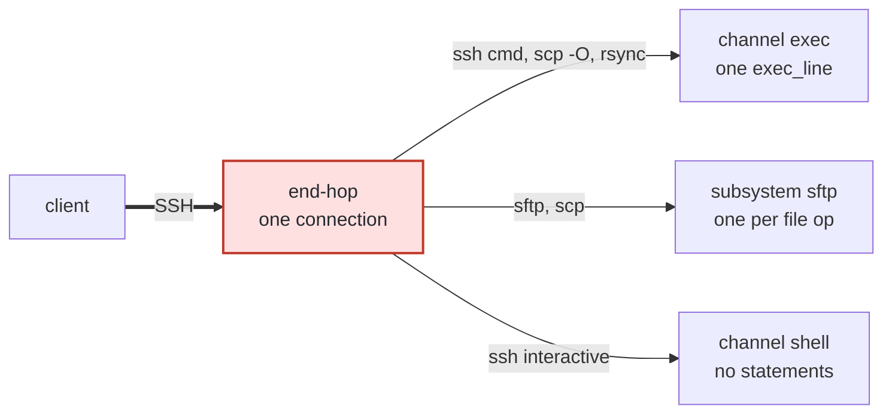

`ssh`, `sftp`, `scp` and `rsync` are not four ways to do the same thing. Each takes a different route through an SSH connection and therefore produces **different statements** — which is what decides whether a rule can see it.



| Client | Route | Statements produced |
|---|---|---|
| `ssh <cmd>` | `exec` | one `exec_line`, the whole command |
| `ssh` (interactive) | `shell` | **none** — a keystroke stream has no boundary a rule could act on |
| `sftp` | the `sftp` subsystem | one per file operation, carrying the path |
| `scp` (OpenSSH 9 default) | the `sftp` subsystem | same as `sftp` |
| `scp -O` | `exec` | one `exec_line`: `scp -f <path>` |
| `rsync` | `exec` | one `exec_line`: `rsync --server …` |

---

## Fencing a path

A rule never sees the client. It sees a **statement**, and tests its `pattern_regex` against that statement's **text**. So the only question that matters is what string each route puts into that text.

The same file, fetched five ways:

| Command | Operation | Text the regex is tested against |
|---|---|---|
| `ssh host "cat data/secrets.env"` | `exec_line` | `cat data/secrets.env` |
| `sftp host:/home/devuser/data/secrets.env .` | `sftp_read` | `/home/devuser/data/secrets.env` |
| `scp host:/home/devuser/data/secrets.env .` | `sftp_read` | `/home/devuser/data/secrets.env` |
| `scp -O host:/home/devuser/data/secrets.env .` | `exec_line` | `scp -f /home/devuser/data/secrets.env` |
| `rsync -e ssh host:/home/devuser/data/secrets.env .` | `exec_line` | `rsync --server --sender -e.LsfxCIvu . /home/devuser/data/secrets.env` |

**The path survives into the text whichever route the client took** — as the entire text on an `sftp_*` operation, as a substring of a command line on `exec_line`. So one regex catches all five, provided `operations` names both families:

```yaml
- name: protected-paths
  type: pattern_match
  pattern_regex: '(secrets\.env|/etc/shadow|\.aws/credentials)'
  operations: [exec_line, sftp_read, sftp_write, sftp_rename,
               sftp_remove, sftp_stat, sftp_setstat]
  message: this path is not readable through hoop
```

Leave one family out and it becomes the bypass:

| Omitted from `operations` | Walks through |
|---|---|
| `exec_line` | `ssh <cmd>`, `scp -O`, `rsync` |
| the `sftp_*` operations | `sftp`, `scp` |

Compare rows 3 and 4 of the first table: **the same `scp` command, one flag apart, lands in a different family.** Naming only one of them is a hole, not a style choice.

<Warning>
The two families are not the same *kind* of match.

On `sftp_*` the statement text **is** the path, so the match is exact and the client cannot restate it.

On `exec_line` the text is an arbitrary command line and the regex is a substring search over it. It catches the path wherever it appears — but the shell expands before anything runs, so `X=secrets; cat data/$X.env` produces an `exec_line` carrying no `secrets.env` at all. A pattern cannot see through expansion. The analyzer, reading the command, can.

So a path rule fences every **client**. It does not fence every **spelling**.
</Warning>

Scoping earns its keep in the other direction too: unscoped, this regex would also be tested against every `env_set` variable name and every other statement the lane produces.

---

## sftp

File transfer is the one subsystem admitted by name, because its wire format frames one request at a time — open a path, read or write through a handle, remove, rename, create or list a directory, read attributes. That framing is what turns *the subsystem was used* into *this path was read*.

```bash
sftp -q endhost:/home/devuser/data/customers.csv /tmp/dl.csv
```

Downloads are masked, exactly as terminal output is — one rule set covers every content-bearing stream the lane produces. A download is read whole before it is rewritten, so unlike terminal output it carries no read boundary a value can be cut on; see [Known Limitations](/setup/configuration/hoop-sidecar/protocols/ssh/known-limitations#a-value-that-crosses-a-read-boundary).

<Warning>
**Paths are resolved from `/`, not from the home directory.** Use absolute paths.
</Warning>

Each operation is its own statement, so the trail reads `sftp_read /home/devuser/data/customers.csv`, not "a file was transferred". The ten operations and what each matches against are in [Configuration](/setup/configuration/hoop-sidecar/protocols/ssh/configuration#operations).

<Note>
**`sftp` requires the Sidecar process to be the account.** File transfer is served inside the process — there is no child to hand a credential to — so a root listener cannot admit it. See [Root vs non-root](/setup/configuration/hoop-sidecar/protocols/ssh/hosts#root-vs-non-root).
</Note>

---

## Uploads

A file the connection **reads back** is safe to rewrite in place. A file it is **writing** is not: rewriting those bytes would silently corrupt what the user believes they uploaded.

So **an upload a masking rule would touch is refused, and nothing is written**:

```bash
sftp -q endhost <<EOF
put ./notes.txt  /home/devuser/upload/notes.txt      # lands
put ./leaked.csv /home/devuser/upload/leaked.csv     # refused
EOF
```

```
close remote: Permission denied
```

The refusal lands when the file is **closed**, not when it is opened, because whether the content matches is only decidable once the bytes exist. The client learns late; the file never lands.

Silently rewriting a file someone believes they uploaded is worse than refusing it — they would go on believing the original arrived.

---

## scp

OpenSSH 9 changed `scp`'s default transport to the SFTP subsystem. `-O` selects the legacy one. **Same file, same user, same result — two completely different policy surfaces:**

```bash
scp    -q endhost:/home/devuser/data/customers.csv /tmp/a.csv   # sftp_* statements
scp -O -q endhost:/home/devuser/data/customers.csv /tmp/b.csv   # one exec_line
```

The `-O` run produces a single `exec_line` reading `scp -f /home/devuser/data/customers.csv`.

Both are masked. And a rule scoped across both operation families catches both:

```bash
scp -O -q endhost:/home/devuser/data/secrets.env /tmp/x
# hoop: this path is not readable through hoop
```

This is exactly why the `operations` list on a path rule must name `exec_line` **and** the `sftp_*` operations. A rule that names only one of them is bypassed by a flag.

---

## rsync

`rsync -e ssh` runs a remote command, so it lands as one `exec_line`:

```json
"operation":"exec_line",
"statement":"rsync --server --sender -e.LsfxCIvu . /home/devuser/data/README.txt"
```

The `-e` flag string encodes rsync's own protocol negotiation and varies by version. What matters is that the path is in it, and so is the verb — so a guardrail fences rsync the same way it fences anything else:

```bash
rsync -e ssh endhost:/home/devuser/data/secrets.env /tmp/no
# rsync error: ... connection unexpectedly closed
```

### Masking conflict

```bash
rsync -e ssh endhost:/home/devuser/data/customers.csv /tmp/masked.csv
```

```
ERROR: customers.csv failed verification -- update discarded.
```

<Warning>
**This is not a bug and it cannot be fixed at this layer.** rsync checksums the file at both ends. The Sidecar rewrote the bytes in between, so the checksums disagree and rsync correctly discards what it received.

**Any transfer protocol that verifies its own content integrity will reject masked data.** Plan for it: either exclude the paths rsync moves from your mask rules, or accept that rsync and masking do not coexist on the same lane.
</Warning>

Note the direction of the failure: rsync **discards** the transfer, so nothing lands in a corrupted state. The cost is a transfer that does not complete, not a file that is silently wrong.

---

## Audit trail

| Recorded | Never recorded |
|---|---|
| the operation and the path, one statement each | the file's bytes, in either direction |
| a transfer record with direction and byte count | — |
| the verdict, reached **before** the filesystem is touched | — |

There is no setting that adds file content, on purpose: a setting that records nothing is the failure this design refuses everywhere else.

---

## Known issues

Both are defects with fixes pending, not design. Knowing them stops you reading a failure as your own mistake.

| Symptom | What is happening |
|---|---|
| **`scp` exits 1 on a successful transfer** | in its default (SFTP) mode the bytes arrive and are masked correctly, but the subsystem channel closes without sending an `exit-status`, and `scp` is the only client that requires one. `scp -v` shows `debug1: Exit status -1`. A script using `scp` under `set -e` will stop on a transfer that worked |
| **An sftp denial reads as `File "…" not found`** | the refusal is enforced and the rule and its message are in the audit trail; the client prints the status code's generic name, which reads like the file is absent |
| **A denial message does not always reach the user** | a rule's `message` goes on the wire, and a stock file-transfer client discards it. The user learns they were refused, not why. The audit trail carries the explanation |

---

## Next

<CardGroup cols={2}>
  <Card title="Configuration" icon="file-code" href="/setup/configuration/hoop-sidecar/protocols/ssh/configuration#capabilities-allowed">
    The ten `sftp_*` operations, and why there is no `sftp_open`.
  </Card>
  <Card title="Guardrail Rules" icon="scale-balanced" href="/setup/configuration/hoop-sidecar/policy-rules">
    Every rule type, and the full operation vocabulary across protocols.
  </Card>
</CardGroup>
