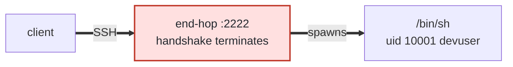
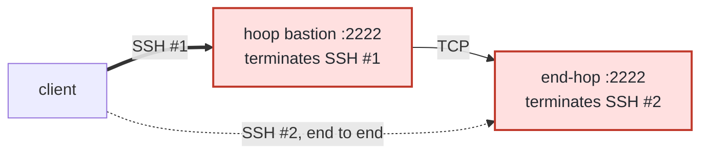

A listener is one of two things, and the config decides which:

| Role | What it is | The keys that make it one |
|---|---|---|
| **End-hop** | a complete SSH server. Terminates the handshake, resolves the account, spawns the process, runs the whole decision chain | `capabilities_allowed` admits session capabilities (omitting the key is enough) |
| **Bastion** | a jump host. Terminates the handshake, checks the destination the client named, dials it and forwards bytes blind | `destinations_allowed` names where; `capabilities_allowed: []` drops the shell |

Those two roles compose into three deployment modes. **The end-hop is the same configuration in all three** — which is the point: hoop puts the whole decision (the certificate, the capabilities, the guardrails, the masking, the audit trail) at the end, so what sits in front changes nothing about what is enforced.

---

## Mode 1 — Direct



One hop, one termination. The certificate, the account, the guardrail, the mask and the audit record all happen in that one process.

```bash
ssh -p 2222 devuser@endhost id
```

**Reach for this first.** An end-hop is a complete SSH server, so nothing needs to sit in front of it. The modes below add a middle hop for what a middle hop centralizes, not because the end-hop needs one.

Direct exposure is defensible here for a reason that does not hold for `sshd`: there is no password method, no keyboard-interactive method and no `authorized_keys`. A connection presents a certificate signed by a CA in `trusted_ca` or it is refused. There is nothing to brute-force.

---

## Mode 2 — Bastion Hoop Sidecar



**Two SSH sessions, nested.** The bastion terminates the outer one — that is how `destinations_allowed` can be checked at all — and carries the inner one blind. SSH #2 is encrypted between the client and the end-hop, so the bastion cannot read those bytes, and it re-signs no identity.

The client's own config does the work:

```
Host prod-target
    HostName 172.31.77.10
    Port 2222
    User devuser
    ProxyJump jump@172.31.77.20:2222
```

<Note>
**`ProxyJump` does not log in to the bastion and run `ssh` there.** It opens a forwarded channel through the bastion and speaks SSH to the end-hop *over* it. So the end-hop sees, and verifies, the **client's** certificate — the same one, unmodified.
</Note>

### Configuration

```yaml config.yaml
listeners:
  - name: prod-bastion
    protocol: ssh
    listen: 0.0.0.0:2222
    ssh:
      host_key: /etc/hoop-inspect/keys/bastion_host_key
      trusted_ca: /etc/hoop-inspect/keys/ca.pub
      capabilities_allowed: []
      destinations_allowed:
        - 172.31.77.10/32:2222
```

| Key | Does |
|---|---|
| `destinations_allowed` | **Carries the jump.** Every forward is denied until an address is written here, so this is the key that puts the listener in the role. One address, one port: the end-hop's SSH port |
| `capabilities_allowed: []` | **Drops the shell.** Written empty, a session channel is refused — no shell, no command, no file transfer, and no content policy, because there is no session to inspect. Omit the key instead to keep a shell for users who log in to the jump host and run `ssh` onward by hand |
| `trusted_ca` | Admits the client's certificate. The **same CA** the end-hop trusts, which is what lets one certificate open the whole path |
| `host_key` | The listener's own identity, as any SSH server has |

**The address checked is the address dialled.** The endpoint resolves the name once, hands the resolved address to the policy check, and connects to that exact value. Checking a name and then dialling it again would leave a window where the resolver answers differently the second time and the connection lands somewhere policy never saw.

A forward gets no statement, deliberately — its bytes are relayed blind, so there is nothing to evaluate. It gets an audit event carrying the destination, the resolved address, the duration and the byte count.

---

## Mode 3 — Bastion OpenSSH


Same shape as mode 2. The middle box changed vendor and nothing else moved — same hops, the last termination in the same place, the same enforcement.

The whole cooperation the design needs from an existing bastion is one line:

```
TrustedUserCAKeys /etc/ssh/hoop_ca.pub
AllowTcpForwarding yes      # already the default; written to be explicit
```

The forwarding is what a corporate jump host already does. It carries the session without learning what it is, and re-signs no identity: the end-hop verifies the same certificate it would have verified on a direct connection.

---

## Why they are equivalent

Mechanically, the end-hop authenticates the same certificate and enforces the same chain whether it was reached directly, through a hoop bastion, or through a stock `sshd`. The modes differ only in whether a middle hop exists and who operates it.

| | Mode 1 | Mode 2 | Mode 3 |
|---|---|---|---|
| Handshakes the end-hop terminates | 1 | 1 (the inner one) | 1 (the inner one) |
| Certificate the end-hop verifies | the client's | the client's | the client's |
| Guardrails, masking, audit | at the end-hop | at the end-hop | at the end-hop |
| Hoop components in the middle | none | one bastion lane | **none** |
| What the middle can read | — | nothing: the inner session is encrypted | nothing |

Mode 3 is the strongest form of the claim, because the bastion there has never heard of hoop.

---

## One certificate

```bash
ssh-keygen -s ca -I alice@corp.example -n devuser,jump -V +8h alice.pub
```

- `-I` is the key id, which maps to the identity's **subject** — the name in every audit record.
- `-n` is the principals list, and it is the **only** place login names are decided: `devuser` at the end-hop, `jump` at the bastion. A login name absent from this list is refused before any policy runs.
- `-V` bounds it in time, checked at the handshake by both hops.

[Certificates and Identity](/setup/configuration/hoop-sidecar/protocols/ssh/certificates) has every field, what reads it, and what refuses the whole certificate.

---

## Next

<CardGroup cols={2}>
  <Card title="Configuration" icon="file-code" href="/setup/configuration/hoop-sidecar/protocols/ssh/configuration">
    Every attribute of the `ssh` block, including the destination grammar these modes depend on.
  </Card>
  <Card title="Host Configuration" icon="server" href="/setup/configuration/hoop-sidecar/protocols/ssh/hosts">
    What the end-hop's host must already have for a login to succeed.
  </Card>
</CardGroup>
